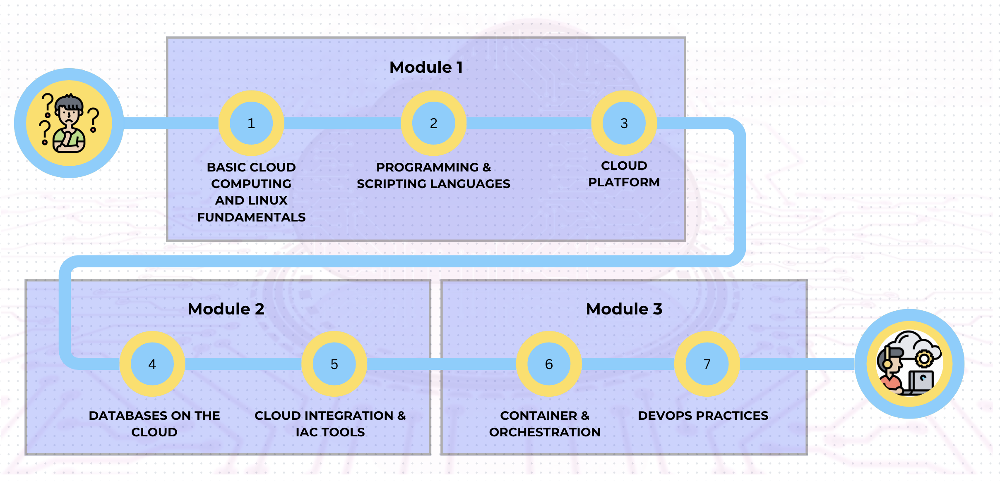

### Cloud Engineering Roadmap

---

### **1. BASIC CLOUD COMPUTING AND LINUX FUNDAMENTALS**
**Objective:**  
Gain a deep understanding of cloud computing concepts and Linux, the primary OS in cloud environments.

- **Cloud Fundamentals**:
  - **Service Models (IaaS, PaaS, SaaS)**: Learn the different service levels in the cloud stack and how to select the right model for different use cases.
  - **Deployment Models (Public, Private, Hybrid)**: Understand how cloud services are deployed and managed, with examples of when to use each model.

- **Linux Fundamentals**:
  - **Linux Commands**: Master basic Linux navigation commands (`ls`, `cd`, `grep`, `chmod`) and utilities like `top`, `ps`, `netstat`.
  - **File Permissions**: Learn to manage user and file permissions.
  - **Shell Scripting**: Understand how to write simple scripts for automating tasks.

- **Learning Resources**:
  - **Books**: "The Linux Command Line" by William E. Shotts.
  - **Courses**: Linux Foundation's introductory courses.

---

### **2. PROGRAMMING & SCRIPTING LANGUAGES**
**Objective:**  
Develop proficiency in key programming and scripting languages used in cloud automation and infrastructure management.

- **Languages to Learn**:
  - **Bash**: Essential for scripting and automating tasks in Linux environments.
  - **Python**: Crucial for automation, scripting, and working with serverless cloud architectures.
  - **JavaScript/TypeScript**: Important for developing cloud-native applications, including serverless applications and API development.

- **Learning Resources**:
  - Platforms like Codecademy for Python, JavaScript.
  - Udemy/Pluralsight for Bash scripting and TypeScript.
  - Build small projects to solidify your skills.

---

### **3. CLOUD PLATFORM**
**Objective:**  
Gain hands-on experience with major cloud providers to learn cloud architecture, services, and management tools.

- **Exploring Major Providers**:
  - **AWS**: Market leader with a vast array of services.
  - **Microsoft Azure**: Best for organizations using Microsoft products.
  - **Google Cloud Platform (GCP)**: Great for data and machine learning services.

- **Hands-on Practice**:
  - Use free tiers on AWS, Azure, or GCP to explore services like virtual machines, object storage, and databases.
  - Experiment with deployments, virtual networking, and scaling in the cloud.

---

### **4. DATABASES ON THE CLOUD**
**Objective:**  
Learn how to set up, manage, and optimize databases in cloud environments for high availability, scalability, and performance.

- **Topics Covered**:
  - **Relational Databases (e.g., AWS RDS, Azure SQL)**: Learn how to provision and manage SQL databases in the cloud.
  - **NoSQL Databases (e.g., DynamoDB, MongoDB)**: Understand when and how to use NoSQL solutions for unstructured data.
  - **Data Backup and Recovery**: Implement robust data backup strategies and disaster recovery.

- **Hands-on Practice**:
  - Use AWS RDS or Google Cloud SQL to set up a database, configure backups, and optimize performance.

---

### **5. CLOUD INTEGRATION & IAC TOOLS**
**Objective:**  
Master cloud automation through Infrastructure as Code (IaC) to manage resources effectively and improve consistency.

- **Key Tools**:
  - **Terraform**: A cloud-agnostic tool to manage and provision infrastructure across multiple cloud providers.
  - **AWS CloudFormation**: AWS-specific tool for managing resources through templates.
  - **Ansible**: For configuration management and automation.

- **Concepts to Learn**:
  - **IaC Best Practices**: Writing modular, reusable IaC templates.
  - **Version Control for Infrastructure**: Use Git to manage and track infrastructure changes.

- **Hands-on Practice**:
  - Build a cloud environment using Terraform, automating the setup of compute, networking, and storage resources.
  - Use Ansible for configuration management across cloud instances.

---

### **6. CONTAINER & ORCHESTRATION**
**Objective:**  
Understand how to build, manage, and scale containerized applications using Docker and Kubernetes.

- **Key Technologies**:
  - **Docker**: Learn how to package applications into containers to ensure consistency across environments.
  - **Kubernetes**: Master container orchestration for deploying, managing, and scaling containerized applications.

- **Topics Covered**:
  - **Containerization**: Learn to build Docker images, run containers, and manage container networking.
  - **Kubernetes Basics**: Understand pods, deployments, services, and autoscaling.

- **Hands-on Practice**:
  - Deploy a containerized application on a Kubernetes cluster using AWS EKS, Azure AKS, or Google Kubernetes Engine (GKE).

---

### **7. DEVOPS PRACTICES**
**Objective:**  
Learn the principles of DevOps to automate and streamline cloud infrastructure development, testing, and deployment processes.

- **DevOps Concepts**:
  - **CI/CD Pipelines**: Automate code integration, testing, and deployment.
  - **Collaboration**: Foster better collaboration between development and operations teams through automation and monitoring tools.

- **DevOps Tools**:
  - **Jenkins**: Automate the build and deployment process.
  - **GitLab CI/CD**: Use GitLab for continuous integration and delivery.
  - **Docker & Kubernetes**: Integrate container management into DevOps pipelines.

- **Hands-on Practice**:
  - Set up a CI/CD pipeline with Jenkins or GitLab to automatically deploy updates to a cloud environment.
  - Configure networking components such as load balancers and VPNs for secure, scalable infrastructure.

---

By following this Cloud Engineering Path, learners will gain a comprehensive understanding of cloud infrastructure, tools, automation, and deployment strategies, preparing them for roles in the rapidly evolving field of cloud engineering.