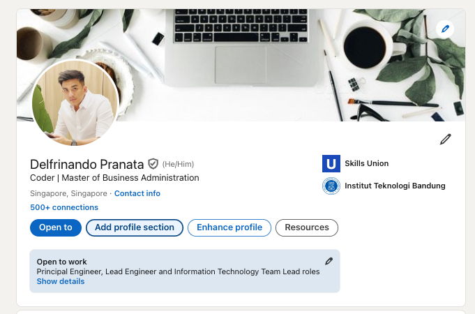

# LinkedIn Education Badge

## Introduction

Cloud Engineering Bootcamp students can add Skills Union to the Education sections of their LinkedIn profiles. Follow these instructions.

## 1. Go to your LinkedIn profile page and click "**Add profile section**"

## 2. Click "**Education**" to add a new education badge

## 3. Fill in Skills Union's Cloud Engineering Bootcamp course details

1. **Notify network**
   - On
2. **School**
   - Skills Union
3. **Degree**
   - Cloud Engineering Bootcamp
4. **Start Date**
   - The month you enrolled in the Cloud Engineering Bootcamp
5. **End Date**
   - The month you graduated from the Cloud Engineering Bootcamp
6. **Description**
   - Comprehensive training in cloud architecture, AWS services, and DevOps practices. View my cloud engineering projects here: \<PORTFOLIO-LINK>

## 4. Admire your hard-earned education badge 🌩️

If needed, move the new education badge to the top of your Education section for greater visibility.
