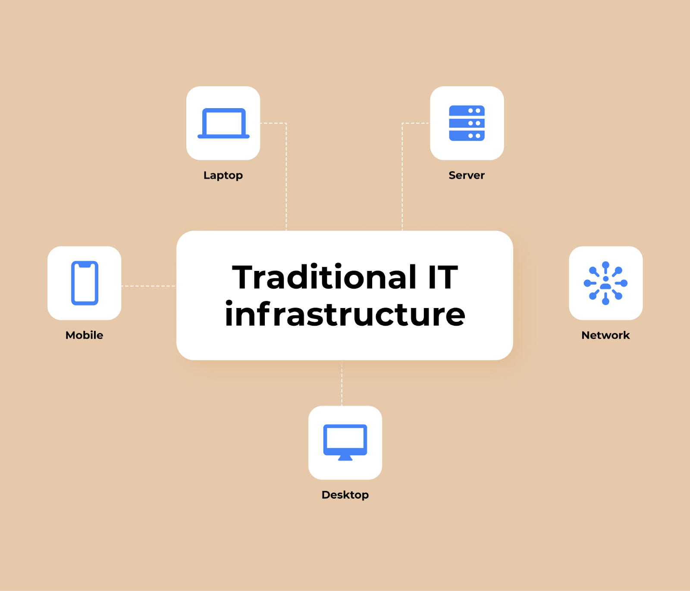
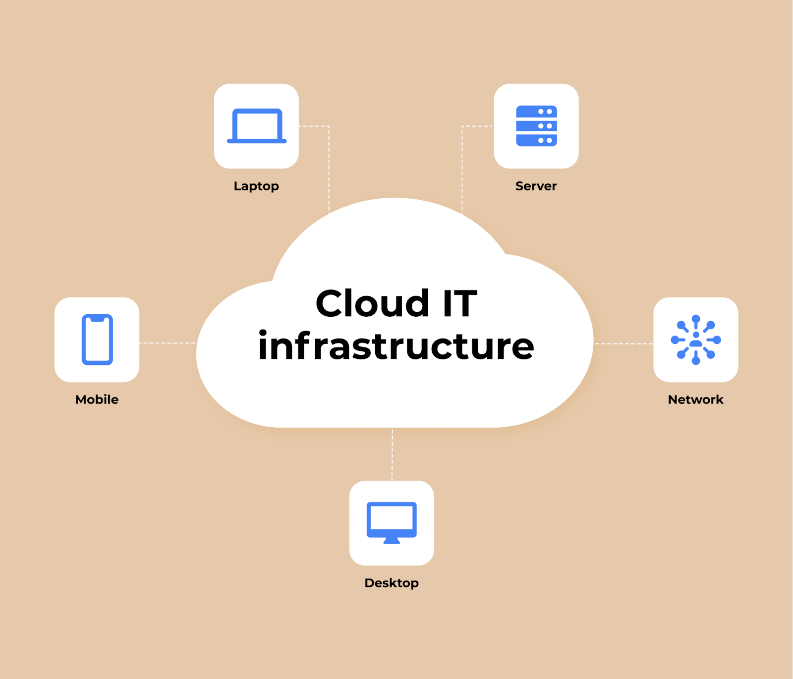
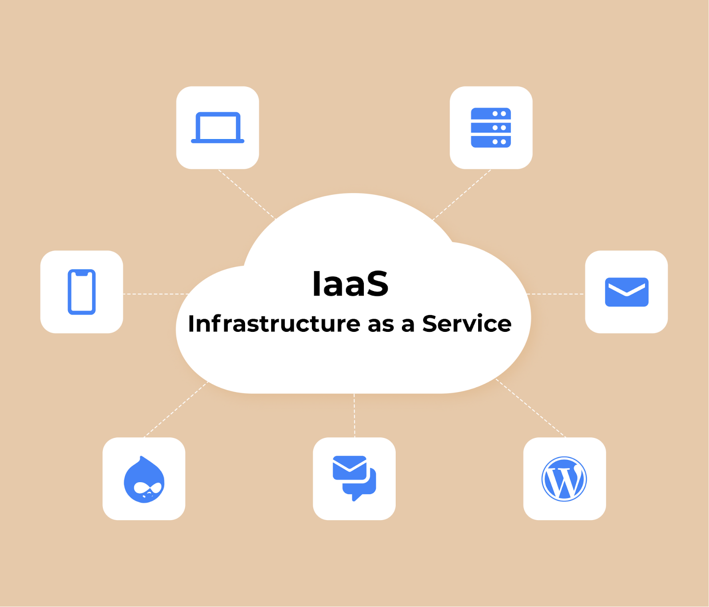

# Basic IT Infrastructure

### **Lesson Objectives: Basic IT Infrastructure**

- Define IT Infrastructure and its role in business operations.
- Identify the key components: hardware, software, and networking.
- Differentiate between traditional and cloud-based infrastructure.
- Explain how IT infrastructure improves business efficiency.
- Understand IT infrastructure management (operational, service, and asset management).
- Describe the benefits of Infrastructure as a Service (IaaS).

#### **What is IT Infrastructure? An Introductory Guide**

In today's fast-paced business environment, it is nearly impossible to envision a company operating without a robust IT infrastructure. From hardware to software, the various components of IT infrastructure work together to streamline operations, enhance productivity, and improve communication across departments. Well-structured infrastructure not only boosts internal processes but also enables businesses to scale and optimize service delivery to external clients.

In this module, learners will gain a comprehensive understanding of the key components of IT infrastructure, explore different types of infrastructure, and learn best practices for managing IT environments efficiently.

---

### **Components of IT Infrastructure**

IT infrastructure comprises several interconnected components designed to improve communication between devices such as desktops, servers, and cloud systems. The primary components include:

- **Hardware**:
  - Physical devices that form the foundation of IT infrastructure, including:
    - Desktop computers, laptops, tablets, and mobile devices.
    - Servers and data centers.
    - Networking equipment such as routers, switches, and hubs.

- **Software**:
  - The various programs and applications that enable business functions and operations:
    - Operating systems, content management systems (CMS), customer relationship management (CRM), and enterprise resource planning (ERP) software.
    - Custom applications tailored to internal business needs.

- **Networks**:
  - Infrastructure components that facilitate connectivity and communication between devices:
    - Servers, hubs, switches, and routers.
    - Firewalls that ensure the security of network connections.

---

### **Types of IT Infrastructure**

IT infrastructure can be categorized into two primary types:

#### **1. Traditional Infrastructure**

Traditional infrastructure consists of hardware and software located on-premises, with all devices connected via an internal network. Businesses using traditional infrastructure maintain full control over their data and systems, requiring in-house teams to manage, monitor, and update the infrastructure. However, traditional setups can be costly due to the need for physical space, constant maintenance, and significant upfront investments in hardware.

**Advantages**:
- Complete control over data and infrastructure.
- Full autonomy over software updates and system enhancements.
- Dedicated team for infrastructure management.

---

#### **2. Cloud-Based Infrastructure**

Cloud-based infrastructure eliminates the need for on-site hardware. Instead, businesses rent computing power, storage, and networking services from a cloud provider. All servers, data, and applications are hosted in the cloud, making it a scalable, flexible, and cost-effective option for businesses of all sizes.

**Advantages**:
- **Flexibility and Scalability**: Cloud infrastructure allows businesses to scale resources based on demand without investing in additional hardware.
- **Automation**: Cloud providers manage routine tasks like updates, security, and backups, enabling businesses to focus on core activities.
- **Cost-Efficiency**: Businesses only pay for the resources they use, reducing costs associated with physical infrastructure and maintenance.

---

### **IT Infrastructure Management**

Managing IT infrastructure is a critical function, and it involves various approaches to optimize operations and control costs:

- **IT Operational Management**:
  - Involves monitoring and maintaining the health of the IT infrastructure. Tools such as ServiceNow provide modules for asset discovery, event management, and process automation to ensure operational efficiency.
  
- **IT Service Management (ITSM)**:
  - Focuses on delivering and managing IT services, ensuring they align with business objectives. Tools like FreshService help automate workflows and improve service delivery across organizations.

- **IT Asset Management**:
  - Involves managing the lifecycle of hardware and software assets within the infrastructure. Solutions such as ServiceNow Discovery and Mapping Services automate asset discovery and map relationships between services and infrastructure components.

---

### **Infrastructure as a Service (IaaS)**

IaaS represents a modern approach to building IT infrastructure, wherein businesses lease cloud infrastructure from a vendor who manages hardware, networking, and security. This model provides significant advantages, including:

- **Pay-as-you-go pricing**: Businesses only pay for the resources they use, which helps minimize costs.
- **Enhanced security**: Cloud providers invest heavily in securing infrastructure, protecting businesses from data breaches.
- **Accessibility**: IaaS can be accessed from any device with an internet connection, enabling remote work and global collaboration.

---
---

IT infrastructure forms the backbone of any modern business. Whether businesses opt for traditional on-premises setups or cloud-based infrastructures, a well-designed and managed infrastructure improves efficiency, enhances operational capabilities, and supports growth. As businesses continue to evolve, upgrading infrastructure to meet current technological demands is essential for staying competitive and agile in the marketplace.

By understanding the components and management strategies of IT infrastructure, learners can build or optimize systems that meet the unique needs of their organizations, positioning themselves for success in the digital age.