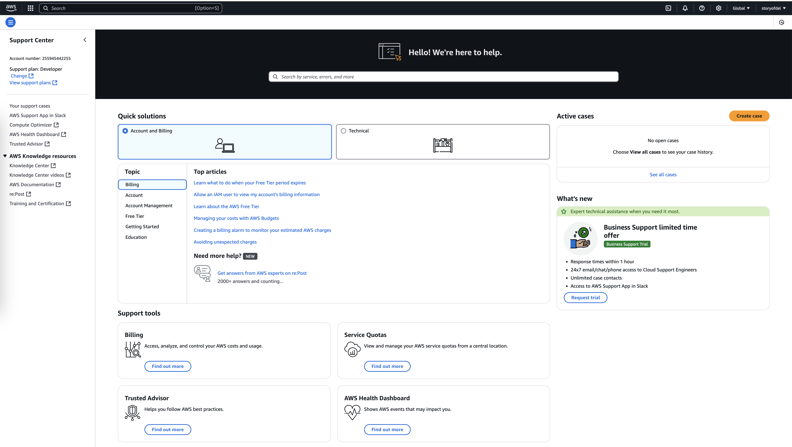

# AWS Support and AWS Support Plans

AWS Support provides customers with the necessary tools and guidance to troubleshoot issues, optimize costs, and leverage AWS services effectively. With flexible plans tailored to meet varying organizational needs, AWS Support ensures reliable operations for businesses of all sizes.

---

## Overview of AWS Support Plans

AWS offers five different support plans, ranging from free Basic Support to Enterprise Support, which includes comprehensive features like proactive monitoring and a dedicated Technical Account Manager (TAM).

### 1. **Basic Support**
- **Cost**: Free for all AWS customers.
- **Features**:
  - Access to AWS whitepapers, documentation, and support communities.
  - AWS Personal Health Dashboard for tracking service health events and remediation guidance.
  - Limited AWS Trusted Advisor checks for cost optimization and security insights.
  - 24/7 access for account and billing inquiries.
  
Basic Support is suitable for individuals and businesses that are just starting with AWS or do not require technical support.

---

### 2. **Developer Support**
- **Cost**: Starts at $29 per month.
- **Features**:
  - All features of Basic Support.
  - Best practices guidance for using AWS services effectively.
  - Client-side diagnostic tools for troubleshooting.
  - **Building-block architecture support**:
    - Guidance for combining AWS services and features to build applications.

**Example**: A company exploring AWS services can use Developer Support to understand how to integrate multiple services like Amazon S3 and Amazon EC2 to address their specific needs.

---

### 3. **Business Support**
- **Cost**: Starts at $100 per month or a percentage of monthly AWS usage.
- **Features**:
  - All features of Developer Support.
  - Use-case guidance for identifying AWS services that meet specific operational needs.
  - Full access to all AWS Trusted Advisor checks.
  - Limited support for common third-party software (e.g., operating systems, application stacks).

**Example**: A business installing a third-party operating system on EC2 instances can use Business Support to get help with configuration and troubleshooting. For advanced optimization, the company might need to consult the third-party vendor.

---

### 4. **Enterprise On-Ramp Support**
- **Cost**: Higher than Business Support, depending on usage.
- **Features**:
  - All features of Basic, Developer, and Business Support.
  - Access to a pool of Technical Account Managers (TAMs) for proactive guidance.
  - Annual consultative reviews and architecture guidance.
  - Cost Optimization workshop (one per year).
  - Infrastructure Event Management support (one per year).
  - 30-minute response time for business-critical issues.
  - Tools for monitoring performance and cost optimization through Trusted Advisor and the Health API/Dashboard.

**Example**: Enterprise On-Ramp is ideal for businesses transitioning to mission-critical workloads but not yet requiring full Enterprise Support.

---

### 5. **Enterprise Support**
- **Cost**: Starts at $15,000 per month or a percentage of monthly AWS usage.
- **Features**:
  - All features of Enterprise On-Ramp Support.
  - Dedicated Technical Account Manager (TAM) for strategic guidance.
  - Concierge Support Team for account and billing assistance.
  - Comprehensive operations reviews and tools for monitoring health and costs.
  - Training programs, including Game Days, to foster innovation.
  - Proactive services like:
    - Infrastructure Event Management.
    - Consultative reviews and architecture guidance.
    - Cost Optimization workshops.
  - 15-minute response time for business-critical issues.

**Example**: A global enterprise running mission-critical applications would use Enterprise Support for rapid issue resolution and proactive cost management.

---

## Technical Account Manager (TAM)

A **Technical Account Manager (TAM)** is included with the Enterprise On-Ramp and Enterprise Support plans. TAMs act as the primary point of contact, offering expert guidance on:

- Designing cost-effective and resilient architectures.
- Aligning AWS services with organizational goals.
- Proactive issue resolution and monitoring.
- Coordination with AWS programs and experts.

**Example**: A company developing a complex application using multiple AWS services can rely on a TAM for insights on integrating services like AWS Lambda, Amazon S3, and Amazon RDS to meet application requirements efficiently.

---

## Choosing the Right Support Plan

When selecting a support plan, consider:

1. **Workload Complexity**: Mission-critical workloads often require Business or Enterprise Support.
2. **Budget**: Align the support plan cost with the organization’s financial capacity.
3. **Expertise**: Organizations with in-house AWS expertise might need only Developer or Basic Support.
4. **Response Time Requirements**: Ensure the plan meets operational demands for issue resolution.

---

## Best Practices for AWS Support

1. **Start with Basic Support**: Begin with Basic Support to explore AWS services and upgrade as needed.
2. **Use Trusted Advisor**: Optimize costs and security using the Trusted Advisor tool.
3. **Leverage the Health Dashboard**: Stay informed about potential issues affecting your AWS resources.
4. **Engage with a TAM**: For Enterprise customers, TAMs can significantly enhance operational efficiency.

---

By understanding AWS Support plans and leveraging the available features, businesses can ensure smooth operations, enhance performance, and optimize costs while using AWS services.
