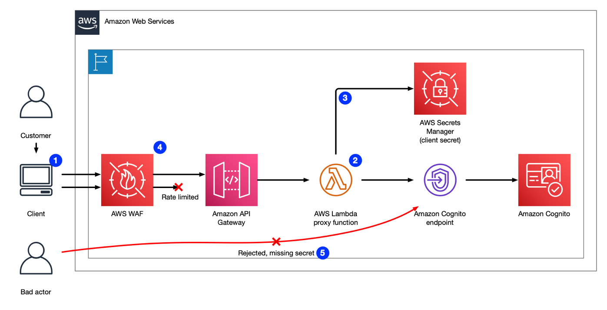

# Introduction to Cloud Computing with AWS

Amazon Web Services (AWS) is the world's most comprehensive and widely adopted cloud computing platform, offering over 200 fully featured services from data centers around the globe. AWS enables businesses of all sizes, from startups to enterprises, to lower costs, increase agility, and drive innovation. Whether you're moving existing applications to the cloud or building new ones, AWS provides the tools and resources to help you succeed.



---

### **Why AWS?**

#### **1. Most Functionality**
AWS offers unmatched functionality with a wide range of services, including:
- **Core Infrastructure**: Compute, storage, and databases.
- **Emerging Technologies**: Machine learning, artificial intelligence, Internet of Things (IoT), and data lakes.
- **Purpose-Built Databases**: A variety of database options tailored to different applications, ensuring cost efficiency and performance optimization.

This breadth and depth make AWS an ideal platform for building and scaling applications, from simple websites to complex enterprise solutions.

---

#### **2. Largest Community of Customers and Partners**
AWS boasts the largest cloud ecosystem, including:
- **Millions of Active Customers**: Organizations across all industries and sizes leverage AWS for diverse use cases.
- **Extensive Partner Network (APN)**:
  - **Systems Integrators**: Specialized in AWS services.
  - **Independent Software Vendors (ISVs)**: Adapting their technologies to work seamlessly with AWS.

This expansive community ensures robust support, collaboration, and innovation opportunities.

---

#### **3. Unmatched Security**
AWS is built to be the most secure cloud environment, offering:
- **Military-Grade Security**: Trusted by banks, governments, and high-sensitivity organizations.
- **Comprehensive Tools**: Over 300 security, compliance, and governance services.
- **Compliance Standards**: Supports 143 security certifications globally.

With AWS, businesses can operate confidently, knowing their data and applications are protected by industry-leading measures.

---

#### **4. Rapid Innovation**
AWS empowers businesses to innovate quickly by leveraging cutting-edge technologies, such as:
- **Serverless Computing**: AWS Lambda allows developers to run code without managing servers.
- **Machine Learning**: Amazon SageMaker simplifies the use of machine learning for developers and data scientists with no prior expertise.

AWS consistently leads the way in introducing new technologies that transform industries and drive innovation.

---

#### **5. Proven Operational Expertise**
With over 17 years of experience delivering cloud services, AWS provides:
- **Reliability and Maturity**: Trusted by millions of customers worldwide.
- **Scalability and Performance**: Handles diverse workloads and critical applications with unmatched operational expertise.

---

#### **6. Global Network of AWS Regions**
AWS has the most extensive global cloud infrastructure, featuring:
- **Regions and Availability Zones**: A model recognized by Gartner for high availability and enterprise application reliability.
- **Global Reach**: Ensures low latency, high throughput, and robust disaster recovery capabilities.

---

### **Key Benefits of AWS**
- **Cost-Effectiveness**: Pay only for what you use, with no upfront costs or long-term commitments.
- **Scalability**: Easily scale resources up or down to meet your needs.
- **Flexibility**: Build and deploy applications using your preferred programming languages, frameworks, and operating systems.
- **Support and Resources**: Access training, documentation, and expert support to maximize your AWS investment.

---

### **Conclusion**
AWS provides businesses with a comprehensive suite of tools to innovate, scale, and achieve their goals. With unparalleled functionality, security, and a global network, AWS is the platform of choice for organizations looking to stay competitive in today’s rapidly evolving technological landscape. Whether you're a startup experimenting with new ideas or an enterprise optimizing global operations, AWS delivers the solutions you need to succeed.

# AWS Overview



## Analytics

### Amazon Athena

**Overview**

Amazon Athena is an interactive query service that simplifies the analysis of data in Amazon S3 using standard SQL. Athena is serverless, meaning there is no infrastructure to manage, and users pay only for the queries they run.

**Key Features**

Athena is easy to use: simply point to the data in Amazon S3, define the schema, and start querying using standard SQL. Most results are delivered within seconds. With Athena, there is no need for complex extract, transform, and load (ETL) jobs to prepare data for analysis, making it accessible for anyone with SQL skills to quickly analyze large-scale datasets.

**Integration with AWS Glue**

Athena is integrated with AWS Glue Data Catalog out of the box, allowing users to create a unified metadata repository across services, crawl data sources to discover schemas and populate the Catalog with table and partition definitions, and maintain schema versioning.

### Amazon CloudSearch

**Overview**

Amazon CloudSearch is a managed service in the AWS Cloud that makes it simple and cost-effective to set up, manage, and scale a search solution for websites or applications.

**Key Features**

It supports 34 languages and popular search features such as highlighting, autocomplete, and geospatial search.

### Amazon DataZone

**Overview**

Amazon DataZone is a data management service designed to publish data and make it available through a business data catalog via a personalized web application.

**Key Features**

It enables secure access to data stored across AWS, on-premises, or in SaaS applications like Salesforce. Amazon DataZone integrates across AWS services such as Amazon Redshift, Amazon Athena, AWS Glue, AWS Lake Formation, and Amazon QuickSight.

### Amazon EMR

**Overview**

Amazon EMR is a leading cloud big data platform for processing vast amounts of data using open-source tools like Apache Spark, Hive, HBase, Flink, Hudi, and Presto.

**Key Features**

Amazon EMR simplifies the setup, operation, and scaling of big data environments by automating tasks like provisioning capacity and tuning clusters. With Amazon EMR, petabyte-scale analysis can be run at a fraction of the cost of traditional on-premises solutions and much faster than standard Apache Spark.

### Amazon FinSpace

**Overview**

Amazon FinSpace is a data management and analytics service tailored for the financial services industry (FSI).

**Key Features**

FinSpace reduces the time spent finding and preparing petabytes of financial data from months to minutes. It enables financial organizations to analyze data from internal sources and third-party feeds, while enforcing compliance requirements.

### Amazon Kinesis

**Overview**

Amazon Kinesis facilitates the collection, processing, and analysis of real-time streaming data for quick insights and immediate response.

**Key Features**

Kinesis offers key capabilities for cost-effective data processing at any scale, supporting applications like machine learning, analytics, and more. The service includes four components: Kinesis Firehose, Managed Service for Apache Flink, Kinesis Data Streams, and Kinesis Video Streams.

### Amazon Data Firehose

**Overview**

Amazon Data Firehose is the easiest way to reliably load streaming data into data stores and analytics tools.

**Key Features**

It can capture, transform, and load data into Amazon S3, Redshift, OpenSearch Service, and Splunk. The fully managed service scales automatically and supports real-time analytics with minimal administration.

### Amazon Managed Service for Apache Flink

**Overview**

Amazon Managed Service for Apache Flink is a managed service for analyzing streaming data and responding in real-time.

**Key Features**

It simplifies building and managing streaming applications by providing tools for both SQL users and Java developers. The service handles continuous query execution and scales automatically based on data throughput.

### Amazon Kinesis Data Streams

**Overview**

Amazon Kinesis Data Streams is a scalable real-time data streaming service that captures large amounts of data from multiple sources.

**Key Features**

It enables use cases like real-time dashboards, anomaly detection, and dynamic pricing.

### Amazon Kinesis Video Streams

**Overview**

Amazon Kinesis Video Streams allows the secure streaming of video from connected devices to AWS for analytics, ML, and more.

**Key Features**

The service automatically scales to ingest video from millions of devices and integrates with ML frameworks like Apache MxNet and TensorFlow.

### Amazon OpenSearch Service

**Overview**

Amazon OpenSearch Service makes it easy to deploy, secure, and scale OpenSearch for real-time search, analysis, and visualization.

**Key Features**

It powers use cases like log analytics, full-text search, and application monitoring with enterprise-grade availability and security.

### Amazon OpenSearch Serverless

**Overview**

Amazon OpenSearch Serverless offers a serverless option for running OpenSearch workloads without managing infrastructure.

**Key Features**

It supports petabyte-scale workloads with interactive millisecond response times, making it ideal for use cases like image search, document search, and anomaly detection.

### Amazon Redshift

**Overview**

Amazon Redshift is a popular cloud data warehouse that simplifies the analysis of structured and semi-structured data using standard SQL.

**Key Features**

It supports complex queries on large datasets at a low cost, with most results returned in seconds.

### Amazon Redshift Serverless

**Overview**

Amazon Redshift Serverless makes it easier to run and scale analytics without managing infrastructure.

**Key Features**

It automatically provisions and scales capacity based on demand, allowing users to focus on querying data and generating insights.

### Amazon QuickSight

**Overview**

Amazon QuickSight is a fast, cloud-powered business intelligence (BI) service that enables the creation and publication of interactive dashboards.

**Key Features**

It scales easily to thousands of users without requiring infrastructure management.

### AWS Clean Rooms

**Overview**

AWS Clean Rooms enables companies and partners to securely analyze and collaborate on datasets without sharing underlying data.

**Key Features**

Customers can create secure data clean rooms in minutes and collaborate with others on AWS to generate insights while maintaining data privacy.

### AWS Data Exchange

**Overview**

AWS Data Exchange simplifies the process of finding, subscribing to, and using third-party data in the cloud.

**Key Features**

It allows users to subscribe to data from leading providers and load it directly into Amazon S3 for analysis using AWS analytics and ML services.

### AWS Data Pipeline

**Overview**

AWS Data Pipeline is a web service for reliably processing and moving data between AWS compute and storage services, as well as on-premises sources.

**Key Features**

It supports creating complex, fault-tolerant data processing workloads that run on schedule and at scale.

### AWS Entity Resolution

**Overview**

AWS Entity Resolution is a service that helps match and link related records across multiple data sources.

**Key Features**

It uses configurable ML and rule-based techniques to create unified customer profiles and personalize experiences for marketing campaigns and e-commerce.

### AWS Glue

**Overview**

AWS Glue is a fully managed ETL service that simplifies data preparation for analytics.

**Key Features**

It integrates with the AWS Glue Data Catalog for metadata management and supports data integration using Apache Spark, PySpark, and Ray for scalable workloads.

### AWS Lake Formation

**Overview**

AWS Lake Formation simplifies setting up secure data lakes by automating data ingestion, cataloging, and transformation.

**Key Features**

It integrates with analytics and ML services to help users extract insights from centralized data repositories.

### Amazon Managed Streaming for Apache Kafka (Amazon MSK)

**Overview**

Amazon MSK is a fully managed service that simplifies building and running applications using Apache Kafka.

**Key Features**

It automates the setup and management of Kafka clusters, allowing organizations to focus on building applications instead of managing infrastructure.

## Compute Services

### Amazon EC2

**Overview**
Amazon Elastic Compute Cloud (Amazon EC2) is a web service that provides secure, resizable compute capacity in the cloud. It is designed to make web-scale computing easier for developers.

**Key Features**
The simple web interface of Amazon EC2 allows users to obtain and configure capacity with minimal friction. It provides complete control over computing resources and lets applications run on Amazon’s proven computing environment. Amazon EC2 reduces the time required to obtain and boot new server instances (called Amazon EC2 instances) to minutes, allowing quick scaling of capacity, both up and down, as computing requirements change.

### Amazon Lightsail

**Overview**
Amazon Lightsail is designed to be the easiest way to launch and manage a virtual private server with AWS.

**Key Features**
Lightsail plans include everything needed to jumpstart a project, including a VM, SSD-based storage, data transfer, DNS management, and a static IP address—all for a low, predictable price.

### Amazon Linux 2023

**Overview**
Amazon Linux 2023 (AL2023) is a Linux-based operating system for AWS, designed to provide a secure, stable, high-performance environment for developing and running cloud applications.

**Key Features**
AL2023 provides seamless integration with various AWS services and development tools and offers optimized performance for Amazon EC2 Graviton-based instances. The release cadence of every two years offers predictable cycles and up to 5 years of support. AL2023 also improves security by default, features preconfigured security policies, and provides deterministic upgrades through versioned repositories.

### AWS App Runner

**Overview**
AWS App Runner is a fully managed service that makes it easy for developers to quickly deploy containerized web applications and APIs at scale.

**Key Features**
AWS App Runner automatically builds, deploys, and scales web applications with load balancing and encryption. It also scales automatically to meet traffic needs, allowing developers to focus on applications instead of infrastructure.

### AWS Batch

**Overview**
AWS Batch enables developers, scientists, and engineers to easily run hundreds of thousands of batch computing jobs on AWS.

**Key Features**
AWS Batch dynamically provisions the optimal quantity and type of compute resources based on job requirements, eliminating the need to manage batch computing software or server clusters. The service plans, schedules, and runs batch computing workloads across AWS compute services.

### AWS Elastic Beanstalk

**Overview**
AWS Elastic Beanstalk is a service for deploying and scaling web applications and services developed in languages like Java, .NET, PHP, Node.js, Python, Ruby, Go, and Docker.

**Key Features**
AWS Elastic Beanstalk handles deployment tasks like capacity provisioning, load balancing, and auto-scaling while allowing full control over the underlying AWS resources.

### AWS Fargate

**Overview**
AWS Fargate is a compute engine for Amazon ECS that allows users to run containers without managing servers or clusters.

**Key Features**
With Fargate, users only need to package their applications in containers, specify CPU and memory requirements, define networking and IAM policies, and launch the application without worrying about underlying infrastructure.

### AWS Lambda

**Overview**
AWS Lambda lets users run code without provisioning or managing servers, charging only for the compute time consumed.

**Key Features**
AWS Lambda is ideal for running code for virtually any application or backend service without the need for administration. Code can be set up to run automatically from other AWS services or called directly from web or mobile apps.

### AWS Serverless Application Repository

**Overview**
The AWS Serverless Application Repository allows users to quickly deploy code samples, components, and complete applications for common use cases.

**Key Features**
Each application is packaged with an AWS Serverless Application Model (AWS SAM) template that defines the AWS resources used. Users can deploy publicly shared applications or publish their own for sharing within teams, organizations, or the community.

### AWS Outposts

**Overview**
AWS Outposts bring native AWS services, infrastructure, and operating models to virtually any data center, co-location space, or on-premises facility.

**Key Features**
Outposts allow users to use the same APIs, tools, hardware, and functionality across on-premises and cloud environments. AWS Outposts infrastructure is fully managed, maintained, and supported by AWS.

### AWS Wavelength

**Overview**
AWS Wavelength is an AWS infrastructure offering optimized for mobile edge computing applications.

**Key Features**
Wavelength Zones embed AWS compute and storage services within communication service providers’ data centers at the edge of the 5G network, minimizing latency for mobile applications.

### VMware Cloud on AWS

**Overview**
VMware Cloud on AWS is an integrated cloud offering jointly developed by AWS and VMware for seamlessly migrating and extending on-premises VMware vSphere-based environments to the AWS Cloud.

**Key Features**
VMware Cloud on AWS allows organizations to run VMware's compute, storage, and network virtualization platforms alongside AWS infrastructure and platform services. It provides seamless workload portability between on-premises environments and the AWS Cloud, simplifying hybrid IT operations.

## Containers

### Amazon Elastic Container Registry

**Overview**
Amazon Elastic Container Registry (Amazon ECR) is a fully-managed Docker container registry that simplifies storing, managing, and deploying Docker container images.

**Key Features**
- Integrated with Amazon ECS for seamless development to production workflows.
- Eliminates the need for operating container repositories or scaling infrastructure.
- Provides resource-level control of each repository using IAM.
- Pay-as-you-go pricing with no upfront fees or commitments.

### Amazon Elastic Container Service

**Overview**
Amazon Elastic Container Service (Amazon ECS) is a scalable and high-performance container orchestration service that supports Docker containers, allowing you to run and scale containerized applications on AWS.

**Key Features**
- No need to manage your own container orchestration software or virtual machine clusters.
- Simple API calls to launch, stop, and query the state of your applications.
- Integrates with IAM roles, security groups, load balancers, CloudWatch Events, CloudFormation templates, and CloudTrail logs.

### Amazon Elastic Kubernetes Service

**Overview**
Amazon Elastic Kubernetes Service (Amazon EKS) makes it easy to deploy, manage, and scale containerized applications using Kubernetes on AWS.

**Key Features**
- Runs Kubernetes management infrastructure across multiple Availability Zones for high availability.
- Certified Kubernetes conformant, compatible with existing tooling and plugins.
- Easily migrate applications running on standard Kubernetes environments to Amazon EKS.

## Databases

### Amazon Aurora

**Overview**
Amazon Aurora is a MySQL and PostgreSQL-compatible relational database engine that combines the speed and availability of high-end commercial databases with the simplicity and cost-effectiveness of open-source databases.

**Key Features**
- Up to five times faster than standard MySQL databases and three times faster than standard PostgreSQL databases.
- Fully managed by Amazon RDS, which automates time-consuming tasks such as hardware provisioning, database setup, patching, and backups.
- Supports distributed, fault-tolerant, self-healing storage that scales up to 128TB per database instance.
- Aurora I/O-Optimized cluster configuration for improved price performance for I/O-intensive applications.

### Amazon DynamoDB

**Overview**
Amazon DynamoDB is a key-value and document database that provides single-digit millisecond performance at any scale. It is a fully managed, multi-Region database with built-in security, backup and restore, and in-memory caching for internet-scale applications.

**Key Features**
- Handles more than 10 trillion requests per day and supports peaks of more than 20 million requests per second.
- Ideal for mobile, web, gaming, ad tech, IoT, and other applications requiring low-latency data access.
- Fully managed with no need to provision or manage servers.

### Amazon ElastiCache

**Overview**
Amazon ElastiCache is a fully managed in-memory caching service that improves the performance of web applications by retrieving data from fast, managed caches.

**Supported Engines**
- **Redis**: A Redis-compatible in-memory service suitable for high-performance use cases such as web, mobile apps, gaming, and IoT.
- **Memcached**: A widely adopted memory object caching system compatible with existing Memcached environments.

**Key Features**
- ElastiCache Serverless: A serverless option that simplifies cache management and scales automatically to support demanding applications.

### Amazon Keyspaces (for Apache Cassandra)

**Overview**
Amazon Keyspaces is a managed Apache Cassandra–compatible database service that allows you to run Cassandra workloads on AWS without managing servers or software.

**Key Features**
- Serverless with automatic scaling based on application traffic.
- Continuous data backup with point-in-time recovery.
- Secure by default with encryption.

### Amazon MemoryDB

**Overview**
Amazon MemoryDB is a Redis-compatible, durable in-memory database service designed for modern applications with microservices architectures.

**Key Features**
- Microsecond read and single-digit millisecond write latency.
- Durable data storage across multiple Availability Zones using a distributed transactional log.

### Amazon Neptune

**Overview**
Amazon Neptune is a fast, reliable, fully-managed graph database service that supports Property Graph and RDF graph models for building applications that work with highly connected datasets.

**Key Features**
- Supports graph use cases such as recommendation engines, fraud detection, knowledge graphs, and network security.
- High availability with read replicas, point-in-time recovery, and replication across Availability Zones.

### Amazon Relational Database Service (RDS)

**Overview**
Amazon RDS makes it easy to set up, operate, and scale a relational database in the cloud with support for six familiar database engines, including MySQL, MariaDB, PostgreSQL, Oracle Database, Microsoft SQL Server, and Amazon RDS on AWS Outposts.

**Key Features**
- Automates time-consuming administration tasks such as hardware provisioning, database setup, patching, and backups.
- Cost-efficient and resizable capacity optimized for memory, performance, or I/O.

### Amazon Quantum Ledger Database (QLDB)

**Overview**
Amazon QLDB is a fully managed ledger database that provides a transparent, immutable, and cryptographically verifiable transaction log owned by a central trusted authority.

**Key Features**
- Tracks each application data change and maintains a complete, verifiable history of changes over time.
- Serverless with automatic scaling and no need to manage infrastructure.

### Amazon Timestream

**Overview**
Amazon Timestream is a fully managed time series database service designed for IoT and operational applications.

**Key Features**
- Purpose-built for time series data, making it more efficient at processing time-interval data than relational databases.
- Serverless with automated data management features like rollups, retention, tiering, and compression.

### Amazon DocumentDB (with MongoDB compatibility)

**Overview**
Amazon DocumentDB is a fast, scalable, fully managed document database service that is designed for operating mission-critical MongoDB workloads at scale.

**Key Features**
- Supports MongoDB workloads with compatibility for MongoDB drivers and tools.
- Fully managed with automated patching, backups, and scaling.

### Amazon Lightsail Managed Databases

**Overview**
Amazon Lightsail offers managed databases separate from compute workloads with support for MySQL and PostgreSQL.

**Key Features**
- Simple setup and management using the Lightsail console, CLI, API, or SDK.
- Fixed monthly pricing with options for standard or high availability configurations.

## Front-end Web and Mobile Services

### AWS Amplify

**Overview**
AWS Amplify makes it easy to create, configure, and implement scalable mobile applications powered by AWS. Amplify seamlessly provisions and manages your mobile backend and provides a simple framework to easily integrate your backend with iOS, Android, Web, and React Native frontends.

**Key Features**
- Automates both front-end and back-end release processes for faster feature delivery.
- Provides cloud services for tasks that can’t be done on-device, such as offline data synchronization, storage, or data sharing.
- Simplifies backend management by automatically provisioning and managing required AWS services.
- Integrates back-end capabilities such as authentication, analytics, and offline sync through Amplify libraries and UI components.

### AWS AppSync

**Overview**
AWS AppSync is a serverless back-end for mobile, web, and enterprise applications that makes it easy to build data-driven applications by handling secure data management tasks.

**Key Features**
- Supports online and offline data access, data synchronization, and manipulation across multiple data sources.
- Uses GraphQL, a query language with intuitive syntax for building client applications.
- Offers built-in security features to handle access control and authorization for data sources.

### AWS Device Farm

**Overview**
AWS Device Farm is an app testing service that lets you test and interact with Android, iOS, and web apps on multiple devices simultaneously or reproduce issues in real time.

**Key Features**
- Allows real-time interaction with devices to reproduce issues.
- Provides video, screenshots, logs, and performance data to help pinpoint and fix issues before releasing your app.
- Supports automated testing across a wide range of real devices.

### Amazon Location Service

**Overview**
Amazon Location Service makes it easy for developers to add location functionality to applications without compromising data security and user privacy.

**Key Features**
- Provides affordable location-based services (LBS) such as tracking and geofencing using high-quality data from trusted providers like Esri and HERE.
- Integrates natively with AWS services for quick and easy location-enabled app development.
- Offers control over location data, allowing you to combine proprietary data with Amazon Location data.

## Networking and Content Delivery

### Amazon API Gateway

**Overview**
Amazon API Gateway is a fully managed service that simplifies the process of creating, publishing, maintaining, monitoring, and securing APIs at any scale.

**Key Features**
With Amazon API Gateway, developers can create an API that acts as a “front door” for applications to access data, business logic, or functionality from backend services. It handles tasks such as traffic management, authorization, monitoring, and API version management.

### Amazon CloudFront

**Overview**
Amazon CloudFront is a fast content delivery network (CDN) service that securely delivers data, videos, applications, and APIs globally with low latency and high transfer speeds.

**Key Features**
CloudFront integrates seamlessly with other AWS services such as AWS Shield, Amazon S3, Elastic Load Balancing, and Lambda@Edge, offering a developer-friendly environment. It operates on a pay-as-you-go pricing model with no upfront fees.

### Amazon Route 53

**Overview**
Amazon Route 53 is a highly available and scalable cloud Domain Name System (DNS) web service.

**Key Features**
It is designed to route users to internet applications by translating human-readable names into numeric IP addresses. Route 53 is compliant with IPv6 and offers traffic management, DNS failover, and domain name registration services.

### AWS Verified Access

**Overview**
AWS Verified Access provides corporate users secure access to applications without using a virtual private network (VPN).

**Key Features**
It evaluates each application request in real time using AWS Zero Trust principles, ensuring users only access applications after meeting specified security requirements.

### Amazon VPC

**Overview**
Amazon Virtual Private Cloud (Amazon VPC) allows the provisioning of a logically isolated section of the AWS Cloud where users can launch AWS resources in a virtual network.

**Key Features**
Amazon VPC provides full control over virtual networking, including IP address range selection, subnet creation, route table configuration, and network gateway settings.

### Amazon VPC Lattice

**Overview**
Amazon VPC Lattice provides fully managed service-to-service connectivity and communication.

**Key Features**
VPC Lattice simplifies connecting compute services across instances, containers, and serverless applications using defined policies for network traffic management and monitoring.

### AWS App Mesh

**Overview**
AWS App Mesh is a service mesh that provides visibility and network traffic control for microservices running on AWS.

**Key Features**
App Mesh standardizes communication between microservices, making it easier to pinpoint errors, re-route traffic after failures, and manage code changes without directly modifying application code.

### AWS Cloud Map

**Overview**
AWS Cloud Map is a cloud resource discovery service.

**Key Features**
It allows users to define custom names for application resources and constantly maintains the updated locations of dynamically changing resources, ensuring the most up-to-date information for application services.

### AWS Direct Connect

**Overview**
AWS Direct Connect simplifies establishing a dedicated network connection from premises to AWS.

**Key Features**
It provides private connectivity between AWS and on-premises environments, reducing network costs and offering more consistent network performance compared to internet-based connections.

### AWS Global Accelerator

**Overview**
AWS Global Accelerator is a networking service that improves the availability and performance of applications for global users.

**Key Features**
It routes internet traffic through the AWS global network, providing consistent availability and performance, and uses static IP addresses as a fixed entry point for applications.

### AWS PrivateLink

**Overview**
AWS PrivateLink provides private connectivity between VPCs, AWS services, and on-premises applications without exposing data to the public Internet.

**Key Features**
PrivateLink simplifies secure service communication across different accounts and VPCs, significantly simplifying network architecture.

### AWS Private 5G

**Overview**
AWS Private 5G offers a way to deploy private cellular networks using 5G technology to extend coverage and increase reliability.

**Key Features**
The service provides pre-integrated hardware and software for setting up a private 5G network, including SIM cards, and automatically configures the network upon setup.

### AWS Transit Gateway

**Overview**
AWS Transit Gateway connects Amazon Virtual Private Clouds (VPCs) and on-premises networks to a single gateway.

**Key Features**
The hub-and-spoke model simplifies network management, reducing operational costs by centralizing connectivity among all connected networks.

### AWS VPN

**Overview**
AWS VPN solutions provide secure connections between on-premises networks, remote offices, client devices, and the AWS global network.

**Key Features**
AWS VPN includes AWS Site-to-Site VPN for creating encrypted tunnels and AWS Client VPN for remote access using a VPN client.

### Elastic Load Balancing (ELB)

**Overview**
Elastic Load Balancing (ELB) distributes incoming application traffic across multiple targets, such as Amazon EC2 instances, containers, and IP addresses.

**Key Features**
ELB offers four types of load balancers: Application Load Balancer, Network Load Balancer, Gateway Load Balancer, and Classic Load Balancer, each catering to different traffic management needs.

### Integrated Private Wireless on AWS

**Overview**
Integrated Private Wireless on AWS provides managed private wireless solutions from leading communications service providers.

**Key Features**
The program integrates CSPs’ private 5G and 4G LTE networks with AWS services across regions, offering secure, reliable, low-latency wireless networks to power AI/ML and IoT workloads.

## Security, Identity, and Compliance

### Amazon Cognito

**Overview**
Amazon Cognito lets you add user sign-up, sign-in, and access control to your web and mobile apps quickly and easily. It supports scaling to millions of users and integrates with various identity providers like Apple, Facebook, Twitter, or Amazon, with SAML 2.0 identity solutions or your own identity system.

**Key Features**
- Save data locally on users’ devices, enabling offline access.
- Synchronize data across users’ devices for a consistent app experience.
- Focus on app development while Amazon Cognito manages user management, authentication, and sync.

### Amazon Detective

**Overview**
Amazon Detective simplifies security investigations by automatically collecting log data from AWS resources and using machine learning and analysis to visualize the relationships between resources over time.

**Key Features**
- Analyzes trillions of events from data sources like VPC Flow Logs, AWS CloudTrail, and Amazon GuardDuty.
- Provides an interactive view for security investigations, helping you identify the root cause of security findings.

### Amazon GuardDuty

**Overview**
Amazon GuardDuty is a threat detection service that continuously monitors for malicious activity and anomalous behavior across your AWS accounts, workloads, and data.

**Key Features**
- Analyzes billions of events and uses threat intelligence feeds and machine learning to detect unauthorized activity.
- Delivers findings to the GuardDuty console, Amazon CloudWatch Events, and AWS Security Hub for easy integration and response.

### Amazon Inspector

**Overview**
Amazon Inspector is an automated vulnerability management service that continuously scans AWS workloads for software vulnerabilities and network exposure.

**Key Features**
- Scans Amazon EC2 instances and container images for known vulnerabilities.
- Provides contextualized risk scores to prioritize the most critical vulnerabilities.
- Integrated with AWS Systems Manager and Amazon Elastic Container Registry (ECR) for easier deployment.

### Amazon Macie

**Overview**
Amazon Macie is a fully managed data security and privacy service that uses machine learning to discover sensitive data and monitor security across Amazon S3 environments.

**Key Features**
- Detects sensitive data types like financial, health, and personally identifiable information (PII).
- Provides security evaluations of S3 buckets and alerts for potential risks.

### Amazon Security Lake

**Overview**
Amazon Security Lake centralizes security data from AWS environments, SaaS providers, and on-premises sources into a purpose-built data lake in your AWS account.

**Key Features**
- Automates the collection and management of security data.
- Converts ingested data into Apache Parquet format and the Open Cybersecurity Schema Framework (OCSF) for standardized analysis.

### Amazon Verified Permissions

**Overview**
Amazon Verified Permissions is a scalable, fine-grained permissions management service that helps define and manage access control for custom applications.

**Key Features**
- Uses the Cedar open-source policy language to define authorization models.
- Centralizes policy management for easier audits and compliance.

### AWS Artifact

**Overview**
AWS Artifact is a central resource for compliance-related information, providing access to AWS security and compliance reports and agreements.

**Key Features**
- Includes SOC reports, PCI reports, and compliance certifications.
- Provides access to agreements like the Business Associate Addendum (BAA) and Non-disclosure Agreement (NDA).

### AWS Audit Manager

**Overview**
AWS Audit Manager helps you continuously audit your AWS usage to assess risk and compliance with industry standards and regulations.

**Key Features**
- Automates evidence collection to reduce manual effort during audits.
- Provides prebuilt frameworks for common compliance standards like GDPR and PCI DSS.

### AWS Certificate Manager

**Overview**
AWS Certificate Manager simplifies provisioning, managing, and deploying SSL/TLS certificates for AWS services and internal resources.

**Key Features**
- Automatically renews certificates and handles deployment for services like Elastic Load Balancing and Amazon CloudFront.
- Allows the creation of private certificates for internal resources.

### AWS CloudHSM

**Overview**
AWS CloudHSM provides a cloud-based hardware security module (HSM) for generating and managing your own encryption keys.

**Key Features**
- FIPS 140-2 Level 3 validated HSMs.
- Fully managed service with automated scaling and high availability.

### AWS Directory Service

**Overview**
AWS Directory Service for Microsoft Active Directory (AWS Managed Microsoft AD) provides managed Active Directory services in the AWS Cloud.

**Key Features**
- Fully compatible with Microsoft Active Directory tools.
- Easily integrates with Amazon EC2, Amazon RDS, and AWS Enterprise IT applications.

### AWS Firewall Manager

**Overview**
AWS Firewall Manager provides centralized security management and enforcement for firewall rules across multiple AWS accounts and applications.

**Key Features**
- Automatically applies security policies to new applications and resources.
- Integrates with AWS Organizations for centralized policy management.

### AWS Identity and Access Management (IAM)

**Overview**
AWS IAM helps you securely control access to AWS resources by managing permissions and roles for users and services.

**Key Features**
- Granular access controls with permissions.
- Single sign-on (SSO) for managing multi-account access.

### AWS Key Management Service (KMS)

**Overview**
AWS KMS helps you create and manage cryptographic keys and control their use across AWS services.

**Key Features**
- FIPS 140-2 validated hardware security modules (HSMs).
- Integrated with AWS CloudTrail for logging key usage.

### AWS Network Firewall

**Overview**
AWS Network Firewall is a managed service that provides network protection for Amazon VPCs with automatic scaling.

**Key Features**
- Custom firewall rules and integrations with managed intelligence feeds.
- Features like intrusion prevention, web filtering, and stateful firewall policies.

### AWS Resource Access Manager (RAM)

**Overview**
AWS RAM helps you securely share resources across AWS accounts without creating duplicates.

**Key Features**
- Share resources like subnets, transit gateways, and more.
- Reduces operational overhead by managing shared resources in one place.

### AWS Secrets Manager

**Overview**
AWS Secrets Manager helps manage and retrieve secrets like API keys and database credentials securely.

**Key Features**
- Automates secret rotation and integrates with Amazon RDS, Redshift, and DocumentDB.
- Provides fine-grained access controls and audit trails.

### AWS Security Hub

**Overview**
AWS Security Hub centralizes and automates security checks across your AWS accounts, aggregating findings from multiple services and partner products.

**Key Features**
- Provides automated security best practice checks.
- Aggregates findings in a standardized format, improving overall security posture.

### AWS Shield

**Overview**
AWS Shield is a managed Distributed Denial of Service (DDoS) protection service that safeguards web applications on AWS.

**Key Features**
- AWS Shield Standard offers free protection against common DDoS attacks.
- AWS Shield Advanced provides enhanced protection, real-time visibility, and DDoS cost protection.

### AWS IAM Identity Center (SSO)

**Overview**
AWS IAM Identity Center provides centralized management of SSO access to multiple AWS accounts and applications.

**Key Features**
- Built-in integrations for popular business applications.
- Single sign-on access through a unified user portal.

### AWS WAF

**Overview**
AWS WAF is a web application firewall that helps protect your web applications and APIs from common exploits.

**Key Features**
- Managed Rules for addressing issues like OWASP Top 10 risks and bot traffic.
- Full-featured API for automation and management of security rules.

### AWS WAF Captcha

**Overview**
AWS WAF Captcha helps block unwanted bot traffic by requiring users to complete challenges before accessing AWS WAF-protected resources.

**Key Features**
- Configurable rules for applying CAPTCHA challenges based on specific traffic patterns.
- Includes an audio version and is designed to meet accessibility requirements.

## Storage

### AWS Backup

**Overview**
AWS Backup enables you to centralize and automate data protection across AWS services with a fully managed, policy-based service. It simplifies data protection at scale and helps meet regulatory compliance or business policies.

**Key Features**
- Centralized data protection management across multiple AWS accounts with AWS Organizations.
- Supports data protection for services like Amazon EC2, Amazon EBS, Amazon RDS, Amazon DynamoDB, Amazon EFS, and more.

### Amazon Elastic Block Store

**Overview**
Amazon Elastic Block Store (Amazon EBS) provides persistent block storage volumes for use with Amazon EC2 instances. It offers high availability and durability by automatically replicating volumes within an Availability Zone.

**Key Features**
- Consistent, low-latency performance for demanding workloads.
- Scalable storage with pay-as-you-go pricing.

### AWS Elastic Disaster Recovery

**Overview**
AWS Elastic Disaster Recovery minimizes downtime and data loss by providing fast, reliable recovery of on-premises and cloud-based applications using affordable storage and minimal compute resources.

**Key Features**
- Secure data replication to a staging area in your selected AWS Region.
- Non-disruptive testing for implementation validation and readiness.

### Amazon Elastic File System

**Overview**
Amazon Elastic File System (Amazon EFS) provides scalable, elastic file storage for Linux-based workloads. It automatically grows and shrinks as you add and remove files, making it ideal for dynamic workloads.

**Key Features**
- Scales on demand to petabytes without disrupting applications.
- Provides shared file storage with high availability across multiple Availability Zones.

### Amazon File Cache

**Overview**
Amazon File Cache is a fully managed high-speed cache that provides fast, temporary storage for processing file data, regardless of where the data is stored.

**Key Features**
- Unified view and access to dispersed datasets.
- High throughput and low-latency access to data from multiple sources like NFS and Amazon S3.

### Amazon FSx for Lustre

**Overview**
Amazon FSx for Lustre is a fully managed file system optimized for compute-intensive workloads like high-performance computing, machine learning, and media data processing.

**Key Features**
- Seamless integration with Amazon S3 for linking long-term data storage with high-performance file systems.
- Cost-optimized storage for compute-intensive workloads.

### Amazon FSx for NetApp ONTAP

**Overview**
Amazon FSx for NetApp ONTAP offers fully managed NetApp file storage with the performance and features of ONTAP combined with the agility of AWS.

**Key Features**
- High-performance storage accessible via NFS, SMB, and iSCSI protocols.
- Elastic storage capacity with support for compression and deduplication.

### Amazon FSx for OpenZFS

**Overview**
Amazon FSx for OpenZFS is a fully managed file storage service that provides the performance and features of OpenZFS with the simplicity and scalability of AWS.

**Key Features**
- Ideal for migrating on-premises file servers without changing applications.
- High-performance storage with the flexibility of OpenZFS.

### Amazon FSx for Windows File Server

**Overview**
Amazon FSx for Windows File Server provides fully managed, native Microsoft Windows file storage for applications that require Windows shared file storage.

**Key Features**
- Built on Windows Server with full support for SMB protocol and Windows NTFS.
- High-performance SSD storage with low-latency access.

### Amazon Simple Storage Service

**Overview**
Amazon Simple Storage Service (Amazon S3) offers scalable, secure, and high-performance object storage. It is designed for 99.999999999% (11 9s) of durability and is ideal for a wide range of use cases.

**Key Features**
- Multiple storage classes for different data access needs, from frequently accessed data to long-term archival storage.
- S3 Object Lock for WORM (write-once-read-many) storage, helping to meet regulatory requirements.

### AWS Storage Gateway

**Overview**
AWS Storage Gateway is a hybrid storage service that connects on-premises applications to AWS cloud storage for use cases like backup, disaster recovery, and cloud data processing.

**Key Features**
- Seamless integration with AWS storage services like Amazon S3, S3 Glacier, Amazon EBS, and Amazon FSx.
- Local caching for low-latency access to frequently accessed data.

