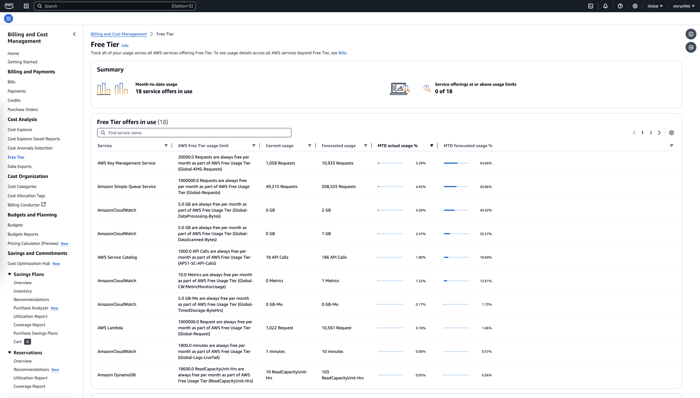

# AWS Free Tier

The AWS Free Tier enables users to explore and utilize AWS services at no cost, within specified usage limits. It comprises three offer types:

1. **12 Months Free**: Available to new AWS customers for 12 months from the account activation date. Services under this offer include:
   - **Amazon EC2**: 750 hours per month of t2.micro or t3.micro instances.
   - **Amazon S3**: 5 GB of standard storage.
   - **Amazon RDS**: 750 hours per month of db.t2.micro or db.t3.micro instances.

2. **Always Free**: These offers are available to all AWS customers and do not expire. Examples include:
   - **AWS Lambda**: 1 million free requests and 3.2 million seconds of compute time per month.
   - **Amazon DynamoDB**: 25 GB of storage with 25 read and write capacity units.

3. **Free Trials**: Short-term trials for specific services, starting from the first use. For instance:
   - **Amazon Redshift**: 60 days free trial with up to 750 hours per month.

**Important Considerations**:
- **Usage Monitoring**: Regularly monitor your usage to stay within the Free Tier limits and avoid unexpected charges.
- **Billing Alerts**: Set up billing alerts to be notified if usage approaches the Free Tier limits.
- **Service Availability**: Not all AWS services are included in the Free Tier. Review the [AWS Free Tier page](https://aws.amazon.com/free/) for detailed information.



https://us-east-1.console.aws.amazon.com/billing/home?region=us-east-1#/freetier

By leveraging the AWS Free Tier, users can gain hands-on experience with AWS services, develop and test applications, and understand service costs without initial financial commitments.
