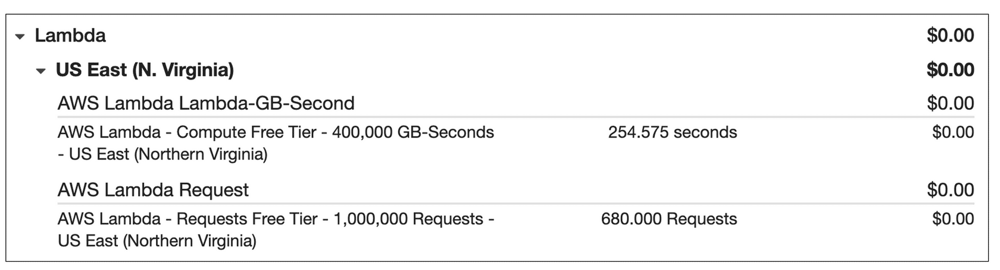
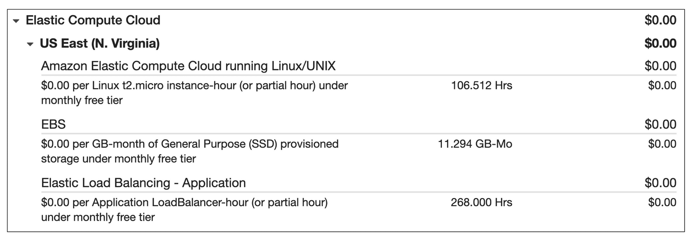
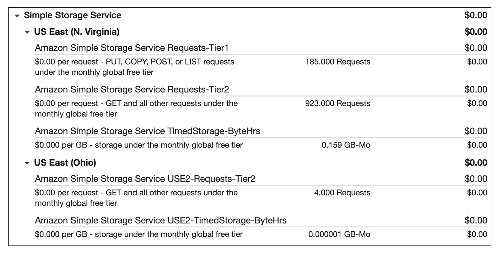

# AWS Pricing

AWS offers a flexible and transparent pricing model that empowers users to optimize their costs while benefiting from the scalability and performance of cloud computing. This guide explores key concepts, tools, and examples to help users understand and manage AWS pricing effectively.

## AWS Pricing Concepts

### 1. **Pay-As-You-Go**
AWS charges users based on actual usage, ensuring that they only pay for the resources they consume. This eliminates the need for long-term contracts or complex licensing agreements.

### 2. **Pay Less When You Reserve**
AWS offers savings plans and reserved instance pricing for users with predictable workloads:
- **Savings Plans**: Save up to 72% by committing to a consistent level of usage for 1 or 3 years.
- **Reserved Instances**: Ideal for workloads that run continuously, providing significant discounts compared to on-demand rates.

### 3. **Volume-Based Discounts**
AWS reduces per-unit costs as usage increases for services like Amazon S3, where larger storage volumes incur lower costs per GB.

---

## AWS Pricing Tools

### **AWS Pricing Calculator**
The AWS Pricing Calculator helps users estimate costs for AWS services based on their specific needs. Features include:
- Organizing estimates by cost centers or projects.
- Comparing costs across AWS Regions and instance types.
- Sharing estimates with others via a generated link.
[Learn more about the AWS Pricing Calculator](https://calculator.aws/)

---

## AWS Pricing Examples

### 1. **AWS Lambda**
- **Pricing Components**:
  - Number of requests: Charged based on the total number of function requests.
  - Compute duration: Charged for the execution time of the function.
- **Free Tier**: 1 million free requests and 3.2 million seconds of compute time per month.
- **Example**:
  - If usage is within the Free Tier limits, no charges are incurred.
  - Costs can be further reduced with Compute Savings Plans, which lower compute costs for committed usage.

---

### 2. **Amazon EC2**
- **Pricing Components**:
  - Compute time: Pay only for the time instances are running.
  - Additional savings through Spot Instances, Savings Plans, and Reserved Instances.
- **Example**:
  - Using Spot Instances for batch jobs can save up to 90%.
  - The Free Tier includes up to 750 hours per month for eligible t2.micro or t3.micro instances.

---

### 3. **Amazon S3**
- **Pricing Components**:
  - **Storage**: Charged based on object size, storage class, and duration.
  - **Requests and data retrievals**: Costs depend on the number of requests to access objects.
  - **Data transfer**: Intra-region transfers are free; other transfers may incur charges.
  - **Management and replication**: Features like inventory and analytics may have associated costs.
- **Example**:
  - Storing and retrieving photo files for a website incurs costs for requests and storage.
  - Transfers within the Free Tier (e.g., S3 to EC2 in the same region) are free.

---

## Benefits of AWS Pricing

- **Flexibility**: Start small and scale resources as needed.
- **Cost-Effectiveness**: Tailored pricing models for different workloads, ensuring savings.
- **Transparency**: Detailed billing and cost management tools for accurate cost tracking.
- **Free Tier**: Enables users to explore services without incurring charges for basic usage.

---

## Best Practices for Cost Optimization

1. **Right-Sizing Resources**: Match resource allocations to workload requirements.
2. **Utilize Discounts**: Commit to Savings Plans or Reserved Instances for predictable workloads.
3. **Leverage Spot Instances**: For non-critical or flexible workloads, utilize Spot Instances for lower costs.
4. **Monitor Usage**: Use tools like AWS Cost Explorer and AWS Budgets to track and optimize spending.

By understanding AWS pricing models, using cost management tools, and following best practices, users can maximize the value of their cloud investments while minimizing costs.
