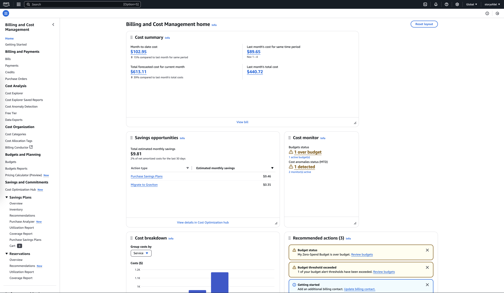
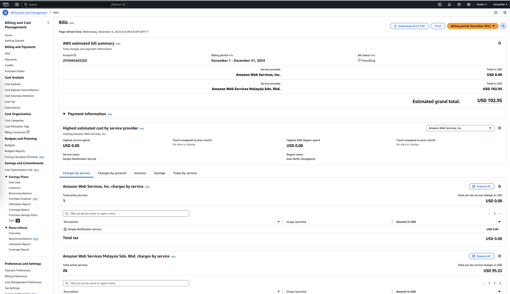
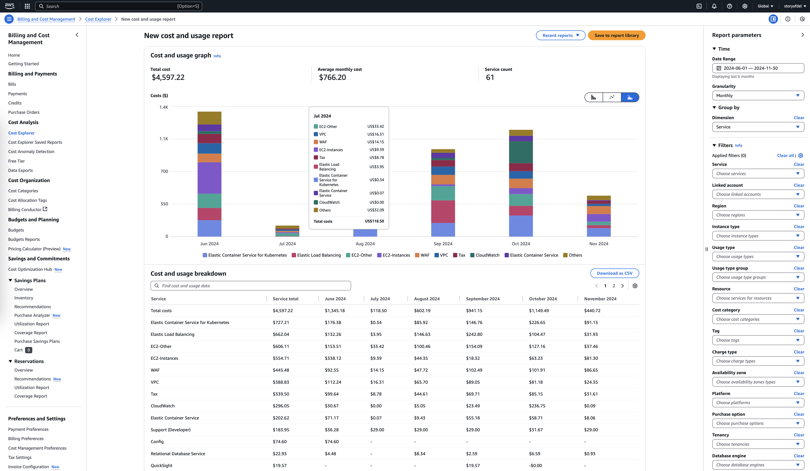
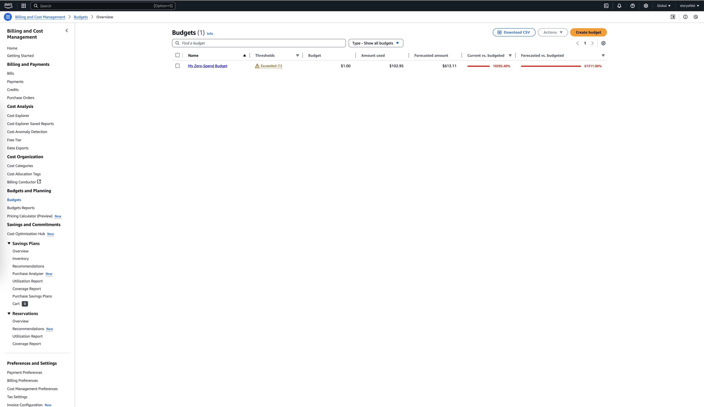
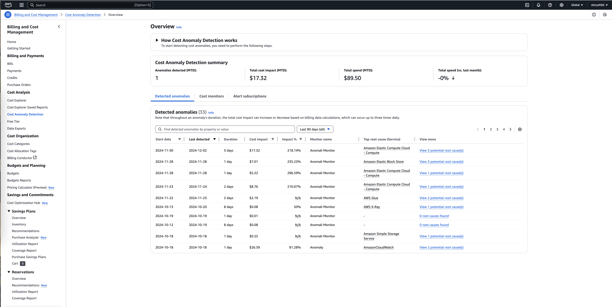
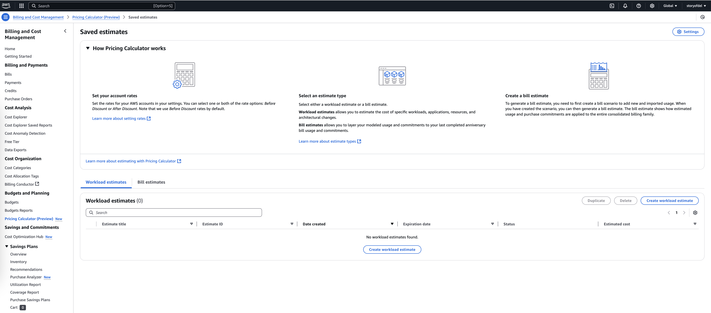

# AWS Billing and Cost Management

AWS Billing and Cost Management is a suite of tools designed to help users track, manage, and optimize their spending on AWS services. These tools provide transparency into costs, insights for resource utilization, and controls for budgeting, making it easier to manage cloud expenses efficiently.

---

## Key Concepts in Billing and Cost Management

### 1. **Pay-As-You-Go Model**
AWS uses a pay-as-you-go pricing model, meaning users only pay for the resources they consume without the need for upfront commitments or long-term contracts.

### 2. **Consolidated Billing**
For organizations with multiple AWS accounts, consolidated billing allows them to manage all accounts under a single payer account. Benefits include:
- Simplified billing management.
- Aggregated usage for volume discounts.
- Centralized tracking and reporting of costs.

### 3. **Billing Dashboard**
The Billing Dashboard provides a high-level overview of costs, including:
- Current month-to-date charges.
- Forecasted costs based on current usage trends.
- Access to detailed billing reports and invoices.

---

## Tools for Billing and Cost Management

### **1. AWS Billing Console**
The AWS Billing Console serves as the central hub for managing billing-related tasks, such as:
- Viewing monthly bills and usage reports.
- Managing payment methods.
- Setting up tax settings and preferences.

### **2. AWS Cost Explorer**
AWS Cost Explorer is a visualization tool for analyzing historical costs and usage. Features include:
- Customized reports based on service, region, or time period.
- Filtering and grouping options for granular analysis.
- Cost forecasting to predict future expenditures.

### **3. AWS Budgets**
AWS Budgets allows users to set custom cost and usage limits and receive alerts when thresholds are exceeded. Features include:
- Budget types for cost, usage, savings, and Reserved Instances.
- Notifications via email or SNS for budget alerts.
- Integration with Cost Explorer for detailed analysis.

### **4. AWS Cost Anomaly Detection**
This tool uses machine learning to identify unusual spending patterns automatically. Benefits include:
- Quick identification of unexpected spikes or trends.
- Notifications to address anomalies promptly.
- Customization for specific services or accounts.

### **5. AWS Pricing Calculator**
This tool helps estimate the cost of AWS services before deployment. Features include:
- Customization of configurations to align with use cases.
- Cost comparison across AWS services and regions.
- Sharing and saving estimates for collaboration.

---

## Features for Cost Optimization

### 1. **Savings Plans and Reserved Instances**
- **Savings Plans**: Commit to consistent usage for discounts on compute services.
- **Reserved Instances**: Save on long-term workloads with 1-year or 3-year commitments.

### 2. **Spot Instances**
Leverage unused AWS capacity for up to 90% cost savings on compute resources.

### 3. **Cost Allocation Tags**
Assign tags to resources to group and track costs by projects, teams, or applications.

### 4. **Resource Rightsizing**
Analyze underutilized resources and optimize for cost efficiency using tools like AWS Compute Optimizer.

---

## Monitoring and Reporting

### **1. Detailed Billing Reports**
Detailed billing reports provide granular information about usage and costs. Reports can be downloaded in CSV format for external analysis.

### **2. Billing Alerts**
Set up billing alerts to notify users when spending exceeds a specified threshold. Alerts can be sent via email or through Amazon Simple Notification Service (SNS).

### **3. AWS Trusted Advisor**
Trusted Advisor offers insights and recommendations to optimize costs, improve security, and enhance performance.

---

## Real-World Scenarios

### Example 1: Cost Control for Multi-Account Organizations
A large enterprise uses Consolidated Billing to manage multiple AWS accounts. By aggregating usage, they qualify for volume discounts, saving costs across the organization.

### Example 2: Budgeting for a Project
A team sets up an AWS Budget to track spending for a new application deployment. They receive alerts when the project budget exceeds 80% of its allocated cost, enabling them to adjust resources proactively.

---

## Best Practices for Billing and Cost Management

1. **Enable Cost Allocation Tags**: Tag all resources for precise cost tracking and reporting.
2. **Regularly Review Usage**: Use AWS Cost Explorer to monitor trends and identify inefficiencies.
3. **Set Budgets**: Create AWS Budgets to align cloud spending with organizational goals.
4. **Optimize Reserved Instances**: Evaluate workloads and commit to Savings Plans or Reserved Instances where applicable.
5. **Leverage Spot Instances**: Use Spot Instances for flexible, non-critical workloads to reduce costs.

By leveraging AWS Billing and Cost Management tools, organizations can maintain control over their cloud expenses, optimize resource utilization, and ensure that their investments align with business objectives.
