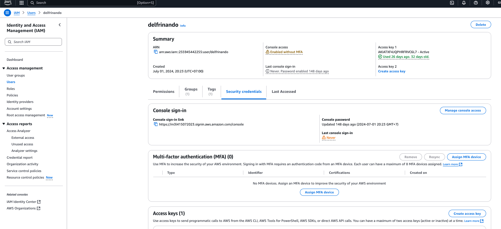
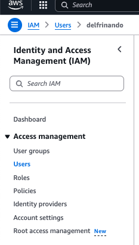
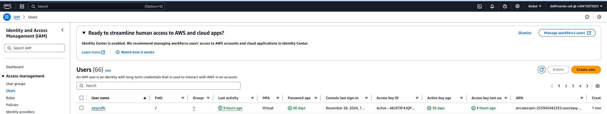
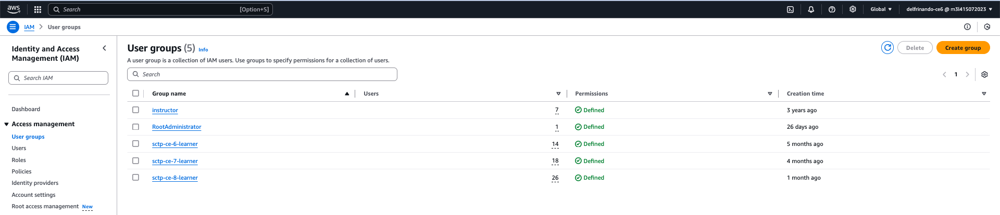
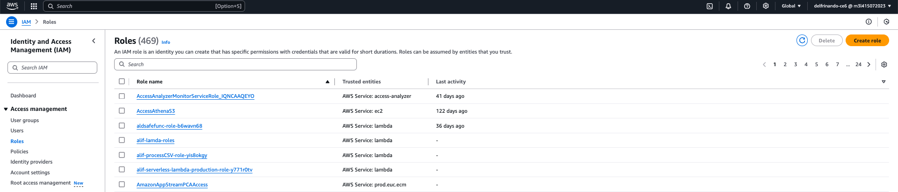

# AWS Identity and Access Management (IAM)

## **Learning Objectives**

By the end of this module, participants will be able to:

1. **Understand the structure and purpose of AWS IAM identities**, including root users, IAM users, groups, and roles, in managing access to AWS resources.  
2. **Differentiate between IAM users and roles**, and identify scenarios where each is most appropriate for managing secure access.  
3. **Apply best practices for IAM identity management**, including the use of temporary credentials and centralized access through IAM Identity Center.

---
## Overview

AWS Identity and Access Management (IAM) is a web service that helps securely control access to AWS resources. IAM allows management of permissions to determine which AWS resources users can access. It provides the necessary infrastructure for controlling authentication (who can sign in) and authorization (what actions can be performed) for an AWS account.



## IAM Identities (Users, User Groups, and Roles)

### IAM Identity Overview

An AWS account root user or an administrative user for the account can create IAM identities. IAM identities provide access to an AWS account and can be in the form of users, user groups, or roles. Each IAM identity can be associated with one or more policies that determine what actions the identity can perform on which AWS resources and under what conditions.

### AWS Account Root User

The root user is the initial sign-in identity created when an AWS account is set up. This identity has complete access to all AWS services and resources in the account and is accessed using the email address and password used to create the account.

> **Important:** It is strongly recommended not to use the root user for everyday tasks. Safeguard the root user credentials and use them only for tasks that require root access, as listed in the IAM User Guide.

### IAM Users

IAM users are individual identities within an AWS account with specific permissions. Best practices suggest using temporary credentials instead of creating IAM users with long-term credentials (e.g., passwords or access keys). IAM users should only be created for use cases not supported by federated users.

### IAM User Groups

An IAM user group is a collection of IAM users managed as a unit. Groups allow easy management of permissions for multiple users. For example, an IAM group named "Developers" can be assigned permissions commonly needed for development tasks.

### IAM Roles

IAM roles are identities within an AWS account that have specific permissions but are not associated with a particular user. Roles can be temporarily assumed to perform specific tasks. Common use cases for IAM roles include:

- **Federated User Access**: Roles are used to grant federated identities temporary permissions for AWS resources.
- **Cross-Account Access**: Roles allow access to resources in one AWS account from another account.
- **Cross-Service Access**: AWS services can use roles to perform tasks in other services.
- **Applications on Amazon EC2**: Roles manage temporary credentials for applications running on EC2 instances, allowing them to securely interact with other AWS services.

### Temporary Credentials in IAM

Temporary credentials are primarily used with IAM roles but can also be requested for IAM users. These credentials expire automatically and offer a more secure approach than long-term credentials.

## When to Use IAM Identity Center Users

IAM Identity Center is recommended for managing access for human users. Benefits include:

- Centralized identity and permissions management across all AWS accounts in an organization.
- Temporary credentials.
- Integration with existing identity providers.
- MFA support and self-service configuration.

## When to Create an IAM User (Instead of a Role)

IAM users should only be created for scenarios where federated users are not supported, such as:

- Workloads that cannot use IAM roles.
- Third-party AWS clients that do not support IAM Identity Center.
- Access to AWS CodeCommit repositories using SSH or service-specific credentials.
- Testing compatibility with services like Amazon Keyspaces (for Apache Cassandra).
- Emergency access scenarios.

## When to Create an IAM Role (Instead of a User)

Create an IAM role in the following cases:

- Running an application on Amazon EC2 that requires access to AWS resources.
- Developing mobile apps that need to authenticate users and access AWS resources.
- Allowing users from a corporate network to access AWS without requiring additional sign-in.



## Comparing AWS Account Root User Credentials and IAM User Credentials

### Root User Credentials

The root user is the account owner and has unrestricted access to all resources. As a security measure, root user credentials should only be used for critical tasks that cannot be delegated to other identities. Safeguard these credentials and consider using IAM Identity Center for daily operations.

### IAM Credentials

IAM users represent entities (e.g., people or applications) with specific permissions within an AWS account. Although IAM users can have long-term credentials (username/password), using temporary credentials via IAM roles or federated access is strongly recommended.
