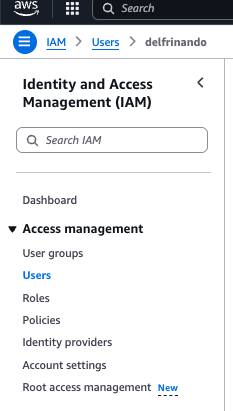

# Creating an AWS Access Key ID

Follow these steps to create an AWS Access Key ID for your IAM user.

## 1. Log in to the AWS Management Console

1. Open your browser and navigate to the [AWS Management Console](https://aws.amazon.com/console/).
2. Log in using your IAM account credentials (not your root account).

## 2. Open the IAM Dashboard

1. In the AWS Management Console, use the **Find Services** search box at the top.
2. Type `IAM` and select **IAM** from the search results to open the IAM dashboard.

## 3. Navigate to Users

1. In the left navigation panel, select **Users**.
2. From the list of users, select the user for which you want to create the access key.

## 4. Create the Access Key

1. On the selected user's summary page, choose the **Security Credentials** tab.
2. Scroll down to the **Access keys** section.
3. Click **Create access key**.

## 5. Download and Save the Access Key

1. After creating the access key, you’ll see both the **Access Key ID** and **Secret Access Key**.
2. **Important:** Save this information securely. You can either:
   - Copy and paste both keys to a secure document.
   - Click **Download .csv file** to save the keys as a CSV file.

**Note:** You will not be able to view the secret access key again after this step. If you lose it, you will need to create a new access key.

## 6. Store the Access Key Securely

For security best practices:
- Store the access key in a secure password manager.
- Do not hard-code the access key in your application code. Instead, use environment variables or configuration files.

**For more information, please see the [official AWS documentation](https://docs.aws.amazon.com/IAM/latest/UserGuide/id_credentials_access-keys.html).**
