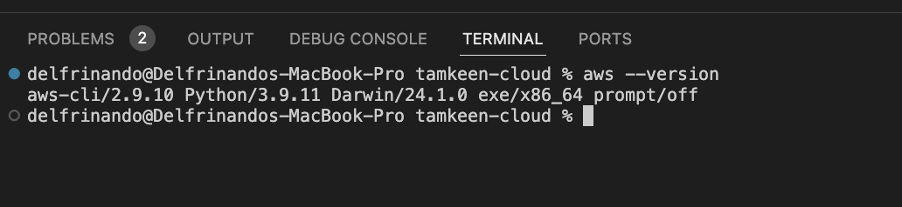

# AWS Command Line Interface (AWS CLI)

The AWS Command Line Interface (AWS CLI) is an open-source tool that enables interaction with AWS services through commands executed in a command-line shell. With minimal configuration, the AWS CLI allows users to run commands that implement functionality equivalent to what is available in the browser-based AWS Management Console directly from the terminal program:

- **Linux Shells** – Users can run commands in Linux or macOS using common shell programs such as bash, zsh, and tcsh.
- **Windows Command Line** – On Windows, users can execute commands via the Windows command prompt or in PowerShell.
- **Remotely** – Commands can be run on Amazon Elastic Compute Cloud (Amazon EC2) instances through a remote terminal program such as PuTTY or SSH, or using AWS Systems Manager.

All infrastructure as a service (IaaS) administration, management, and access functions available in the AWS Management Console are also accessible via the AWS API and AWS CLI. New AWS IaaS features and services offer full AWS Management Console functionality through the API and CLI at launch or within 180 days of launch.

The AWS CLI provides direct access to the public APIs of AWS services, enabling users to explore service capabilities and develop shell scripts to manage resources. Beyond the low-level, API-equivalent commands, several AWS services offer customizations for the AWS CLI. These customizations may include higher-level commands designed to simplify the use of services with complex APIs.





# About AWS CLI Version 2

The AWS CLI version 2 is the most recent major release of the AWS CLI and supports all the latest features. Some features introduced in version 2 are not backported to version 1, making it necessary to upgrade in order to access those features. Additionally, there are some "breaking" changes in version 2 that may require script modifications. For a list of these breaking changes, refer to the guide on migrating from AWS CLI version 1 to version 2.

AWS CLI version 2 is available for installation only as a bundled installer. While it may be found in some package managers, these are unsupported and unofficial packages that are neither produced nor managed by AWS. It is recommended to install the AWS CLI only from official AWS distribution points, as documented in the official guide.


To check the currently installed version, use the following command:

```bash
$ aws --version
aws-cli/2.17.20 Python/3.11.6 Linux/5.10.205-195.807.amzn2.x86_64 botocore/1.18.6
```



# Prerequisites to Use the AWS CLI Version 2

To access AWS services with the AWS CLI, an AWS account and IAM credentials are required. When running AWS CLI commands, the AWS CLI needs access to those AWS credentials. To enhance the security of the AWS account, it is recommended not to use root account credentials. Instead, users should be created with the principle of least privilege, providing only the access necessary for the tasks being performed in AWS.
