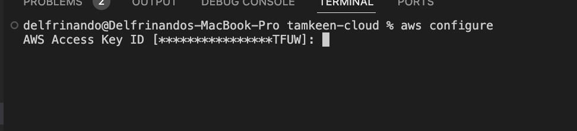

# AWS CLI Install and Update Instructions

### Installation Instructions

For detailed instructions on installing or updating the AWS CLI, please visit the [official documentation](https://docs.aws.amazon.com/cli/latest/userguide/getting-started-install.html).


# Configuring AWS CLI

## 1. Open Your Terminal

Open your preferred terminal or command prompt. For example:
- **Linux or macOS:** Use `bash`, `zsh`, or `tcsh`.
- **Windows:** Use Command Prompt or PowerShell.

## 2. Run the AWS Configure Command



In your terminal, type the following command:

```bash
aws configure
```

This command starts the configuration process by prompting you to enter your AWS credentials and settings.

## 3. Enter the AWS Access Key ID

The terminal will prompt you to enter your **AWS Access Key ID**:

```bash
AWS Access Key ID [None]: AKIA*************VPMC
```

- Replace the placeholder with your actual access key ID, which you can retrieve from the IAM dashboard.

## 4. Enter the AWS Secret Access Key

Next, you’ll be asked for your **AWS Secret Access Key**:

```bash
AWS Secret Access Key [None]: eZO***********************wFap
```

- Replace the placeholder with your actual secret access key.

## 5. Specify the Default Region Name

You’ll be prompted to enter the **Default region name**:

```bash
Default region name [None]: eu-central-1
```

- Specify the AWS region you want to use by default. You can find this information in the top right corner of your AWS console. Common region codes include:
  - `us-east-1` (N. Virginia)
  - `us-west-2` (Oregon)
  - `eu-west-1` (Ireland)
  - `ap-southeast-1` (Singapore)

## 6. Specify the Default Output Format

Finally, you’ll be prompted to specify the **Default output format**:

```bash
Default output format [None]: json
```

- Choose from the following options:
  - `json` (recommended for most users)
  - `text` (for plaintext)
  - `table` (for a more readable table format)

If you’re unsure, `json` is a good default choice.

## 7. Verify Your Configuration

To confirm that your settings are correctly configured, you can run a simple command:

```bash
aws ec2 describe-vpcs
```

You should see output similar to this:

```json
{
    "Vpcs": [
        {
            "CidrBlock": "172.31.0.0/16",
            "VpcId": "vpc-a71cfcce",
            "IsDefault": true
        }
    ]
}
```