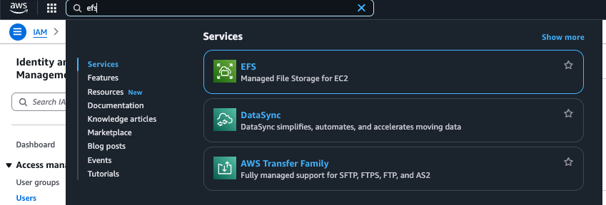

# Amazon Elastic File System

Amazon Elastic File System (Amazon EFS) provides serverless, fully elastic file storage that allows sharing of file data without the need to provision or manage storage capacity and performance. Amazon EFS is designed to scale on demand to petabytes without disrupting applications, automatically growing and shrinking as files are added and removed. With a simple web services interface, you can quickly and easily create and configure file systems. The service manages all the file storage infrastructure, allowing you to avoid the complexity of deploying, patching, and maintaining complex file system configurations.

Amazon EFS supports the Network File System version 4 (NFSv4.1 and NFSv4.0) protocol, ensuring that existing applications and tools work seamlessly with Amazon EFS. The service is accessible across most types of Amazon Web Services compute instances, including Amazon EC2, Amazon ECS, Amazon EKS, AWS Lambda, and AWS Fargate.

Amazon EFS is designed to be highly scalable, highly available, and highly durable. The service offers two file system types to meet different availability and durability needs:

- **Regional (Recommended):** Regional file systems store data redundantly across multiple geographically separated Availability Zones within the same AWS Region. This setup provides continuous availability to the data, even if one or more Availability Zones are unavailable.

- **One Zone:** One Zone file systems store data within a single Availability Zone, offering continuous availability to the data within that zone. However, if the Availability Zone experiences loss or damage, data in these file systems could be lost.

Amazon EFS provides the throughput, IOPS, and low latency needed for a wide range of workloads. EFS file systems can scale to petabytes, drive high throughput levels, and enable massively parallel access from compute instances. The default modes recommended for most workloads include:

- **General Purpose:** Ideal for latency-sensitive applications like web-serving environments, content management systems, home directories, and general file serving.

- **Elastic:** Designed to automatically scale throughput performance up or down based on workload activity.

Amazon EFS offers file-system-access semantics, including strong data consistency and file locking. It also supports access control through Portable Operating System Interface (POSIX) permissions.

Amazon EFS supports authentication, authorization, and encryption capabilities to help meet security and compliance requirements. It offers two forms of encryption for file systems:

- **Encryption at rest:** Enable this option during file system creation to ensure all data and metadata are encrypted.
- **Encryption in transit:** Enable this option when mounting the file system for secure data transfer.

Access to EFS via NFS clients is controlled through AWS Identity and Access Management (IAM) policies and network security policies like security groups.

---
---

## Features of Amazon EFS

The following are key features of Amazon Elastic File System (Amazon EFS):

### 1. Authentication and Access Control

To make Amazon EFS API requests, such as creating a file system, valid credentials are required, along with permissions to create or access resources. Users and roles created in AWS Identity and Access Management (IAM) must be granted appropriate permissions. IAM authorization for NFS clients simplifies access management at scale. IAM authorization is optimized for cloud environments and allows managing access using IAM policies.

### 2. Data Consistency in Amazon EFS

Amazon EFS offers close-to-open consistency semantics typical of NFS systems. Write operations for Regional file systems are durably stored across Availability Zones in cases like:

- Performing a synchronous write operation (e.g., using the `O_DIRECT` flag with the `open` Linux command, or the `fsync` Linux command).
- Closing a file.

For applications with synchronous data access and non-appending writes, Amazon EFS can provide stronger consistency guarantees, offering read-after-write consistency.

### 3. File Locking

Amazon EFS supports NFS version 4 file locking, including byte-range locking for read and write operations. It only supports advisory locking, meaning read/write operations don’t check for conflicting locks before executing. Applications should handle synchronization issues considering NFS semantics like close-to-open consistency.

A single file can have up to 512 locks across all instances and users accessing it.

### 4. Availability and Durability of EFS File Systems

Amazon EFS offers two file system types:

- **Regional (Recommended):** Data is stored redundantly across multiple Availability Zones within an AWS Region, providing high durability and availability even during zone failures.
- **One Zone:** Data is stored within a single Availability Zone. While offering continuous availability, it may result in data loss if the entire Availability Zone is compromised.

For enhanced protection, Amazon EFS backs up One Zone file systems using AWS Backup, with recovery options across different Availability Zones or Regions.

### 5. EFS Storage Classes

Amazon EFS provides various storage classes to optimize storage for different use cases:

- **EFS Standard:** Uses SSD storage for low-latency performance of frequently accessed files.
- **EFS Infrequent Access (IA):** Cost-optimized for data accessed a few times each quarter.
- **EFS Archive:** Cost-optimized for data accessed a few times each year or less.

### 6. Storage Class Pricing

You are billed based on data stored in each class and additional charges apply for data access in IA or Archive classes, as well as throughput in Provisioned and Bursting modes.

### 7. Lifecycle Management

Amazon EFS supports lifecycle management, automatically transitioning data between storage classes based on defined lifecycle policies to manage costs effectively.

### 8. Replication

Amazon EFS allows creating a replica of a file system in a preferred AWS Region. The replication process is automatic and continuous, synchronizing data and metadata between the source and destination file systems. This feature ensures a recovery point objective (RPO) and a recovery time objective (RTO) of minutes, helping meet compliance and business continuity goals.

---



---