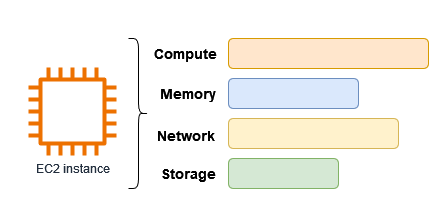
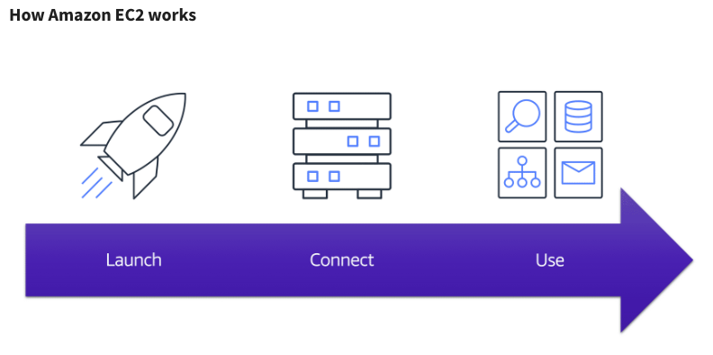

# Amazon EC2

Amazon Elastic Compute Cloud (Amazon EC2) offers on-demand, scalable compute capacity within the AWS Cloud. By leveraging Amazon EC2, organizations can minimize hardware expenses and accelerate application development and deployment. EC2 instances provide the flexibility to launch as many or as few virtual servers as needed, with configurable security, networking, and storage options. Instances can be scaled up to handle compute-intensive workloads, such as traffic surges on websites, or scaled down when demand decreases.

An EC2 instance functions as a virtual server hosted in the AWS Cloud. The chosen instance type determines the available hardware resources, including compute power, memory, network bandwidth, and storage options to meet various application needs.



--- 



---

## Accessing Amazon EC2

There are several interfaces to create and manage Amazon EC2 instances:

### 1. **Amazon EC2 Console**

The Amazon EC2 console is a web-based interface for creating and managing instances and resources. After registering an AWS account, users can access the Amazon EC2 console by signing into the AWS Management Console and selecting EC2 from the homepage.

### 2. **AWS Command Line Interface (CLI)**

The AWS CLI facilitates interaction with AWS services through command-line commands and is available on Windows, Mac, and Linux. More details can be found in the [AWS Command Line Interface User Guide](https://docs.aws.amazon.com/cli/latest/userguide/). Specific commands for Amazon EC2 are listed in the [AWS CLI Command Reference](https://docs.aws.amazon.com/cli/latest/reference/ec2/).

### 3. **AWS CloudFormation**

AWS CloudFormation allows users to create and manage EC2 resources by defining templates in JSON or YAML format. These templates describe AWS resources, and CloudFormation provisions and configures them accordingly. Templates can be reused for consistent deployments across multiple Regions and accounts. For supported resource types and properties, refer to the [EC2 resource type reference](https://docs.aws.amazon.com/AWSCloudFormation/latest/UserGuide/AWS_EC2.html).

### 4. **AWS SDKs**

AWS SDKs provide language-specific APIs for developers to build applications, simplifying tasks such as signing requests, retrying failed requests, and handling errors. SDKs include libraries, sample code, and tutorials. More information is available at [Tools to Build on AWS](https://aws.amazon.com/tools/).

### 5. **AWS Tools for PowerShell**

AWS Tools for PowerShell are modules that extend the functionality of the AWS SDK for .NET, enabling users to script operations on AWS resources from the PowerShell command line. Details can be found in the [AWS Tools for Windows PowerShell User Guide](https://docs.aws.amazon.com/powershell/latest/userguide/), with cmdlets for Amazon EC2 listed in the [Cmdlet Reference](https://docs.aws.amazon.com/powershell/latest/reference/index.html).

### 6. **Query API**

The Amazon EC2 Query API allows HTTP or HTTPS requests using the HTTP verbs GET or POST with a Query parameter named "Action." For more details on EC2 API actions, refer to the [Amazon EC2 API Reference](https://docs.aws.amazon.com/AWSEC2/latest/APIReference/).

## How Amazon EC2 Works



### 1. Launch

To launch an EC2 instance, select a template with basic configurations, including the operating system, application server, or applications. Choose the instance type, specifying the hardware configuration such as CPU and memory. Configure security settings to control network traffic to and from the instance.

### 2. Connect

Connect to your instance through various methods, allowing programs and applications to exchange data. Users can also log in to access the instance’s desktop interface.

### 3. Use

Once connected, the instance can be used to run commands, install software, manage storage, organize files, and perform other administrative tasks.

## Getting Started with Amazon EC2

### Key Components for Launching an Instance

- **Image**: A template that includes the software to be run on the instance, such as the operating system.
- **Key Pair**: Security credentials used for authentication. The public key is stored on the instance, and the private key remains on the local machine.
- **Network**: Amazon VPC (Virtual Private Cloud) serves as the virtual network for the AWS account. By default, each AWS Region has a VPC with subnets in each Availability Zone.
- **Security Group**: A virtual firewall that controls the inbound and outbound traffic to the instance.
- **EBS Volume**: The root storage volume for the instance, with the option to add additional data volumes.

## Cost Considerations for EC2

For new AWS accounts within 12 months and under the AWS Free Tier benefits, launching an EC2 instance as described in this guide may not incur charges. However, accounts that exceed Free Tier limits or are older will incur standard Amazon EC2 usage fees from the time the instance is launched until it is terminated, regardless of activity.