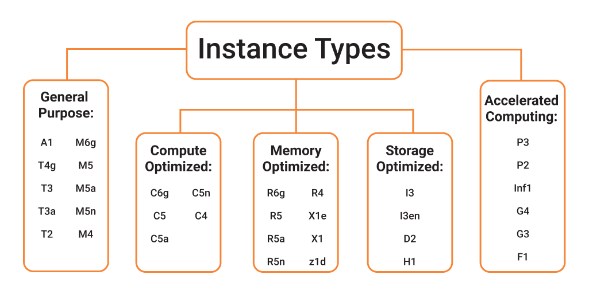

# Amazon EC2 Instances

An Amazon EC2 instance is a virtual server within the AWS cloud environment, granting users complete control over their instances from the moment they are launched to when they are terminated. Upon launching an instance, users have the flexibility to choose from a variety of operating systems and can connect to and customize their instance according to their specific needs. This customization includes configuring the operating system, installing updates, and adding applications.

Amazon EC2 offers a diverse range of instance types, each providing varying levels of compute resources, memory, storage, and network performance, allowing users to select the most suitable instance type for their applications.

Amazon EC2 follows a pay-as-you-go model, where billing begins when an instance is launched and enters the running state. Billing pauses when an instance is stopped and resumes when it is restarted. Once an instance is terminated, billing ceases as it transitions to the shutting down state.

Amazon EC2 includes features designed to optimize both the performance and cost-efficiency of instances. Users can utilize **Amazon EC2 Fleet** or **Amazon EC2 Auto Scaling** to dynamically adjust their capacity in response to changes in instance utilization. Additionally, costs can be minimized by leveraging **Spot Instances** or **Savings Plans**.

## Amazon EC2 Instance Types

When launching an EC2 instance, the specified instance type determines the hardware of the host computer used for the instance. Each instance type offers different combinations of compute, memory, and storage capabilities and is categorized into an instance family based on these features. Users should select an instance type based on the specific requirements of the application or software being run on the instance.

Amazon EC2 dedicates certain resources of the host computer, such as CPU, memory, and instance storage, to a specific instance. Other resources, like the network and disk subsystem, are shared among instances. If multiple instances on a host computer attempt to use the same shared resource, each instance receives an equal share. However, an instance can consume more of a shared resource when it is underutilized by others.

Each instance type offers varying minimum performance from shared resources. For example, instance types with high I/O performance have a larger share of resources, which reduces the variance in I/O performance. Most applications require moderate I/O performance, but for applications needing greater or more consistent I/O, a higher I/O performance instance type is recommended.

### Instance Type Naming Conventions

Instance types are named based on the following components:
- **Instance family**
- **Generation**
- **Processor family**
- **Capabilities**
- **Size**

For more information, refer to the naming conventions in the <a href="https://docs.aws.amazon.com/AWSEC2/latest/UserGuide/instance-types.html#instance-type-summary" target="_blank">Amazon EC2 Instance Types Guide</a>.

### Current Generation Instances

#### General Purpose:
- M5, M5a, M5ad, M5d, M5dn, M5n, M5zn
- M6a, M6g, M6gd, M6i, M6id, M6idn, M6in
- M7a, M7g, M7gd, M7i, M7i-flex
- Mac1, Mac2, Mac2-m1ultra, Mac2-m2, Mac2-m2pro
- T2, T3, T3a, T4g

#### Compute Optimized:
- C5, C5a, C5ad, C5d, C5n
- C6a, C6g, C6gd, C6gn, C6i, C6id, C6in
- C7a, C7g, C7gd, C7gn, C7i, C7i-flex

#### Memory Optimized:
- R5, R5a, R5ad, R5b, R5d, R5dn, R5n
- R6a, R6g, R6gd, R6i, R6id, R6idn, R6in
- R7a, R7g, R7gd, R7i, R7iz, R8g
- U-3tb1, U-6tb1, U-9tb1, U-12tb1, U-18tb1, U-24tb1, U7i-12tb, U7in-16tb, U7in-24tb, U7in-32tb
- X1, X1e, X2gd, X2idn, X2iedn, X2iezn
- z1d

#### Storage Optimized:
- D2, D3, D3en, H1, I3, I3en, I4g, I4i, Im4gn, Is4gen

#### Accelerated Computing:
- DL1, DL2q, F1, G4ad, G4dn, G5, G5g, G6, G6e, Gr6, Inf1, Inf2, P2, P3, P3dn, P4d, P4de, P5, Trn1, Trn1n, VT1

#### High-Performance Computing:
- Hpc6a, Hpc6id, Hpc7a, Hpc7g
