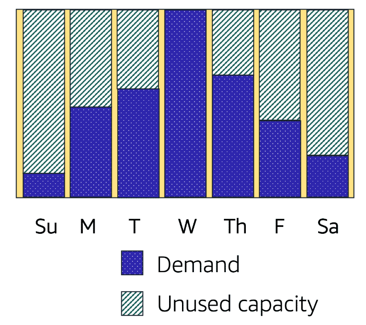
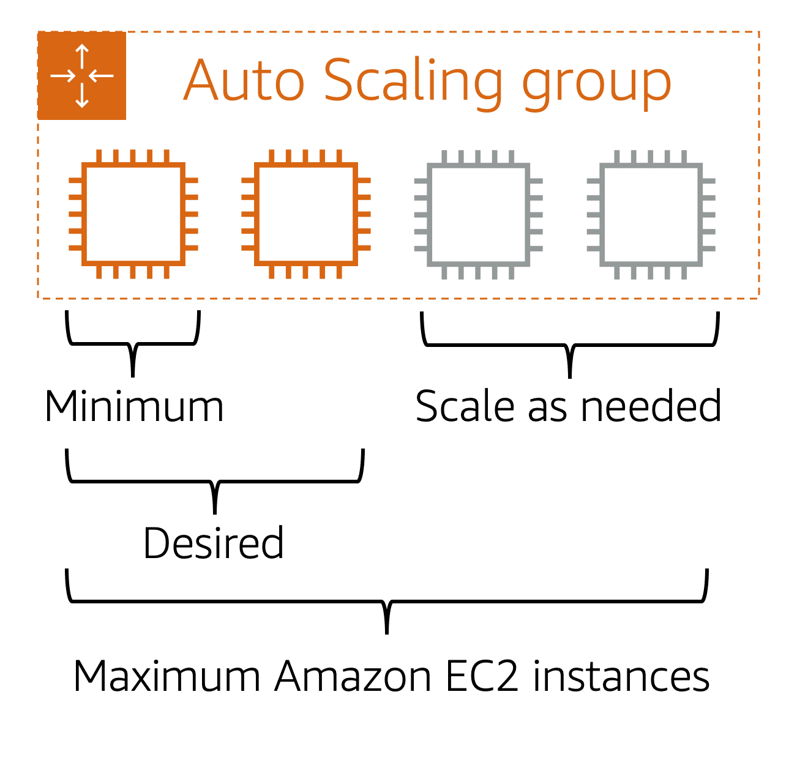

# Scaling Amazon EC2

## Scalability

Scalability involves starting with only the necessary resources and designing the architecture to automatically adjust to changing demands by scaling out (adding resources) or scaling in (removing resources). This ensures that costs are aligned with resource usage, eliminating concerns over insufficient computing capacity for customer needs.

To automate the scaling process, the AWS service used is **Amazon EC2 Auto Scaling**.

### Amazon EC2 Auto Scaling

Imagine a scenario where a website is slow or times out due to an overload of requests. This is akin to a busy coffee shop with only one barista handling many customers. **Amazon EC2 Auto Scaling** solves this issue by automatically adding or removing EC2 instances to respond to changing application demands. This feature helps maintain application availability and ensures the optimal use of resources.

Amazon EC2 Auto Scaling can be configured using:

- **Dynamic scaling**: Adjusts the number of instances based on real-time changes in demand.
- **Predictive scaling**: Anticipates demand and schedules the appropriate number of instances ahead of time.

In the cloud, computing power is programmatic, enabling a flexible approach to scaling. By incorporating **Amazon EC2 Auto Scaling** into an application, instances can be added when needed and terminated when no longer required.

### Setting Up an Auto Scaling Group

When launching an application on Amazon EC2, an **Auto Scaling group** can be configured with the following parameters:

- **Minimum Capacity**: The minimum number of instances that should always be running. For example, setting this to one ensures at least one instance is active.
- **Desired Capacity**: The targeted number of instances for normal operations. This can be higher than the minimum. For instance, setting the desired capacity to two means two instances will run, even if the application only needs one instance to function.
- **Maximum Capacity**: The upper limit of instances that can be running to handle high demand. For instance, setting this to four allows the group to scale up to four instances at peak demand.

### Cost-Effective Scaling

Amazon EC2 Auto Scaling helps create a cost-efficient architecture by ensuring that you pay only for the instances you use, when you use them. This dynamic scaling model optimizes customer experience while keeping operational expenses low.

By implementing these scaling practices, your applications can handle varying loads seamlessly, maintaining performance and reliability.

