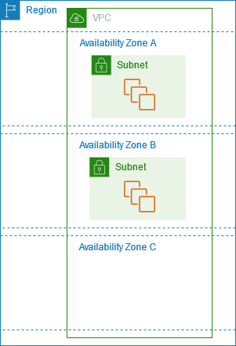
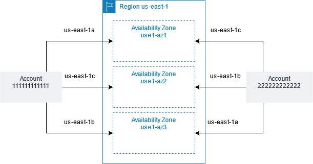
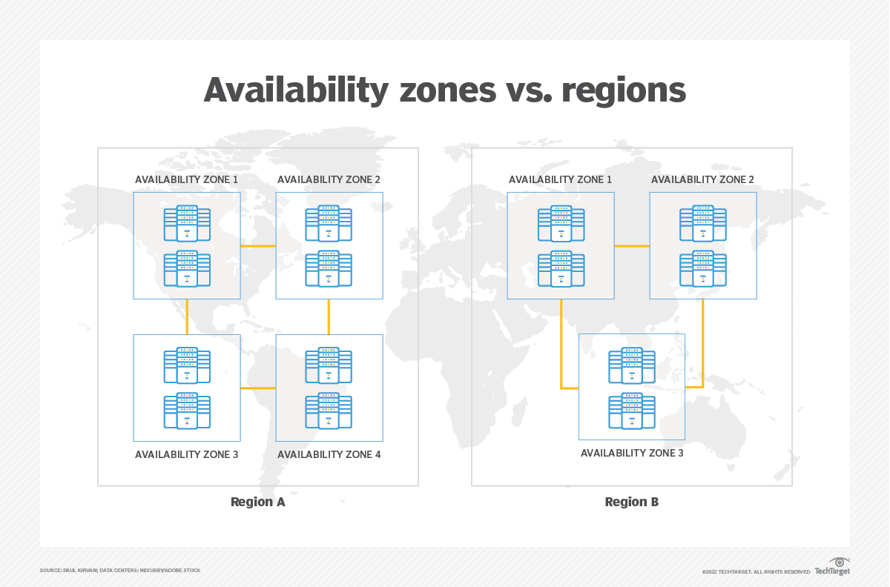

# AWS Availability Zones (AZs)

Availability Zones (AZs) are the building blocks of AWS's high-availability and fault-tolerant architecture. They are designed to ensure resilience and reliability for applications hosted on Amazon Web Services (AWS). In this guide, we’ll dive into what AZs are, their importance, and best practices for leveraging them in your cloud architecture.

---

## **What is an AWS Availability Zone?**

An **AWS Availability Zone (AZ)** is a physically distinct, independent data center or group of data centers within a single AWS Region. Each AZ is equipped with its own power, cooling, and networking infrastructure, ensuring high availability and fault tolerance.

While AZs are part of the same Region, they are isolated from each other to prevent localized failures from affecting multiple zones. This isolation provides the foundation for designing robust disaster recovery and failover solutions.

The following diagram illustrates multiple Availability Zones in an AWS Region. Availability Zone A and Availability Zone B each have one subnet, and each subnet has instances. Availability Zone C has no subnets, therefore you can't launch instances into this Availability Zone.




As Availability Zones expand over time, constraints may arise that limit their ability to accommodate additional resources. When such constraints occur, AWS might restrict the ability to launch new instances in a constrained Availability Zone unless an instance already exists in that zone for a particular account. Over time, AWS may also remove constrained Availability Zones from the list of available zones for new accounts. Consequently, the number of available Availability Zones in a Region may differ between accounts.

### **AZ IDs**

To ensure even distribution of resources across Availability Zones within a Region, AWS independently maps Availability Zones to codes for each account in its older Regions. For example, the Availability Zone labeled **us-east-1a** for one AWS account may correspond to a different physical location than the **us-east-1a** for another account.

To provide consistency across accounts in all Regions, including those with independently mapped Availability Zones, AWS uses **AZ IDs**. These are unique and consistent identifiers for a specific physical Availability Zone. For instance, **use1-az1** is an AZ ID in the **us-east-1** Region that corresponds to the same physical location for all AWS accounts.

AZ IDs allow users to determine the physical location of resources relative to those in another account. For example, if a subnet in an Availability Zone with the AZ ID **use1-az2** is shared between accounts, the subnet will be available in the corresponding Availability Zone with the AZ ID **use1-az2** in the other account. This ensures seamless resource coordination across accounts.

The following diagram illustrates two accounts with different mappings of Availability Zone code to AZ ID.




### **Key Features of AZs**
1. **Isolation**
   - Each AZ operates independently to protect workloads from localized failures like power outages or hardware malfunctions.
2. **Low-Latency Connectivity**
   - AZs within a Region are connected through high-speed, low-latency private networking, enabling seamless communication between them.
3. **Data Center Redundancy**
   - Each AZ has redundant power, networking, and cooling systems, reducing the risk of downtime.

---

## **Benefits of Using AWS Availability Zones**

### **1. High Availability**
By distributing applications and data across multiple AZs, organizations can ensure their workloads remain operational even if one AZ fails.

### **2. Fault Tolerance**
Isolated infrastructure reduces the risk of cascading failures. Deploying across multiple AZs enhances the fault tolerance of your applications.

### **3. Scalability**
Applications can scale horizontally by adding resources across multiple AZs, ensuring consistent performance during high traffic periods.

### **4. Disaster Recovery**
Using multiple AZs allows for disaster recovery strategies where critical applications automatically fail over to a different AZ during outages.

---

## **How AZs Differ from Regions**

| **Feature**                 | **Region**                              | **Availability Zone**                   |
|-----------------------------|-----------------------------------------|-----------------------------------------|
| **Definition**              | A geographically isolated cluster of data centers. | Independent data centers within a Region. |
| **Purpose**                 | Enable compliance, latency optimization, and regional fault tolerance. | Provide high availability and redundancy within a Region. |
| **Physical Location**       | Spanning countries or continents.       | Located within tens of miles from each other. |
| **Connectivity**            | Inter-Region networking incurs additional latency and costs. | Low-latency, high-speed connections between AZs. |

---



## **Best Practices for Using AZs**

### **1. Design for Multi-AZ Architectures**
- Deploy critical workloads, like databases and application servers, across multiple AZs.
- Use services like Amazon RDS Multi-AZ to replicate data across zones automatically.

### **2. Leverage Elastic Load Balancing**
- Use Elastic Load Balancers (ELBs) to distribute traffic across resources in multiple AZs, ensuring uninterrupted service.

### **3. Implement Fault-Tolerant Storage**
- Use Amazon S3 or Amazon EBS with snapshots to replicate data across AZs for durability and fault tolerance.

### **4. Automate Failover**
- Utilize services like AWS Elastic Beanstalk or Amazon Route 53 to automatically route traffic to healthy AZs in case of failures.

### **5. Test Disaster Recovery Plans**
- Regularly simulate AZ outages to ensure that your failover strategies work effectively.

---

## **Examples of Multi-AZ Deployments**

1. **Web Applications**
   - Deploy web servers across AZs with an Elastic Load Balancer to route user traffic dynamically.
2. **Relational Databases**
   - Use Amazon RDS with Multi-AZ deployments to replicate databases across AZs for high availability.
3. **Data Processing**
   - Distribute compute workloads (like Amazon EMR or Lambda functions) across AZs to enhance performance and fault tolerance.

---

## **Understanding AZ Naming and Availability**

Each AZ within a Region is assigned a unique identifier, such as `us-east-1a` or `ap-southeast-1b`. These identifiers:
- Correspond to physically distinct locations.
- Are Region-specific, meaning `us-east-1a` in the Northern Virginia Region is different from `us-west-1a` in the Northern California Region.

To check available AZs in a Region, you can use the AWS CLI:
```bash
aws ec2 describe-availability-zones --region <region_name>
```

---

## **When to Use Multiple AZs**

1. **High Availability and Redundancy**
   - For mission-critical applications where downtime is unacceptable.
2. **Disaster Recovery**
   - To ensure business continuity during data center outages.
3. **Scalability**
   - To distribute workloads effectively during traffic surges.
4. **Compliance**
   - For regulations that require redundancy within a specific geographic location.

---

## **Conclusion**

AWS Availability Zones are integral to building resilient and scalable cloud applications. By leveraging AZs, organizations can achieve high availability, fault tolerance, and disaster recovery within a single Region. Designing multi-AZ architectures ensures that your workloads remain operational and performant, even in the face of unexpected failures.
