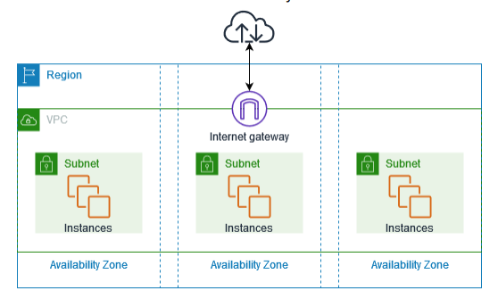
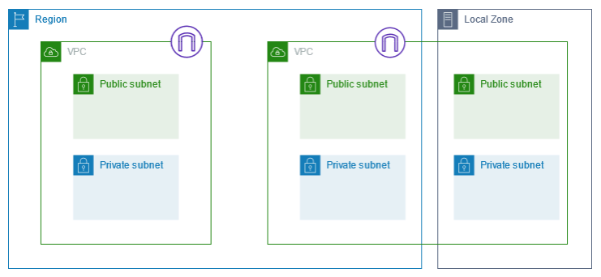

# AWS Networking

---

## **Introduction to AWS Networking**

AWS Networking forms the core of Amazon Web Services (AWS) infrastructure, allowing users to securely and efficiently manage connections between resources within AWS and the external internet. By understanding AWS Networking, users can design architectures that are scalable, secure, and tailored to their specific application requirements.

---

## **Learning Objectives**

At the end of this module, learners will:
1. Understand the concept and purpose of AWS networking.
2. Learn how to create and manage Virtual Private Clouds (VPCs).
3. Differentiate between public and private subnets and understand their use cases.
4. Explore the role of routing and route tables in traffic management.
5. Learn how gateways enable communication within AWS and beyond.

---

## Introduction to AWS Networking

AWS networking provides the foundation for deploying applications and services in a secure, scalable, and reliable environment. The core service enabling AWS networking is **Amazon Virtual Private Cloud (VPC)**, which allows users to create isolated virtual networks within the AWS cloud.

### **Key Features of AWS Networking**
- **Isolation:** Each VPC operates independently, providing a secure environment.
- **Customization:** Users can configure subnets, routing tables, and access controls.
- **Scalability:** Networking infrastructure scales automatically to handle traffic demands.

## **1. Virtual Private Cloud (VPC)**

### **1.1 What is a VPC?**
Amazon Virtual Private Cloud (Amazon VPC) is a networking service that allows users to establish boundaries around their AWS resources. Without these boundaries, network traffic could flow between millions of resources—such as Amazon EC2 instances—without restriction.

Amazon VPC enables users to provision an isolated section of the AWS Cloud where they can launch resources within a **virtual network** they define. Within this isolated environment, users can organize resources into **subnets**. A subnet is a section of a VPC that can contain resources like EC2 instances. It provides full control over network configurations, including:
- IP address range
- Subnets
- Route tables
- Gateways and endpoints

With Amazon Virtual Private Cloud (Amazon VPC), you can launch AWS resources in a logically isolated virtual network that you've defined. This virtual network closely resembles a traditional network that you'd operate in your own data center, with the benefits of using the scalable infrastructure of AWS.

The following diagram shows an example VPC. The VPC has one subnet in each of the Availability Zones in the Region, EC2 instances in each subnet, and an internet gateway to allow communication between the resources in your VPC and the internet.

### **1.2 Why Use a VPC?**
A VPC is critical for:
- **Security:** Isolate resources and control traffic flow with fine-grained access.
- **Customization:** Define your own IP ranges and subnet layouts.
- **Flexibility:** Build hybrid environments connecting AWS to on-premises data centers.

### **1.3 Key Features of VPC**
- **Customizable IP Ranges:** Assign IP ranges in CIDR format (e.g., `10.0.0.0/16`).
- **Scalability:** Subdivide the IP range into smaller segments using subnets.
- **Multiple AZ Support:** Span your VPC across multiple Availability Zones (AZs) for redundancy.
- **Secure Access:** Implement firewalls through Security Groups and Network ACLs.

### **1.4 Default vs. Custom VPC**
AWS provides a **default VPC** in each Region, preconfigured for ease of use. However, **custom VPCs** allow you to define specific configurations tailored to your application's requirements.

---

## **2. Subnets**

### **2.1 What are Subnets?**
Subnets are logical subdivisions of a VPC’s IP address range. They provide a way to segregate resources within the VPC for better management and security.

The diagram below illustrates two VPCs within a Region, each containing public and private subnets along with an internet gateway. Additionally, subnets can be configured in a Local Zone, as depicted in the diagram. A Local Zone is an AWS infrastructure extension that brings compute, storage, and database services closer to end users. Utilizing a Local Zone enables end users to run applications with single-digit millisecond latency requirements.

### **2.2 Public vs. Private Subnets**
1. **Public Subnets:**
   - Accessible from the internet.
   - Resources in these subnets (e.g., web servers) use an Internet Gateway (IGW) for communication.
   - Typically used for resources that need direct public access.

2. **Private Subnets:**
   - Isolated from the internet.
   - Used for backend resources (e.g., databases) that do not require direct internet access.
   - Can use a NAT Gateway for outbound internet traffic.

### **2.3 CIDR Ranges for Subnets**
Each subnet must have a unique CIDR range within the VPC. Example configuration:
- VPC CIDR: `10.0.0.0/16`
  - Public Subnet 1: `10.0.1.0/24`
  - Public Subnet 2: `10.0.2.0/24`
  - Private Subnet 1: `10.0.3.0/24`
  - Private Subnet 2: `10.0.4.0/24`

### **2.4 Subnet and AZ Mapping**
For fault tolerance, subnets can be deployed across multiple AZs. Example:
- Public Subnet 1: `us-east-1a`
- Public Subnet 2: `us-east-1b`
- Private Subnet 1: `us-east-1a`
- Private Subnet 2: `us-east-1b`

---

## **3. Security in VPCs**

### **3.1 Security Groups**
- Act as stateful firewalls for instances.
- Control inbound and outbound traffic based on rules.
- Example:
  - Allow inbound HTTP (port 80) and SSH (port 22) traffic.
  - Allow outbound traffic to any destination.

### **3.2 Network Access Control Lists (NACLs)**
- Operate at the subnet level, providing stateless traffic filtering.
- Explicitly allow or deny specific IP ranges, ports, or protocols.

### **3.3 Encryption and Access Control**
- Use **VPC Endpoints** for private connections to AWS services without exposing traffic to the internet.
- Enable **Flow Logs** for monitoring and auditing traffic within your VPC.

---

## **4. Routing in AWS**

### **4.1 What is Routing?**
Routing defines how traffic flows between subnets, VPCs, and external networks. Route tables specify the rules that direct traffic based on destination IP addresses.

### **4.2 Route Tables**

A route table is a collection of rules, known as routes, that define how network traffic within your VPC is directed. Subnets can be explicitly linked to a specific route table; if no explicit association is made, the subnet is automatically linked to the main route table.

Each rule in the route table specifies two key elements: the range of IP addresses the traffic is intended for (the destination) and the gateway, network interface, or connection used to deliver the traffic (the target).

1. **Main Route Table:**
   - Automatically created with the VPC.
   - Default table for all subnets unless explicitly assigned.

2. **Custom Route Tables:**
   - Created for specific use cases, such as separating public and private traffic.

### **4.3 Route Table Entries**
Route table entries include:
- **Destination:** Specifies the traffic’s target (e.g., `0.0.0.0/0` for all internet traffic).
- **Target:** Specifies the next hop for the traffic (e.g., IGW, NAT Gateway, or a local VPC).

### **4.4 Example Route Table**
For a public subnet:
| **Destination** | **Target**        | **Description**                |
|------------------|-------------------|--------------------------------|
| `10.0.0.0/16`    | Local             | Internal traffic within the VPC. |
| `0.0.0.0/0`      | Internet Gateway  | Internet traffic.              |

For a private subnet:
| **Destination** | **Target**      | **Description**                |
|------------------|-----------------|--------------------------------|
| `10.0.0.0/16`    | Local           | Internal traffic within the VPC. |
| `0.0.0.0/0`      | NAT Gateway     | Outbound internet traffic.     |

---

## **5. Gateways in AWS**

### **5.1 Internet Gateway (IGW)**

To allow public traffic to access your VPC, you can attach an **internet gateway** to it. An internet gateway serves as a connection point between the VPC and the internet. It acts like a doorway that enables external traffic to reach resources within your VPC. Without an internet gateway, resources in the VPC are isolated from the internet.

- **Use Case:** Web servers in public subnets.
- **Key Features:**
  - Supports IPv4 and IPv6 traffic.
  - Highly available within a Region.

### **5.2 NAT Gateway**
A Network Address Translation (NAT) Gateway allows resources in private subnets to access the internet for outbound traffic, without exposing them to inbound internet traffic.

- **Use Case:** Allow databases or application servers in private subnets to download software updates from the internet.
- **Key Features:**
  - Managed and highly available.
  - Scales automatically based on traffic.

### **5.3 VPC Endpoints**
VPC Endpoints allow private connections between a VPC and AWS services, bypassing the public internet.

- **Types of Endpoints:**
  1. **Interface Endpoints:** Connect to services via private IP addresses.
  2. **Gateway Endpoints:** Used for S3 and DynamoDB.

- **Benefits:**
  - Enhanced security by avoiding internet exposure.
  - Reduced latency and data transfer costs.

---

## **Summary**

AWS Networking provides robust tools and services to manage connectivity, scalability, and security in the cloud. By mastering the fundamentals of VPCs, subnets, routing, and gateways, users can design efficient and secure architectures that meet both technical and business requirements.

This module has covered:
1. The structure and purpose of Virtual Private Clouds.
2. The role of public and private subnets in network segmentation.
3. The importance of routing and route tables for traffic management.
4. The function of gateways like IGW, NAT, and VPC Endpoints.

For a deeper understanding, hands-on practice is highly recommended. AWS Networking forms the backbone of cloud infrastructure, and a strong grasp of its concepts is crucial for successful deployments.
