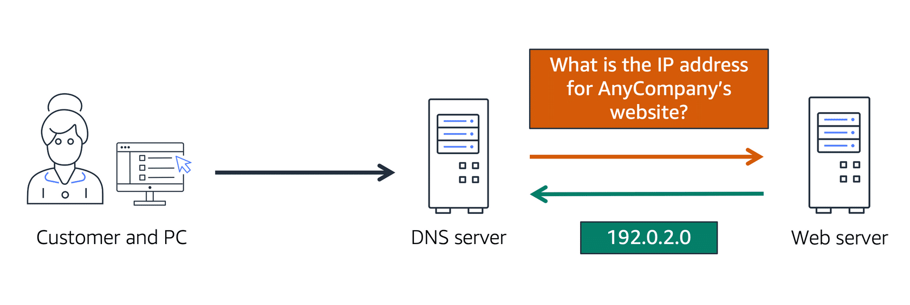
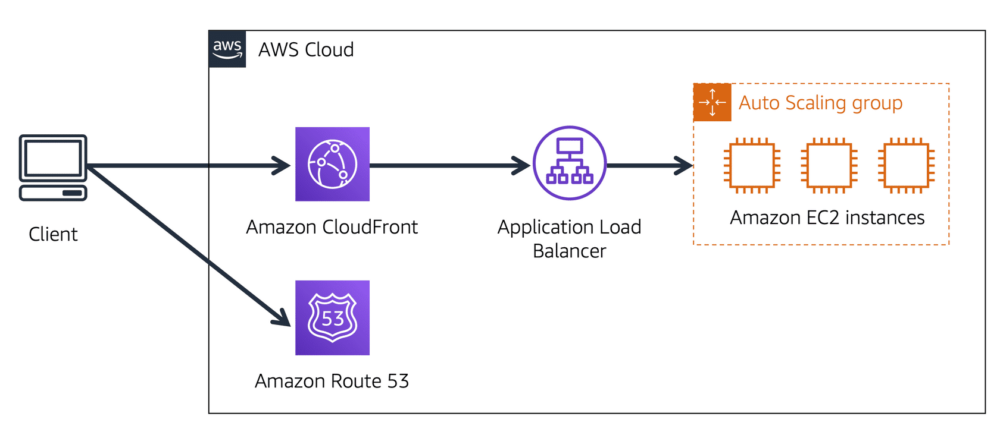

# Global Networking

#### **Domain Name System (DNS)**

Suppose AnyCompany has a website hosted in the AWS Cloud. Customers can access the website by entering its web address into their browser, thanks to Domain Name System (DNS) resolution. DNS resolution involves a DNS server communicating with a web server to translate a domain name into an IP address.

Think of DNS as the internet's phone book. It translates domain names (like AnyCompany.com) into IP addresses, which are required for routing traffic to the correct server.

For example, when a customer wants to visit AnyCompany’s website:

1. The customer enters the domain name into their browser.
2. The request is sent to a DNS server.
3. The DNS server queries the web server to retrieve the corresponding IP address for AnyCompany's website.
4. The web server returns the IP address (e.g., 192.0.2.0).
5. The browser connects to this IP address, allowing the customer to access the website.

---

#### **Amazon Route 53**

**Amazon Route 53** is a scalable, highly available DNS web service. It enables developers and businesses to reliably route end users to applications hosted in AWS, such as Amazon EC2 instances, load balancers, or infrastructure outside of AWS.

Key features of Route 53 include:

- **DNS Resolution**: Translating domain names to IP addresses, enabling user requests to reach the correct AWS or non-AWS infrastructure.
- **Domain Management**: Route 53 allows users to register new domain names and manage DNS records for domains hosted elsewhere, providing a single place for managing domain names.

---

#### **Example: How Amazon Route 53 and Amazon CloudFront Deliver Content**

Let’s explore how **Amazon Route 53** and **Amazon CloudFront** work together to deliver content for AnyCompany’s application:

1. **Application Setup**: AnyCompany’s application is hosted on several Amazon EC2 instances in an Auto Scaling group, connected to an Application Load Balancer (ALB).
2. **Customer Request**: A customer requests data by accessing AnyCompany’s website.
3. **DNS Resolution**: Amazon Route 53 performs DNS resolution to find the IP address of AnyCompany.com (e.g., 192.0.2.0), which is sent back to the customer.
4. **CloudFront Integration**: The customer’s request is routed to the nearest **Amazon CloudFront** edge location for efficient delivery.
5. **Load Balancing**: CloudFront connects to the Application Load Balancer, which forwards the customer’s request to the appropriate Amazon EC2 instance, ensuring the application responds quickly and efficiently.

---

By combining Route 53’s DNS resolution and CloudFront’s content delivery, AWS ensures fast, reliable delivery of applications and websites to end users, wherever they are located.