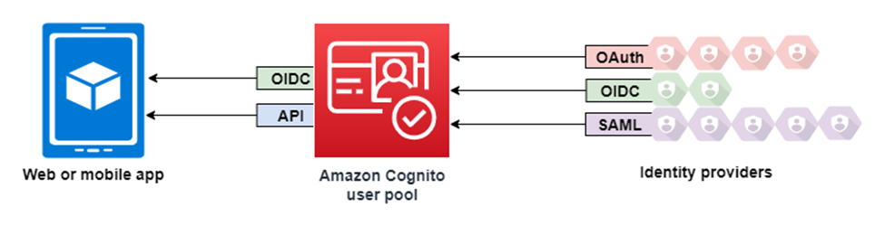
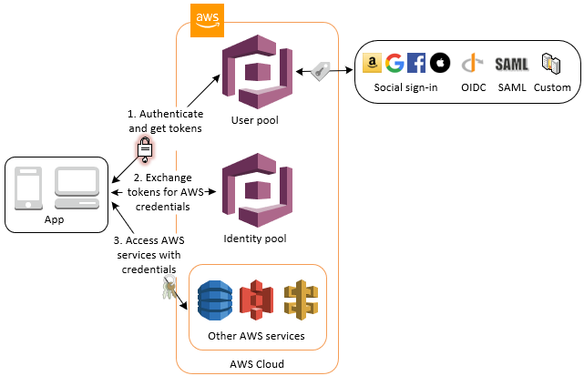

# Amazon Cognito



## 1. Introduction to Amazon Cognito
Amazon Cognito is AWS’s fully managed authentication, authorization, and user identity management service. It provides seamless and scalable user authentication for web and mobile applications while offering federated identity management and temporary AWS credentials for accessing AWS resources.

### 1.1 Key Features
- **User Authentication & Authorization** – Secure sign-up and sign-in with user directory management.
- **Federated Authentication** – Supports login via Google, Facebook, Apple, Amazon, SAML, and OpenID Connect (OIDC).
- **Token-Based Authentication** – Uses OAuth 2.0, OpenID Connect, and JSON Web Tokens (JWT).
- **Multi-Factor Authentication (MFA)** – Strengthen security with TOTP, SMS, and WebAuthn (FIDO2) Passkeys.
- **Role-Based Access Control (RBAC)** – Provides temporary AWS credentials via Identity Pools.
- **Scalability & Security** – Secure millions of users with adaptive authentication and AWS IAM integration.

---

## 2. Core Components of Amazon Cognito

Amazon Cognito consists of two primary services:

### 2.1 Cognito User Pools (User Authentication)
User Pools provide a fully managed user directory to authenticate users. Features include:
- User sign-up and sign-in with email, phone number, or username.
- User profile and account management.
- OAuth 2.0-based authentication and token issuance.
- Federated authentication with social and enterprise identity providers.
- Custom authentication workflows via AWS Lambda triggers.
- Security features such as password policies and MFA.

### 2.2 Cognito Identity Pools (AWS Resource Authorization)
Identity Pools grant temporary AWS credentials to users authenticated via Cognito or external IdPs. Features include:
- IAM role assignment for authenticated and guest users.
- Access control for AWS services (S3, DynamoDB, Lambda, etc.).
- Federated identity integration with SAML and OpenID Connect (OIDC) providers.

### 2.3 User Pools vs. Identity Pools
| Feature | **User Pools** | **Identity Pools** |
|---------|--------------|----------------|
| **Purpose** | User authentication | AWS resource access |
| **Token Type** | OAuth JWT tokens | Temporary IAM credentials |
| **User Directory** | Yes | No |
| **Federated Sign-In** | Yes | Yes |
| **Primary Use Case** | Secure authentication | AWS access control |

---

## 3. Authentication and Authorization
### 3.1 Authentication Mechanisms
Amazon Cognito supports multiple authentication methods:

| **Flow Type** | **Description** |
|--------------|----------------|
| **Authorization Code Flow (OAuth 2.0)** | Used for server-side authentication. |
| **Implicit Flow (OAuth 2.0)** | Used for Single Page Applications (SPAs). |
| **Resource Owner Password Flow** | Allows direct username & password authentication. |
| **Custom Authentication** | Uses AWS Lambda triggers for tailored auth workflows. |

### 3.2 Cognito Tokens
Cognito issues OAuth 2.0-compliant JWT tokens:
1. **ID Token** – Contains user profile details.
2. **Access Token** – Grants access to protected APIs.
3. **Refresh Token** – Enables session continuation without re-authentication.

### 3.3 Multi-Factor Authentication (MFA)
Amazon Cognito supports various MFA methods:
- **Time-based One-Time Passwords (TOTP)** – via Google Authenticator, Authy.
- **SMS-based MFA** – One-time passcodes via SMS.
- **WebAuthn (FIDO2) Passkeys** – Biometric and hardware-based authentication.

### 3.4 Role-Based Access Control (RBAC)
IAM roles can be dynamically assigned based on user attributes.

---

## 4. Federated Authentication (Social & Enterprise Login)
### 4.1 Social Identity Providers
Cognito supports Google, Facebook, Apple, and Amazon authentication.

### 4.2 Enterprise Authentication (SAML & OIDC)
Cognito integrates with Microsoft Active Directory (Azure AD), Okta, Ping Identity, and other enterprise IdPs.

---

## 5. Advanced Features and Integrations

### 5.1 Adaptive Authentication
- **Risk-Based Authentication** – Detects unusual sign-in activity and triggers challenges like MFA.
- **Compromised Credentials Check** – Scans for exposed passwords using third-party datasets.

### 5.2 AWS Lambda Triggers
- **Pre-Signup** – Custom validation logic before user registration.
- **Post-Confirmation** – Actions after successful sign-up.
- **Pre-Token Generation** – Modify ID tokens before returning to the client.
- **Custom Authentication Flow** – Implement custom challenges.

### 5.3 Security Features
- **Data Encryption** – Encrypts user data at rest and in transit.
- **Advanced Security Features** – Includes **account takeover protection** and **adaptive authentication**.
- **Audit and Monitoring** – Integration with **AWS CloudTrail** and **CloudWatch**.

---

## 6. Summary
Amazon Cognito is a scalable, secure, and customizable identity management solution that:
- Manages user authentication and federated sign-in.
- Provides temporary AWS credentials via Identity Pools.
- Supports MFA, OAuth 2.0, and IAM Role-Based Access.
- Integrates with AWS Lambda for advanced authentication workflows.

For further reading, visit the [Amazon Cognito Developer Guide](https://docs.aws.amazon.com/cognito/latest/developerguide/) and [AWS Cognito Pricing](https://aws.amazon.com/cognito/pricing/).

