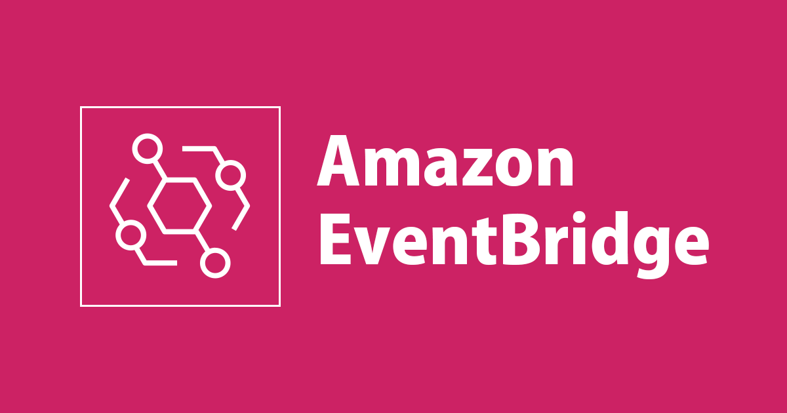
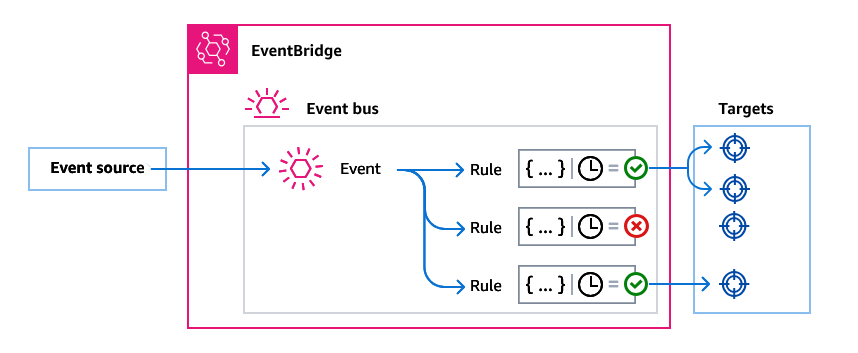

### **Amazon EventBridge**



## **Introduction to Amazon EventBridge**
Amazon EventBridge is a **serverless event bus** service that enables applications to communicate in real-time by ingesting, filtering, and delivering events. It simplifies the creation of event-driven applications and allows integration across AWS services, third-party applications, and custom applications.





EventBridge was formerly known as **Amazon CloudWatch Events**, and it enhances its capabilities by providing schema registries, partner event sources, and advanced filtering.

## **Key Features of Amazon EventBridge**
- **Event Routing:** Routes events from AWS services, SaaS applications, and custom sources.
- **Event Filtering:** Uses rules to match and process specific events.
- **Schema Registry:** Defines event formats to enable seamless integration.
- **Cross-Account and Cross-Region Event Bus:** Enables event sharing across AWS accounts and regions.
- **Event Replay & Archiving:** Allows storing and replaying past events for debugging or auditing.
- **Pipes:** Facilitates point-to-point integration between sources and targets with event transformation.

---

## **EventBridge Architecture**
EventBridge follows a structured architecture that consists of **event buses, rules, targets, and sources**:

1. **Event Buses**  
   - Central channels that receive and route events.
   - AWS services, SaaS applications, and custom applications can send events.
   - The **default event bus** is created automatically in every AWS account.

2. **Rules**  
   - Evaluate and filter events before passing them to targets.
   - Can have up to **five targets per rule**.
   - Uses **event patterns** (JSON-based) for event matching.

3. **Targets**  
   - Define the destination for matched events.
   - Examples: AWS Lambda, Amazon SQS, Amazon SNS, Amazon Kinesis, Step Functions.

4. **Event Sources**  
   - The origins of events.
   - Can be **AWS services, SaaS applications, or custom applications**.

---



---

## **Types of Event Buses**
### **1. Default Event Bus**
- Automatically created in each AWS account.
- Collects events from AWS services within the account.

### **2. Custom Event Buses**
- User-created event buses that receive events from applications or other accounts.

### **3. Partner Event Buses**
- Connects external SaaS applications as event sources.
- Example: DataDog, PagerDuty, or Zendesk.

---

## **EventBridge Event Processing**
### **1. Event Filtering**
- **Event patterns** filter events before routing them to a target.
- Example event pattern that filters EC2 instance state changes:

```json
{
  "source": ["aws.ec2"],
  "detail-type": ["EC2 Instance State-change Notification"],
  "detail": {
    "state": ["running"]
  }
}
```

### **2. Event Transformation**
- **Input transformers** modify event payloads before sending them to a target.
- Example transformation:

```json
{
  "inputPathsMap": {
    "instanceId": "$.detail.instance-id"
  },
  "inputTemplate": "{ \"EC2Instance\": <instanceId> }"
}
```

### **3. Event Delivery Mechanisms**
- **Retry Policies:** Defines the number of retry attempts if a target fails.
- **Dead Letter Queues (DLQ):** Captures undelivered events in Amazon SQS.

---

## **Cross-Account and Cross-Region Events**
### **1. Cross-Account Events**
- EventBridge allows sending events to different AWS accounts.
- Requires an **IAM policy** in the receiving account to allow event ingestion.

**Example IAM policy for cross-account event buses:**
```json
{
  "Version": "2012-10-17",
  "Statement": [
    {
      "Effect": "Allow",
      "Principal": {
        "AWS": "arn:aws:iam::123456789012:root"
      },
      "Action": "events:PutEvents",
      "Resource": "arn:aws:events:us-east-1:111122223333:event-bus/default"
    }
  ]
}
```

### **2. Cross-Region Event Routing**
- Enables routing events across AWS regions for disaster recovery or global applications.

---

## **EventBridge Advanced Features**
### **1. Event Replay**
- Allows users to replay historical events to analyze or debug systems.
- Useful for:
  - Debugging failed event processing.
  - Simulating production traffic in a test environment.

### **2. Archive and Replay**
- Archives event buses for auditing and compliance purposes.
- Replays archived events as needed.

**Example CLI command to create an archive:**
```sh
aws events create-archive --name MyArchive --event-bus-name default --retention-days 90
```

### **3. EventBridge Pipes**
- **Pipes** allow direct point-to-point connections between event sources and targets.
- Supports **event enrichment** by integrating AWS Lambda, Step Functions, and Amazon Kinesis.

---

## **Common Use Cases for EventBridge**
### **1. Automating AWS Workflows**
- Automatically triggers Lambda functions based on AWS resource changes.
- Example: **Triggering a Lambda function when an S3 file is uploaded.**

### **2. Integrating with Third-Party Services**
- EventBridge enables event-driven integration with **Datadog, PagerDuty, and Zendesk**.

### **3. Microservices Communication**
- Ensures **loose coupling** between microservices by sending and processing events asynchronously.

### **4. Security and Compliance**
- Monitors **AWS security events** and triggers automated security workflows.

### **5. Serverless Application Development**
- Simplifies building **event-driven serverless applications** using AWS Lambda and Step Functions.

---

## **Comparison: EventBridge vs. SNS vs. SQS**

| Feature            | EventBridge                     | SNS                         | SQS                         |
|--------------------|--------------------------------|-----------------------------|-----------------------------|
| **Use Case**       | Event-driven workflows        | Pub/Sub messaging           | Queue-based processing      |
| **Message Format** | JSON-based structured events | Raw messages                | FIFO or Standard queue      |
| **Filtering**      | Advanced event filtering      | Basic message filtering     | No filtering                |
| **Integration**    | AWS services & SaaS apps     | AWS services & subscribers | AWS services & consumers    |
| **Ordering**       | Not guaranteed               | Not guaranteed              | FIFO queues ensure ordering |


## **Best Practices for EventBridge**
1. **Use Custom Event Buses** for better isolation and security.
2. **Enable Dead Letter Queues (DLQs)** to capture failed events.
3. **Optimize Filtering** by defining event patterns that only match required events.
4. **Limit Targets per Rule** to avoid performance issues.
5. **Use IAM Policies** to control event bus access.
6. **Archive Events** for compliance and debugging.

---

Amazon EventBridge simplifies event-driven architectures by offering **real-time event routing, filtering, and transformation**. It allows seamless communication between AWS services, third-party SaaS applications, and custom workloads. Whether automating AWS workflows, integrating with external APIs, or managing serverless applications, EventBridge is a **powerful tool for scalable and loosely coupled event processing**.

