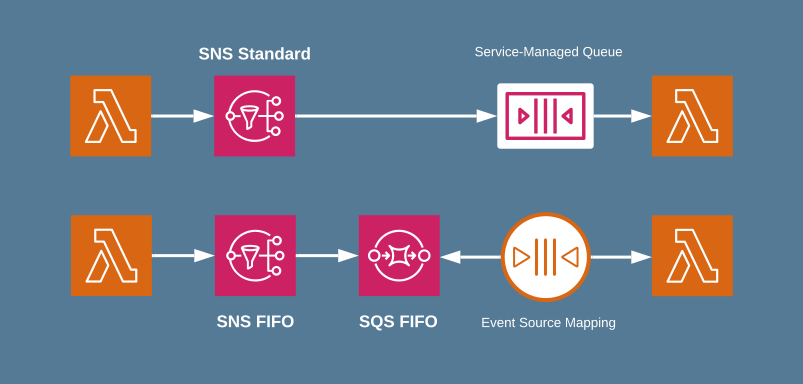

# Amazon Simple Notification Service (Amazon SNS)

## Overview

Amazon Simple Notification Service (Amazon SNS) is a fully managed messaging service that facilitates message delivery from publishers to subscribers. It enables asynchronous communication by sending messages to a topic, which acts as a communication channel, allowing multiple subscribers to receive published messages via various endpoint types such as:

- Amazon SQS
- AWS Lambda
- HTTP/HTTPS
- Email
- Mobile push notifications (SMS)




---

## Features and Capabilities

Amazon SNS provides a range of features designed to improve messaging reliability, security, and scalability. Key features include:

### 1. **Application-to-Application Messaging**
Amazon SNS supports fan-out messaging where messages sent to a topic are replicated and delivered to multiple endpoints such as:

- Amazon SQS for queue-based applications.
- AWS Lambda for serverless processing.
- HTTP/HTTPS endpoints for real-time updates.

### 2. **Application-to-Person Notifications**
It allows direct messaging to individuals or groups via:

- Email notifications
- SMS messages
- Mobile push notifications

### 3. **Topic Types: Standard vs FIFO**
- **Standard Topics:** Allow high throughput and best-effort ordering with potential message duplication.
- **FIFO Topics:** Ensure strict ordering and deduplication of messages.



### 4. **Message Durability**
Amazon SNS ensures message durability through:

- Storing messages across multiple availability zones.
- Applying retry policies for undelivered messages.
- Integration with Amazon SQS dead-letter queues (DLQs).

### 5. **Message Filtering**
Subscribers can filter messages based on attributes to receive only relevant content.

### 6. **Security**
Amazon SNS supports:

- **Server-side encryption (SSE):** Protects messages using AWS Key Management Service (KMS).
- **IAM Policies:** Restrict access to SNS resources.
- **VPC Endpoints:** Secure traffic within AWS infrastructure.

### 7. **Message Archiving and Replay**
SNS FIFO topics allow in-place message archiving and replaying for historical analysis.

---

## Common Use Cases

Amazon SNS can be applied in various scenarios, including:

1. **Application Integration:** Distributing events to multiple services in microservices architectures.
2. **Application Alerts:** Sending system alerts for infrastructure monitoring via Amazon CloudWatch.
3. **User Notifications:** Delivering real-time notifications to end users via mobile or email.
4. **Mobile Push Notifications:** Integrating with applications to send user-specific notifications.

---

## Accessing Amazon SNS

Amazon SNS can be accessed and managed through:

1. **AWS Management Console:** Provides an intuitive web-based interface for creating and managing SNS topics.
2. **AWS Command Line Interface (CLI):** Allows automation of SNS operations via command-line commands.
3. **AWS SDKs:** Available in multiple programming languages such as Python (Boto3), Java, .NET, and more.

---

## Amazon SNS Pricing

Amazon SNS operates on a **pay-as-you-go** model with no upfront fees. Costs are based on:

- Number of messages published and delivered.
- Type of endpoint used (e.g., SMS has different pricing than email).
- Additional API calls for topic and subscription management.

A **free tier** is available, which provides:

- 1 million SNS requests per month.
- 1,000 email notifications.
- 100 SMS notifications.

For more details, visit the [AWS SNS Pricing Page](https://aws.amazon.com/sns/pricing/).

---

## Key Concepts in Amazon SNS

1. **Topics:** Logical access points that manage message delivery.
2. **Publishers:** Entities that send messages to SNS topics.
3. **Subscribers:** Endpoints that receive notifications from SNS topics.
4. **Message Attributes:** Metadata attached to messages for filtering purposes.

---

## Managing Amazon SNS Resources

### 1. **Creating an SNS Topic**
To create an SNS topic, follow these steps:

1. Navigate to the Amazon SNS console.
2. Choose “Create topic” and select the topic type (Standard or FIFO).
3. Provide a name and optional display name.
4. Configure access policies, encryption, and delivery retry settings.
5. Click “Create topic” to finalize the process.

### 2. **Creating Subscriptions**
After creating a topic, subscribers can be added by specifying:

- Topic ARN (Amazon Resource Name).
- Protocol (HTTP, Email, Lambda, etc.).
- Endpoint (e.g., email address, HTTP URL).

### 3. **Publishing Messages**
Messages can be published via:

- AWS Console.
- AWS CLI using the `sns publish` command.
- AWS SDKs using the `Publish` API method.

### 4. **Deleting Topics and Subscriptions**
Topics and subscriptions can be deleted when they are no longer needed to avoid unnecessary costs.

---

## Message Delivery and Reliability

Amazon SNS employs the following strategies to ensure message delivery:

1. **Delivery Retries:** Attempts message redelivery based on a defined policy.
2. **Dead-Letter Queues (DLQs):** Unsuccessful messages are moved to an Amazon SQS DLQ for analysis.
3. **Cross-Region Delivery:** Ensures global distribution of messages across AWS Regions.

---

## Message Filtering

Subscribers can define **filter policies** to receive only relevant messages based on specific attributes. Filters support:

- String value matching.
- Numeric value matching.
- Logical operations (AND/OR).

Example filter policy:

```json
{
  "eventType": ["order_placed", "order_shipped"]
}
```

---

## Security and Compliance

Amazon SNS offers robust security features:

1. **Encryption:** Messages can be encrypted at rest using AWS KMS.
2. **Access Control:** IAM policies can restrict who can publish and subscribe to topics.
3. **Logging and Monitoring:** Integration with AWS CloudTrail and CloudWatch for auditing and alerting.

---

## Monitoring and Troubleshooting

Amazon SNS provides monitoring options using AWS CloudWatch to track:

- Number of messages published and delivered.
- Message size.
- Delivery success/failure rates.

Common troubleshooting tools include:

- CloudTrail logs for API call tracking.
- CloudWatch metrics for performance monitoring.

---

## Integration with Other AWS Services

Amazon SNS can be integrated with:

- **Amazon SQS:** For reliable message queuing.
- **AWS Lambda:** To trigger serverless functions.
- **Amazon CloudWatch:** For alerts and monitoring.
- **Amazon S3:** For archiving messages.

---

## Conclusion

Amazon SNS is a powerful, scalable, and fully managed messaging service that enables seamless communication across distributed systems and users. Its flexible architecture allows businesses to integrate SNS into their existing workflows for better responsiveness, real-time notifications, and automated message processing.

For further details, refer to the [AWS SNS Documentation](https://docs.aws.amazon.com/sns/latest/dg/welcome.html).