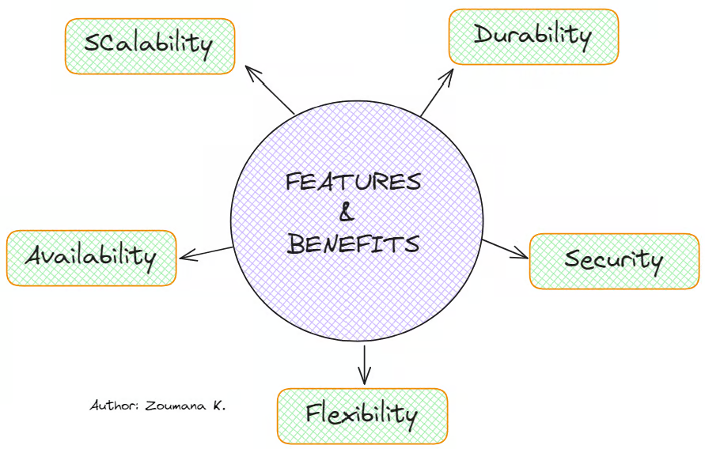

# Amazon Simple Queue Service (Amazon SQS)

## Introduction to Amazon SQS

Amazon Simple Queue Service (SQS) is a fully managed message queuing service that enables decoupling and scaling of distributed systems, microservices, and serverless applications. It provides a secure, durable, and scalable way to transmit messages between different parts of an application. Amazon SQS offers two types of message queues:

- **Standard Queues** – Support high throughput and at-least-once message delivery.
- **FIFO Queues** – Ensure messages are processed in the exact order they are sent with exactly-once processing.

---

## Benefits of Using Amazon SQS

Amazon SQS provides several advantages for building distributed applications:

1. **Security:** 
   - Control who can send and receive messages via AWS Identity and Access Management (IAM).
   - Supports server-side encryption (SSE) using AWS Key Management Service (KMS).

2. **Durability:** 
   - Messages are stored across multiple servers to ensure fault tolerance.

3. **Availability:** 
   - Redundant infrastructure ensures high availability and concurrent message processing.

4. **Scalability:** 
   - Automatically scales to accommodate any volume of messages.

5. **Reliability:** 
   - Ensures messages are locked during processing to prevent duplication.

6. **Customization:** 
   - Flexible message size, retention period, and delay queues allow for tailored solutions.

---

## Basic Amazon SQS Architecture

### Components:

1. **Producers:** Applications or services that send messages to an SQS queue.
2. **Queue:** A distributed storage space where messages are temporarily held.
3. **Consumers:** Applications or services that retrieve and process messages from the queue.

### Message Lifecycle:

1. A producer sends a message to an SQS queue.
2. Amazon SQS stores the message redundantly across multiple AWS Availability Zones (AZs).
3. A consumer retrieves the message.
4. The consumer processes the message.
5. The message is deleted from the queue.

---

## Differences Between Amazon SQS, Amazon MQ, and Amazon SNS

| Feature        | Amazon SQS            | Amazon SNS            | Amazon MQ              |
|----------------|-----------------------|------------------------|-------------------------|
| Type           | Queue-based            | Publish-subscribe       | Message broker          |
| Use Case       | Decoupling microservices| Fan-out notifications   | Migration from existing brokers |
| Message Order  | Best-effort (Standard) or FIFO | N/A                    | Guaranteed               |
| Duplication    | Possible in Standard   | N/A                      | No duplication            |
| Protocols      | HTTP/S, AWS SDK         | HTTP/S, Lambda, Email   | AMQP, MQTT, JMS          |

---

## Queue Types in Amazon SQS

### 1. Standard Queues

- **Unlimited Throughput:** Support an unlimited number of transactions per second.
- **At-Least-Once Delivery:** Messages might be delivered multiple times.
- **Best-Effort Ordering:** Messages are delivered in a different order than sent.
- **Use Cases:** Background job processing, log aggregation.

### 2. FIFO Queues

- **Strict Ordering:** Messages are processed exactly in the order sent.
- **Exactly-Once Processing:** Avoid duplicate processing using deduplication IDs.
- **Throughput Limitations:** Supports up to 3,000 messages per second with batching.
- **Use Cases:** Financial transactions, order processing systems.

---

## Key Amazon SQS Features

### 1. Dead-Letter Queues (DLQs)
- Capture messages that fail to be processed after a set number of retries.
- Helps troubleshoot and isolate issues in the message processing pipeline.

### 2. Message Attributes
- Attach metadata to messages (e.g., timestamps, priority levels).
- Useful for filtering and organizing messages.

### 3. Message Retention
- Messages can be retained for up to 14 days before being deleted.

### 4. Long and Short Polling
- **Short polling:** Returns messages immediately, even if none are available.
- **Long polling:** Waits until messages arrive before responding to requests, reducing API costs.

### 5. Visibility Timeout
- Defines the duration during which a message remains invisible after being retrieved by a consumer.
- Prevents duplicate processing.

---

## Cost and Pricing Model

Amazon SQS uses a **pay-as-you-go** pricing model based on:

- The number of requests.
- Data transfer rates.
- Additional features (e.g., long polling, encryption).
- Free Tier: 1 million requests per month at no cost.

---

## Security Considerations

1. **IAM Policies:** Control access to SQS queues with fine-grained permissions.
2. **Encryption:** Use AWS KMS for message encryption.
3. **VPC Endpoints:** Securely access SQS queues within an Amazon VPC.

---

## Common Use Cases

1. **Decoupling Microservices:**
   - SQS helps microservices communicate asynchronously without dependency on each other.
   
2. **Event-Driven Architectures:**
   - Applications can respond to events when they occur without continuous polling.

3. **Batch Processing:**
   - Aggregate messages for processing at scheduled intervals.

4. **Workflow Orchestration:**
   - Ensure sequential execution of tasks with FIFO queues.

---

## Best Practices

- Use **FIFO queues** when message order matters.
- Implement **dead-letter queues** to manage failed messages.
- Optimize costs by enabling **long polling**.
- Secure sensitive messages with **encryption**.
- Set appropriate **visibility timeouts** to prevent duplicate processing.

---

## Troubleshooting Amazon SQS

Common issues include:

1. **Message Duplication:** Can occur in standard queues; ensure idempotency.
2. **Empty Queue Responses:** Use long polling to reduce unnecessary requests.
3. **Permission Errors:** Validate IAM policies and permissions.
4. **Visibility Timeout Issues:** Adjust the timeout to suit processing time.

---

## Monitoring and Logging

Amazon SQS integrates with:

- **Amazon CloudWatch:** Monitor queue metrics like message count, age, and processing time.
- **AWS CloudTrail:** Track API calls and changes to queue configurations.
- **AWS X-Ray:** Analyze distributed application performance.

---

## Conclusion

Amazon SQS is a powerful messaging service that helps organizations build scalable, reliable, and decoupled applications. Whether using standard or FIFO queues, SQS provides flexible features for a variety of use cases, from event-driven applications to microservices communication.