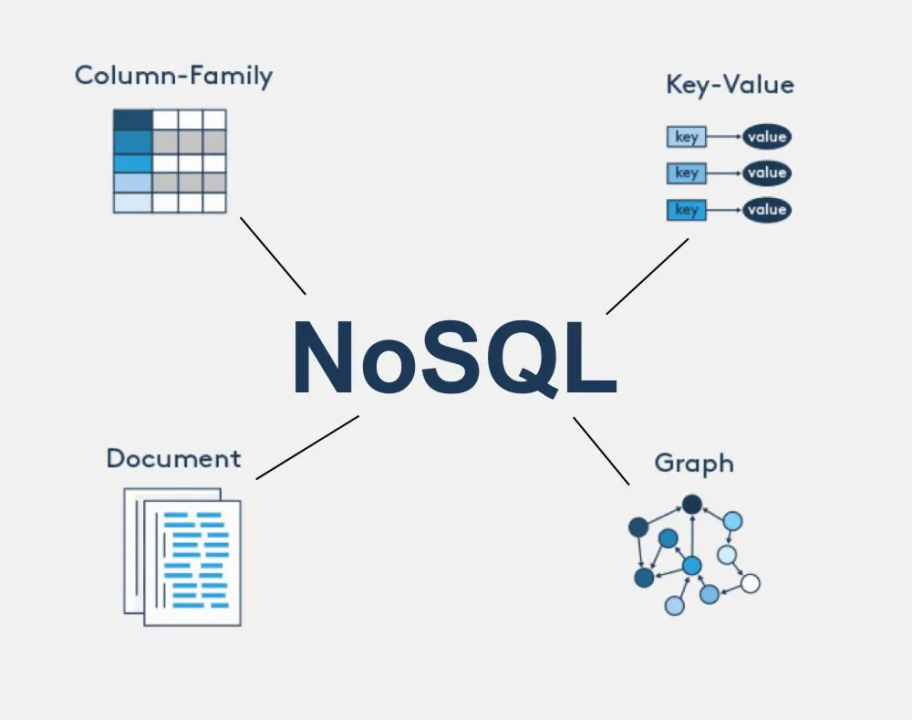
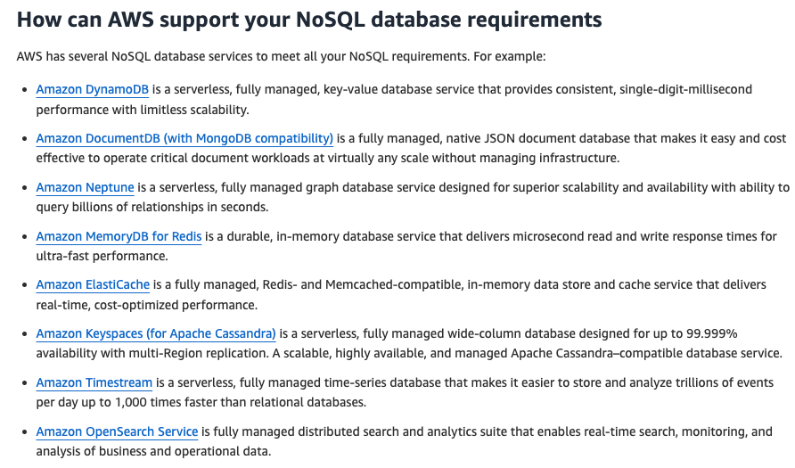
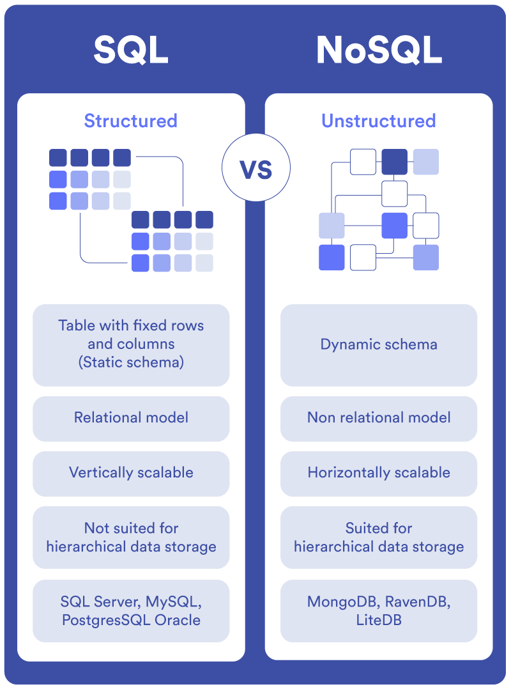

# **Non-Relational Databases (NoSQL Databases)**

---

## **1. Introduction to Non-Relational Databases (NoSQL Databases)**

**Non-relational databases**, commonly referred to as **NoSQL databases**, offer a **flexible approach to data management** that is fundamentally different from traditional **relational databases**. Unlike **SQL databases**, which use **structured tables** and **schemas**, **NoSQL databases** provide the ability to handle **unstructured**, **semi-structured**, and **highly variable data models**, enabling more **scalable**, **agile**, and **high-performance data storage solutions**.




---

## **2. Key Characteristics of Non-Relational Databases**

| **Characteristic** | **Description** |
|--------------------|-----------------|
| **Schema Flexibility** | Allows **dynamic schemas**, which means **data structure** can evolve over time. |
| **Horizontal Scalability** | Supports **scaling out** by adding **more servers** rather than **increasing server power**. |
| **High Performance** | Optimized for **large datasets** and **low-latency access**. |
| **Data Variety** | Handles **documents**, **key-value pairs**, **graphs**, and **wide-column stores**. |
| **Eventual Consistency** | Emphasizes **availability** and **partition tolerance**, sometimes at the expense of **strong consistency** (as per **CAP Theorem**). |
| **Distributed Architecture** | Designed to run **across clusters** of **commodity hardware**. |
| **Designed for Big Data** | Ideal for **real-time applications**, **big data analytics**, and **content management systems**. |

---

## **3. When to Choose Non-Relational Databases?**

### **3.1 Suitable Use Cases for NoSQL Databases**

| **Use Case** | **Description** |
|--------------|-----------------|
| **High Volume Transactions** | Applications that handle **massive amounts of data**, like **social media platforms** and **e-commerce websites**. |
| **Real-Time Analytics** | Systems requiring **fast data processing**, such as **recommendation engines** and **streaming analytics**. |
| **Content Management Systems (CMS)** | Ideal for **dynamic content**, **metadata**, and **search engine storage**. |
| **Internet of Things (IoT)** | Efficiently manages **sensor data**, **device logs**, and **real-time telemetry**. |
| **Unstructured Data Storage** | Supports **documents**, **JSON objects**, **graph data**, and **flexible records**. |
| **Scalable Applications** | Easily scales **horizontally** to accommodate **growing user bases**. |
| **Agile Development Environments** | Enables **quick changes to data structures** without significant **database redesigns**. |

---

## **4. Types of Non-Relational Databases**





**Non-relational databases** can be categorized into **four primary types**, each suited to specific **data storage needs** and **application scenarios**.

### **4.1 Document-Oriented Databases**

- **Description:** Store data in **document formats**, typically **JSON**, **BSON**, or **XML**.
- **Key Features:** Schema flexibility, **nested data structures**, and **rich querying capabilities**.
- **Use Cases:** **Content management**, **blogging platforms**, **e-commerce catalogs**.
- **Examples:** 
  - **MongoDB:** Known for **flexibility**, **scalability**, and **rich query language**.
  - **CouchDB:** Uses a **distributed architecture** and provides **RESTful APIs**.

#### **Sample Data Format (JSON):**
```json
{
    "product_id": "12345",
    "name": "Smartphone",
    "category": "Electronics",
    "price": 299.99,
    "specifications": {
        "screen_size": "6.1 inches",
        "battery": "3000 mAh"
    }
}
```

---

### **4.2 Key-Value Stores**

- **Description:** Simplest form of **NoSQL database**, using a **key-value pair model**.
- **Key Features:** **High performance**, **simplicity**, and **low-latency data access**.
- **Use Cases:** **Caching**, **session management**, **real-time analytics**.
- **Examples:** 
  - **Redis:** An **in-memory data structure store** supporting **strings**, **hashes**, **lists**, **sets**, and **sorted sets**.
  - **DynamoDB (AWS):** **Managed key-value store** with **built-in replication**, **high availability**, and **auto-scaling**.

#### **Sample Key-Value Pair:**
```json
"sessionID_12345": "userID_67890"
```

---

### **4.3 Column-Family Stores**

- **Description:** Store data in **columns** rather than **rows**, enabling **efficient aggregation** and **analytics**.
- **Key Features:** Ideal for **large-scale distributed data storage**, **big data analytics**, and **write-heavy applications**.
- **Use Cases:** **Time-series data**, **IoT data**, **analytics platforms**.
- **Examples:** 
  - **Apache Cassandra:** Known for **high scalability** and **eventual consistency**.
  - **HBase:** Built on **Apache Hadoop**, suitable for **wide tables** with **billions of rows**.

#### **Sample Data Format (Column-Family):**
| UserID | Name   | Age | Location   |
|--------|---------|-----|------------|
| 101    | John    | 25  | New York   |
| 102    | Alice   | 30  | San Francisco |

---

### **4.4 Graph Databases**

- **Description:** Represent **data as nodes** (entities) and **edges** (relationships), focusing on **relationships between data points**.
- **Key Features:** Efficient **traversal** of **complex relationships**, **social network analysis**, and **fraud detection**.
- **Use Cases:** **Social networks**, **recommendation engines**, **network topology mapping**.
- **Examples:** 
  - **Neo4j:** A **native graph database** with **strong query capabilities** using **Cypher query language**.
  - **Amazon Neptune:** Fully managed **graph database service** that supports **Property Graph** and **W3C RDF standards**.

#### **Sample Graph Data Model:**
```text
[John] -(FRIENDS_WITH)-> [Alice]
[Alice] -(WORKS_AT)-> [TechCorp]
```

---

## **5. Non-Relational Databases on AWS**



### **5.1 Key AWS NoSQL Database Services**

| **Service** | **Database Type** | **Description** | **Use Cases** |
|-------------|-------------------|-----------------|---------------|
| **Amazon DynamoDB** | **Key-Value Store** | **Fully managed**, **serverless**, **highly scalable** | **E-commerce**, **IoT data**, **mobile apps** |
| **Amazon DocumentDB** | **Document Store** | **Managed MongoDB-compatible database** | **Content management**, **catalogs**, **personalization** |
| **Amazon ElastiCache** | **In-Memory Key-Value Store** | Supports **Redis** and **Memcached** for **caching** | **Real-time data processing**, **session storage** |
| **Amazon Neptune** | **Graph Database** | **Managed graph database service**, supports **Gremlin** and **SPARQL** | **Social networks**, **knowledge graphs** |
| **Amazon Timestream** | **Time-Series Database** | **Optimized for time-series data**, provides **fast ingestion** | **IoT applications**, **metrics storage** |

---

## **6. Advantages of Using Non-Relational Databases**

| **Advantage** | **Description** |
|---------------|-----------------|
| **Flexibility** | Supports **dynamic data models** and **semi-structured data**. |
| **Scalability** | **Easily scales horizontally**, adding more **nodes** as needed. |
| **High Performance** | Optimized for **high throughput** and **low-latency data access**. |
| **Schema Agility** | Enables **quick changes** to **data structures** without **complex migrations**. |
| **Cost Efficiency** | Reduces **infrastructure costs** through **distributed architectures**. |
| **High Availability** | Designed for **fault tolerance** and **high availability**. |

---

## **7. When to Use Non-Relational Databases on AWS?**

- When data is **unstructured**, **semi-structured**, or **highly variable**.
- For **real-time analytics** and **big data** applications.
- When **horizontal scalability** is crucial.
- In scenarios requiring **high-speed read and write operations**.
- For **social networks**, **IoT platforms**, and **content management systems**.



---

## **8. Further Exploration**

- [**Amazon DynamoDB**](https://aws.amazon.com/dynamodb/): Explore **AWS's managed NoSQL database service** for **key-value and document data models**.
- [**Amazon DocumentDB**](https://aws.amazon.com/documentdb/): Learn about the **MongoDB-compatible managed document database**.
- [**Amazon Neptune**](https://aws.amazon.com/neptune/): Discover the **graph database service** for **highly connected datasets**.
- [**AWS Training and Certification**](https://aws.amazon.com/training/): Take **hands-on labs** and pursue **AWS Certified Database – Specialty** certification.