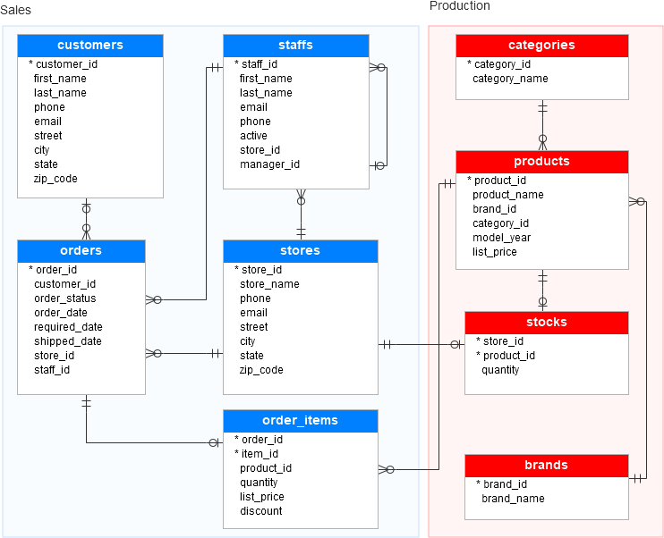
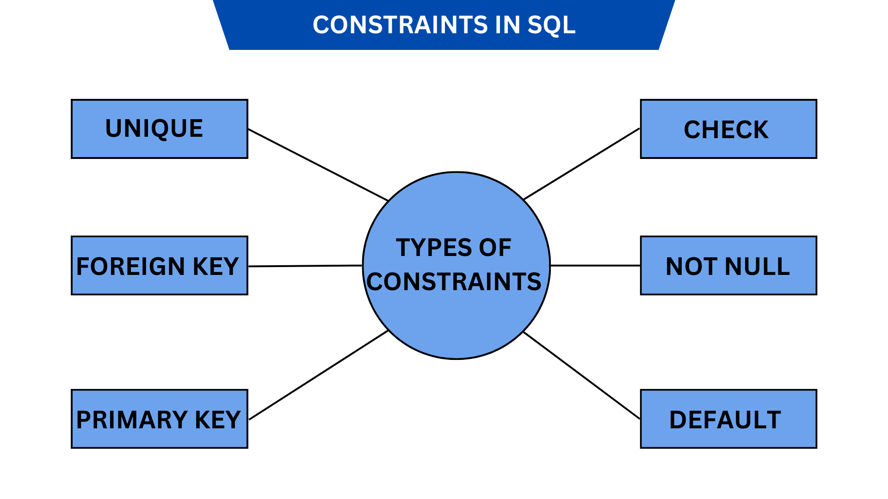
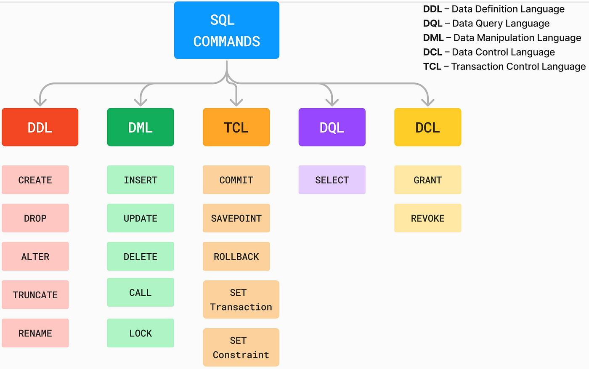

# **Relational Databases**

---

## **1. Introduction to Relational Databases**

A **Relational Database** is a type of **database management system (DBMS)** that organizes data into **tables (relations)** consisting of **rows (records)** and **columns (attributes)**. Developed in the 1970s by **E.F. Codd** at **IBM**, relational databases leverage **Structured Query Language (SQL)** for **data definition**, **manipulation**, and **querying**.



---

## **2. Key Characteristics of Relational Databases**

| **Characteristic** | **Description** |
|--------------------|-----------------|
| **Structured Data Storage** | Data is stored in **tables** with **defined schemas**. |
| **Schema-Based** | Requires a **predefined schema** for data consistency. |
| **ACID Compliance** | Ensures **Atomicity**, **Consistency**, **Isolation**, and **Durability** in transactions. |
| **Data Integrity** | Uses **constraints**, **foreign keys**, and **relationships** to maintain **data consistency**. |
| **Data Relationships** | Supports **one-to-one**, **one-to-many**, and **many-to-many** relationships between tables. |
| **Scalability** | Primarily supports **vertical scaling** (adding more power to a single server). |
| **Standardized Query Language** | Uses **SQL** for **data operations** and **administrative tasks**. |




---

## **3. Core Concepts in Relational Databases**

### **3.1 Tables (Relations)**
A **table** is the **fundamental data structure** in a relational database, where data is stored in **rows** and **columns**.

- **Rows:** Represent **individual records**.
- **Columns:** Represent **attributes of the data**.
- **Primary Key:** A **unique identifier** for each record (e.g., **UserID**).
- **Foreign Key:** Establishes **relationships** between **tables** (e.g., **UserID** in the **Orders** table linking to the **Users** table).

---

### **3.2 Relationships in Relational Databases**

| **Relationship Type** | **Description** | **Example** |
|-----------------------|-----------------|-------------|
| **One-to-One** | Each record in **Table A** is related to **one** record in **Table B**. | **Person** and **Passport** |
| **One-to-Many** | A record in **Table A** can relate to **multiple** records in **Table B**. | **Customer** and **Orders** |
| **Many-to-Many** | **Multiple records** in **Table A** relate to **multiple records** in **Table B** (usually through a **junction table**). | **Students** and **Courses** |

---

### **3.3 Constraints**

Constraints enforce **data integrity** and **rules** within the database:

| **Constraint Type** | **Description** |
|---------------------|-----------------|
| **Primary Key** | Ensures **uniqueness** of data in a column. |
| **Foreign Key** | Maintains **referential integrity** between **tables**. |
| **Unique** | Ensures **no duplicate values** in a column. |
| **Not Null** | Prevents **empty values** in a column. |
| **Check** | Defines a **condition** for valid data entries. |
| **Default** | Sets a **default value** for a column when **none is provided**. |



---

## **4. SQL (Structured Query Language)**

**SQL** is the **standard language** for **interacting with relational databases**, offering functionalities for **data definition**, **manipulation**, **querying**, and **administration**.

### **4.1 Types of SQL Commands**

| **SQL Command Type** | **Description** | **Examples** |
|-----------------------|-----------------|--------------|
| **Data Definition Language (DDL)** | Defines **database schemas** and **structures**. | `CREATE`, `ALTER`, `DROP` |
| **Data Manipulation Language (DML)** | Manages **data within tables**. | `SELECT`, `INSERT`, `UPDATE`, `DELETE` |
| **Data Query Language (DQL)** | Retrieves **data from databases**. | `SELECT` |
| **Data Control Language (DCL)** | Manages **permissions and access controls**. | `GRANT`, `REVOKE` |
| **Transaction Control Language (TCL)** | Manages **transactions**. | `COMMIT`, `ROLLBACK`, `SAVEPOINT` |




---

### **4.2 Common SQL Operations**

1. **Creating a Table:**
```sql
CREATE TABLE Employees (
    EmployeeID INT PRIMARY KEY,
    Name VARCHAR(255) NOT NULL,
    Position VARCHAR(255),
    Salary DECIMAL(10, 2)
);
```

2. **Inserting Data:**
```sql
INSERT INTO Employees (EmployeeID, Name, Position, Salary)
VALUES (1, 'John Doe', 'Manager', 75000.00);
```

3. **Querying Data:**
```sql
SELECT Name, Position FROM Employees WHERE Salary > 50000;
```

4. **Updating Data:**
```sql
UPDATE Employees SET Salary = 80000 WHERE EmployeeID = 1;
```

5. **Deleting Data:**
```sql
DELETE FROM Employees WHERE EmployeeID = 1;
```

---

## **5. Relational Database Management Systems (RDBMS)**

**RDBMS** is software used to **create**, **manage**, and **interact with relational databases**.

### **5.1 Popular RDBMS Solutions**

| **RDBMS** | **Description** | **Use Cases** |
|-----------|-----------------|---------------|
| **MySQL** | Open-source RDBMS, ideal for **web applications**. | E-commerce, CMS |
| **PostgreSQL** | Advanced RDBMS with **support for complex queries**. | Financial Services, Data Analytics |
| **Oracle Database** | Enterprise-grade RDBMS with **robust features**. | ERP Systems, Large Enterprises |
| **Microsoft SQL Server** | Strong **business intelligence tools**, integrates with **Microsoft services**. | Corporate Applications, BI |
| **Amazon RDS** | Managed **relational database service** on **AWS**. | Scalable cloud-based databases |
| **Amazon Aurora** | **MySQL** and **PostgreSQL**-compatible, designed for **high performance**. | Enterprise applications |

---

## **6. Relational Databases on AWS**

Amazon Web Services (**AWS**) provides **fully managed services** to host and manage **relational databases**.

### **6.1 Key Relational Database Services on AWS**

| **Service** | **Description** | **Benefits** |
|-------------|-----------------|--------------|
| **Amazon RDS (Relational Database Service)** | Supports **MySQL**, **PostgreSQL**, **MariaDB**, **Oracle**, **SQL Server**. | **Automated backups**, **scalability**, **security** |
| **Amazon Aurora** | **High-performance**, **MySQL** and **PostgreSQL-compatible**. | **5x faster** than standard MySQL, **enterprise-grade performance** |
| **Amazon Redshift** | **Data warehousing service**, optimized for **analytics**. | **Petabyte-scale data processing**, **BI tools integration** |

### **6.2 Advantages of Using Relational Databases on AWS**

- **Scalability:** Supports **automatic scaling** and **provisioning**.
- **High Availability:** Offers **multi-AZ deployments** for **disaster recovery**.
- **Security:** Provides **encryption at rest** and **in transit**, **IAM integration**.
- **Monitoring:** Integrated with **AWS CloudWatch** for **performance monitoring**.
- **Maintenance:** Automatic **backups**, **patching**, and **upgrades**.

---

## **7. When to Choose Relational Databases**

Relational databases are best suited for scenarios requiring:

- **Structured Data:** Where **data consistency** and **relationships** are crucial.
- **Complex Transactions:** **ACID compliance** ensures **data integrity**.
- **Reporting and Analytics:** Supports **complex queries** and **joins**.
- **Data-Driven Applications:** Ideal for **ERP systems**, **CRM**, **e-commerce**, and **financial systems**.
- **Regulatory Compliance:** **Enforces rules** and **audit capabilities**.

---

## **8. Further Exploration**

To **deepen your knowledge** and **enhance your skills** with **relational databases**, explore the following:

- [**AWS Relational Database Services**](https://aws.amazon.com/rds/): Learn about **managed relational databases** on AWS.
- [**Structured Query Language (SQL) Tutorial**](https://www.w3schools.com/sql/): Practice **SQL queries** and **database design**.
- [**Amazon Aurora Best Practices**](https://docs.aws.amazon.com/aurora/latest/userguide/aurora-best-practices.html): Optimize **performance** and **scalability**.
- [**Database Design Principles**](https://aws.amazon.com/dms/): Understand **schema design**, **normalization**, and **performance optimization**.
- [**AWS Training and Certification**](https://aws.amazon.com/training/): Take **hands-on labs** and pursue the **AWS Certified Database – Specialty** ce