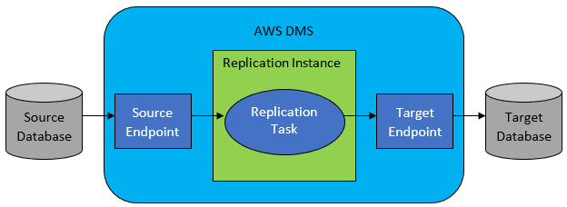
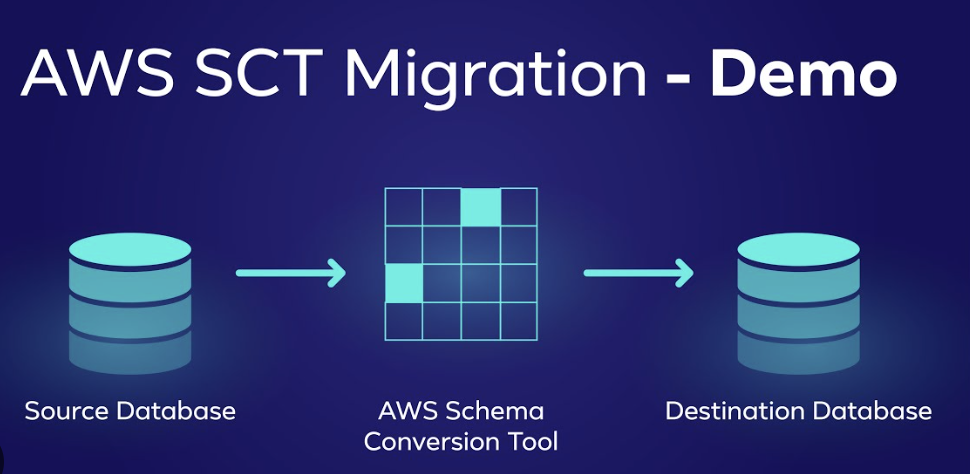
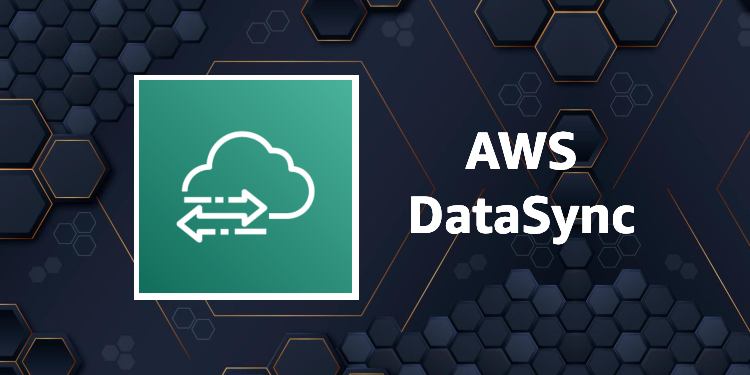

# **Database Migration on AWS**

## **1. Introduction to Database Migration**
Database migration is the process of moving data, applications, and schema from one database environment to another. This could involve migrating from on-premises databases to the cloud, between cloud providers, or even between different database engines.

AWS provides several services and tools to simplify and automate database migrations, ensuring minimal downtime and data integrity.

---

## **2. AWS Database Migration Service (AWS DMS)**

### **2.1 Overview**
AWS Database Migration Service (AWS DMS) helps migrate databases to AWS quickly and securely. It supports homogeneous migrations (e.g., Oracle to Oracle) and heterogeneous migrations (e.g., Microsoft SQL Server to Amazon Aurora).

### **2.2 Key Features**
- **Supports Multiple Database Engines**: AWS DMS works with relational databases (e.g., MySQL, PostgreSQL, Oracle, SQL Server) and NoSQL databases (e.g., MongoDB, Amazon DynamoDB).
- **Minimal Downtime**: AWS DMS ensures continuous data replication with near-zero downtime.
- **Schema Conversion**: AWS Schema Conversion Tool (SCT) converts database schemas from one database engine to another.
- **Replication Across AWS Services**: Migrate data between Amazon RDS, Amazon Aurora, Amazon Redshift, Amazon DynamoDB, and Amazon S3.

### **2.3 Migration Phases**
1. **Assessment**:
   - Determine database compatibility.
   - Identify data dependencies and performance requirements.

2. **Planning**:
   - Choose the target database.
   - Define migration strategy (online or offline migration).

3. **Schema Conversion**:
   - If migrating between different database engines, use **AWS Schema Conversion Tool (SCT)**.

4. **Data Migration**:
   - Use **AWS DMS** for full or incremental data transfer.

5. **Validation and Optimization**:
   - Test the migrated database.
   - Optimize queries and indexes.

---

## **3. AWS Schema Conversion Tool (AWS SCT)**
### **3.1 Overview**
AWS SCT helps automate schema conversions when migrating between different database engines. It scans your source database, translates schema objects, and generates an optimized schema for the target database.

### **3.2 Key Features**
- **Automated Schema Conversion**: Translates schemas, views, stored procedures, and functions.
- **Assessment Reports**: Identifies potential migration issues and provides recommendations.
- **Data Migration Integration**: Works with AWS DMS to migrate data efficiently.

### **3.3 Supported Database Migrations**
| **Source Database** | **Target Database** |
|---------------------|---------------------|
| Oracle | Amazon Aurora, MySQL, PostgreSQL |
| Microsoft SQL Server | Amazon Aurora, MySQL, PostgreSQL |
| MySQL | Amazon RDS for MySQL, Amazon Aurora |
| PostgreSQL | Amazon RDS for PostgreSQL, Amazon Aurora |
| MongoDB | Amazon DynamoDB |

---

## **4. Database Migration Strategies**

### **4.1 Homogeneous Migration**
- Migration between similar database engines (e.g., MySQL to Amazon RDS MySQL).
- Requires minimal schema conversion.
- AWS DMS can replicate the data without modification.

### **4.2 Heterogeneous Migration**
- Migration between different database engines (e.g., Oracle to PostgreSQL).
- Schema conversion is required using AWS SCT before data migration.

### **4.3 Offline vs. Online Migration**
| **Migration Type** | **Description** | **Use Case** |
|------------------|----------------|--------------|
| **Offline Migration** | Data is copied in bulk, requiring database downtime. | When downtime is acceptable. |
| **Online Migration** | Continuous data replication with minimal downtime. | When minimizing downtime is critical. |

---

## **5. AWS Database Migration Tools**
### **5.1 AWS DMS (Database Migration Service)**
- Migrates relational and NoSQL databases.
- Supports continuous data replication.
- Works with on-premises and cloud databases.

### **5.2 AWS SCT (Schema Conversion Tool)**
- Converts schema and application code between different database engines.
- Helps assess migration complexity.

### **5.3 AWS Snowball**
- Used for large-scale migrations when internet transfer isn't feasible.
- Physically transfers petabyte-scale data to AWS.

### **5.4 AWS DataSync**
- Automates data transfer between on-premises storage and AWS.

---

## **6. Best Practices for Database Migration**
- **Evaluate Compatibility**: Assess database dependencies before migration.
- **Use AWS SCT for Schema Conversion**: Convert schema efficiently for heterogeneous migrations.
- **Plan for Downtime**: Choose offline migration when minimal downtime is acceptable.
- **Enable Continuous Replication**: Use AWS DMS for real-time migration with minimal downtime.
- **Test After Migration**: Validate performance and data integrity before full production deployment.
- **Optimize Performance**: Tune indexes and optimize queries in the target database.

---

## **7. Conclusion**
AWS provides a range of tools and services to simplify database migrations, ensuring seamless transitions with minimal downtime. Whether migrating between on-premises and AWS, different database engines, or across AWS services, AWS DMS and SCT streamline the process. Understanding migration strategies and best practices ensures an efficient and successful migration to AWS.

For further reading:
- **[AWS DMS Documentation](https://docs.aws.amazon.com/dms/latest/userguide/Welcome.html)**
- **[AWS SCT Documentation](https://docs.aws.amazon.com/SchemaConversionTool/latest/userguide/Welcome.html)**
- **[AWS Database Migration Best Practices](https://aws.amazon.com/dms/resources/)**
