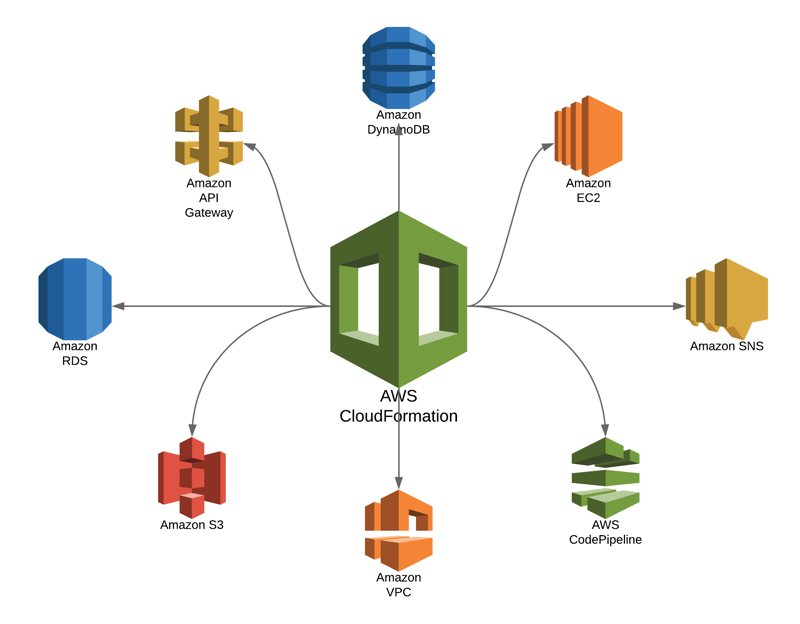

## **Introduction to AWS CloudFormation and Core Concepts**

### **1. Introduction to AWS CloudFormation**
AWS CloudFormation is an **Infrastructure as Code (IaC)** service that enables users to define and provision AWS resources using **JSON** or **YAML** templates. It automates **resource creation, configuration, and management**, making it easier to maintain a consistent infrastructure across multiple AWS environments.



### **2. Key Benefits of AWS CloudFormation**
- **Infrastructure as Code (IaC)**: Manage AWS resources using declarative code.
- **Automated Provisioning**: Deploy and update entire environments quickly.
- **Consistency & Reliability**: Reduce human errors and configuration drift.
- **Scalability**: Easily replicate infrastructure across multiple AWS accounts and regions.
- **Cost-Efficiency**: Optimize cloud spending by using reusable templates.

---

### **3. Core Components of AWS CloudFormation**




#### **3.1 CloudFormation Templates**
A **template** is the core component of CloudFormation and is a declarative file written in JSON or YAML.

##### **3.1.1 Template Structure**
A CloudFormation template consists of the following sections:

| **Section** | **Purpose** |
|------------|------------|
| **AWSTemplateFormatVersion** | Defines the CloudFormation template version. |
| **Description** | Provides a brief summary of the template. |
| **Metadata** | Stores additional data about the template. |
| **Parameters** | Accepts user input to customize stack creation. |
| **Mappings** | Creates static key-value pairs for dynamic values. |
| **Conditions** | Defines logical conditions to determine when resources should be created or skipped. |
| **Resources** | Declares AWS resources to be created. |
| **Outputs** | Returns values after the stack is created (e.g., instance ID, bucket name). |

##### **3.1.2 Example CloudFormation Template**
```yaml
AWSTemplateFormatVersion: '2010-09-09'
Description: "Basic CloudFormation Template to Create an S3 Bucket"

Resources:
  MyS3Bucket:
    Type: "AWS::S3::Bucket"
    Properties:
      BucketName: "my-cloudformation-demo-bucket"

Outputs:
  BucketName:
    Description: "Name of the created S3 bucket"
    Value: !Ref MyS3Bucket
```

---

#### **3.2 CloudFormation Stacks**
A **Stack** is a collection of AWS resources managed as a **single unit**. You can create, update, and delete resources within a stack.

##### **Creating a Stack Using AWS CLI**
```sh
aws cloudformation create-stack --stack-name MyS3Stack --template-body file://s3-template.yaml
```
##### **Updating a Stack**
```sh
aws cloudformation update-stack --stack-name MyS3Stack --template-body file://updated-template.yaml
```
##### **Deleting a Stack**
```sh
aws cloudformation delete-stack --stack-name MyS3Stack
```

---

#### **3.3 StackSets: Multi-Region & Multi-Account Deployment**
StackSets allow you to deploy CloudFormation stacks across **multiple AWS accounts and regions**.

##### **Creating a StackSet**
```sh
aws cloudformation create-stack-set --stack-set-name MyStackSet --template-body file://template.yaml
```
##### **Deploying a StackSet**
```sh
aws cloudformation create-stack-instances --stack-set-name MyStackSet --accounts 123456789012 --regions us-east-1 us-west-1
```

---

#### **3.4 CloudFormation Change Sets**
Change Sets allow you to **preview changes** before applying them to an existing stack.

##### **Creating a Change Set**
```sh
aws cloudformation create-change-set --stack-name MyStack --template-body file://template.yaml --change-set-name MyChangeSet
```
##### **Executing a Change Set**
```sh
aws cloudformation execute-change-set --change-set-name MyChangeSet
```

---

#### **3.5 Drift Detection**
**Drift Detection** helps identify any manual modifications to AWS resources that deviate from the CloudFormation stack.

##### **Detecting Stack Drift**
```sh
aws cloudformation detect-stack-drift --stack-name MyStack
```
##### **Viewing Drift Status**
```sh
aws cloudformation describe-stack-drift-detection-status --stack-drift-detection-id <drift-id>
```

---