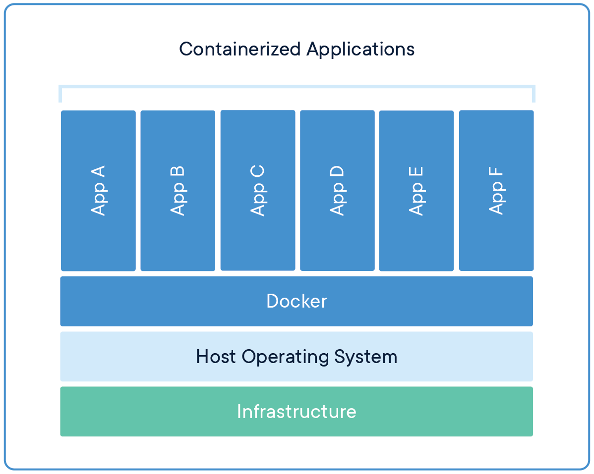
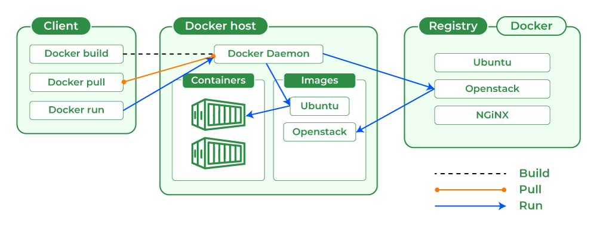

# **Introduction to Containerization and Docker Basics**  

## **1. Introduction to Containerization**  

### **1.1 Overview of Containerization**  
Containerization is a modern approach to **application deployment** that allows applications and their dependencies to be **packaged together** into a lightweight, portable unit called a **container**. These containers ensure seamless application execution in **development, testing, and production** across different environments.  

### **1.2 What is a Container?**  
A **container** is a **lightweight, standalone, executable package** that includes:  
- **Application Code**  
- **System Libraries**  
- **Dependencies**  
- **Configuration Files**  

Containers **isolate applications** from the underlying system, ensuring consistency across various environments.

### **1.3 How Does Containerization Work?**  
Containers use **operating system (OS) virtualization** to share the host OS kernel while maintaining **isolation** between applications. Unlike virtual machines (VMs), which require a full OS installation, containers leverage the host OS, making them **efficient and lightweight**.  

### **1.4 Containers vs. Virtual Machines (VMs)**  
| Feature | Containers | Virtual Machines |
|---------|-----------|------------------|
| **OS Dependency** | Shares Host OS | Requires Full Guest OS |
| **Resource Usage** | Lightweight | Heavy, Requires More Resources |
| **Startup Time** | Fast (Seconds) | Slow (Minutes) |
| **Portability** | High | Medium |
| **Isolation Level** | Process-Level | Full OS-Level |

---

## **2. Benefits of Containerization**

### **2.1 Portability**
- Containers run consistently across different environments, eliminating the "it works on my machine" problem.
- Developers can create an application once and deploy it anywhere—on-premises, in the cloud, or in a hybrid setup.
- Containers eliminate OS-level differences, allowing applications to move between different infrastructures seamlessly.
- Cloud providers such as AWS, Google Cloud, and Azure fully support containerized workloads, enabling multi-cloud deployments.

### **2.2 Efficiency**
- Containers are lightweight, sharing the host OS kernel, reducing overhead compared to full virtual machines.
- Unlike VMs that require entire guest OS installations, containers can run with minimal resource usage.
- Containers start up in seconds rather than minutes, leading to improved developer productivity.
- They help optimize resource utilization, allowing multiple containers to run efficiently on a single host.

### **2.3 Scalability**
- Containers are designed to scale horizontally, meaning they can be quickly replicated when demand increases.
- With container orchestration tools like Kubernetes, Amazon ECS, and Docker Swarm, teams can automatically scale services based on traffic or CPU/memory usage.
- Load balancing between container instances helps applications handle high availability requirements.
- Containers allow rolling updates and rollbacks, ensuring minimal downtime during updates.

### **2.4 Isolation**
- Containers encapsulate applications and their dependencies, preventing conflicts with other applications running on the same machine.
- Developers can run multiple versions of an application on the same system without causing dependency issues.
- By using namespace and cgroups features in Linux, containers ensure strict resource control and process isolation.
- This isolation enhances security, preventing one application from affecting another.

### **2.5 Automation & CI/CD Integration**
- Containers integrate seamlessly with CI/CD pipelines, allowing automated builds, tests, and deployments.
- They ensure consistent environments between development, staging, and production, reducing deployment failures.
- Tools like Jenkins, GitHub Actions, and AWS CodePipeline leverage containers for automated software delivery.
- Containers allow blue-green and canary deployments, enabling safe application rollouts with minimal risk.

### **2.6 Security**
- Containers offer process isolation, making them more secure than traditional application deployments.
- Images can be scanned for vulnerabilities using tools like AWS Inspector, Trivy, or Docker Security Scanning.
- Access control mechanisms, such as role-based access control (RBAC) in Kubernetes, help secure containerized environments.
- Secrets management tools like AWS Secrets Manager, HashiCorp Vault, and Kubernetes Secrets help protect sensitive data inside containers.

### **2.7 Cost Optimization**
- Containers help reduce costs by maximizing resource utilization on physical servers.
- Organizations can move workloads between on-premises and cloud environments based on pricing and infrastructure needs.
- Serverless container platforms like AWS Fargate allow businesses to run containers without managing infrastructure, reducing operational overhead.
- Containers enable auto-scaling, ensuring that applications only consume the necessary resources, further optimizing costs.

---

## **3. Introduction to Docker**  

### **3.1 What is Docker?**  
Docker is an **open-source platform** that allows developers to build, package, and run applications inside containers. It provides an easy way to create **reproducible development environments** and simplifies **deployment**.



### **3.2 Docker Architecture**  
Docker consists of several key components:  

1. **Docker Client** – The CLI (`docker`) used to interact with Docker.  
2. **Docker Daemon** – Runs in the background and manages containers.  
3. **Docker Images** – Read-only templates used to create containers.  
4. **Docker Containers** – Running instances of Docker images.  
5. **Docker Registry** – Stores Docker images (e.g., **Docker Hub, AWS ECR**).  



---

## **4. Installing Docker**  

### **4.1 Install Docker on Your Machine**  
#### **Windows & Mac**  
1. Download **Docker Desktop** from [Docker's official website](https://www.docker.com/get-started).  
2. Follow the installation instructions.  
3. Start Docker and ensure it is running.

#### **Linux**  
1. Update your system:
   ```bash
   sudo apt update
   ```
2. Install Docker:
   ```bash
   sudo apt install docker.io -y
   ```
3. Start and enable Docker:
   ```bash
   sudo systemctl start docker
   sudo systemctl enable docker
   ```
4. Verify the installation:
   ```bash
   docker --version
   ```
   Expected output (example):  
   ```bash
   Docker version 24.0.5, build 123abc
   ```

---

## **5. Running Your First Docker Container**  

### **5.1 Pull and Run a Container**  
Run a basic `hello-world` container to verify Docker works:  
```bash
docker run hello-world
```

---

## **7. Challenges and Considerations in Containerization**  

### **7.1 Security Risks**  
- **Vulnerabilities in container images** – Containers often use **third-party images** from public registries, which may contain security risks. Regular **scanning and updates** are crucial.  
- **Isolation Issues** – Containers share the same **host OS kernel**, which can lead to **security breaches** if improperly configured. Implement **role-based access control (RBAC)** and enforce **least privilege policies**.  

---

## **8. Summary**  
Containers offer **portability, scalability, and efficiency**, making them ideal for modern software development. Docker simplifies container management, enabling faster deployments and better resource utilization.