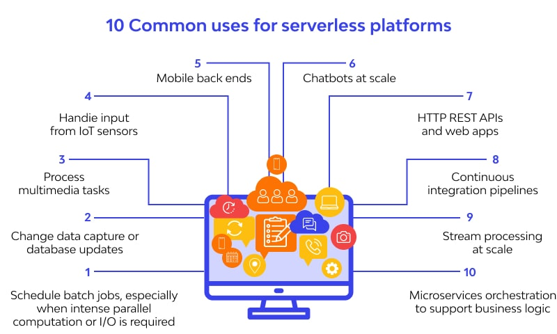

# **Introduction to Serverless Computing**

## **1. Overview of Serverless Computing**
Serverless computing is a cloud computing execution model where cloud providers manage the infrastructure, automatically handling provisioning, scaling, and maintenance of resources. Developers focus on writing code without managing servers.

### **1.1 Key Characteristics of Serverless Computing**
- **No Server Management** – The cloud provider handles provisioning, scaling, and maintenance.
- **Automatic Scaling** – Resources scale up or down based on demand.
- **Event-Driven Execution** – Functions execute in response to events (e.g., HTTP requests, database changes, file uploads).
- **Pay-as-You-Go Pricing** – Charges are based on actual execution time and resource consumption.
- **Stateless Execution** – Each function runs independently without maintaining persistent state (stateful options exist using external services like databases and storage).

### **1.2 Comparison: Serverless vs. Traditional Infrastructure**

| Feature             | Serverless Computing       | Traditional Infrastructure |
|---------------------|--------------------------|----------------------------|
| **Server Management** | Fully managed by provider | Requires provisioning & maintenance |
| **Scaling**         | Automatic scaling         | Manual or auto-scaling (complex) |
| **Pricing Model**   | Pay-per-use               | Pay for allocated resources |
| **Deployment Time** | Fast (instant execution)  | Slow (server provisioning needed) |
| **Event-Driven**    | Yes                        | Not by default |
| **Maintenance**     | Handled by provider       | Requires manual updates |

---

## **2. How Serverless Works**
### **2.1 Event-Driven Execution Model**
Serverless functions are event-driven, meaning they execute only in response to specific events. These events can come from:
- **HTTP Requests** (API Gateway, ALB, or direct function invocation)
- **Database Triggers** (e.g., changes in DynamoDB, Aurora, Firebase, or MongoDB)
- **File Uploads** (e.g., Amazon S3 event triggers)
- **Scheduled Jobs** (e.g., AWS EventBridge or Google Cloud Scheduler)
- **Message Queues** (e.g., AWS SQS, SNS, Kafka, RabbitMQ)

### **2.2 Stateless and Scalable Execution**
Each execution of a serverless function is stateless. If state persistence is required, external services such as:
- **Databases** (DynamoDB, RDS, Firebase, MongoDB)
- **Storage Solutions** (S3, Blob Storage)
- **Session Stores** (Redis, Memcached)

---

## **3. Benefits of Serverless Computing**
### **3.1 Cost Efficiency**
- Pay only for actual execution time, reducing infrastructure costs.
- No idle server costs as resources are automatically allocated.

### **3.2 Simplified Operations**
- No need to manage or provision servers.
- Faster deployments and reduced DevOps overhead.

### **3.3 Auto-Scaling**
- Dynamically scales based on incoming requests or event triggers.
- Handles unpredictable traffic spikes automatically.

### **3.4 Faster Time to Market**
- Developers focus on writing code, reducing the time spent on infrastructure management.
- Deployment of new features is faster due to simplified CI/CD processes.

### **3.5 High Availability**
- Serverless providers ensure built-in fault tolerance and high availability across multiple regions.

---

## **4. Challenges of Serverless Computing**
### **4.1 Cold Starts**
- Functions may experience slight delays (cold starts) when scaling from zero.
- Solutions: Provisioned concurrency (AWS Lambda), keeping functions warm with scheduled triggers.

### **4.2 Debugging & Monitoring**
- Traditional debugging tools don’t work well in ephemeral serverless environments.
- Solutions: Use logging and monitoring tools like AWS CloudWatch, Azure Monitor, Google Stackdriver.

### **4.3 Vendor Lock-In**
- Serverless architectures are tightly integrated with cloud provider services.
- Solutions: Use multi-cloud strategies or frameworks like the Serverless Framework to reduce dependency.

### **4.4 Stateless Limitations**
- Functions must rely on external storage services for persistence.
- Solutions: Use managed databases like DynamoDB or cloud-native caching services.

---

## **5. Common Use Cases for Serverless Computing**
### **5.1 Web and API Applications**
- Serverless APIs using AWS Lambda, API Gateway, or Azure Functions.
- Full-stack applications using serverless backend services.

### **5.2 Event-Driven Applications**
- File processing (e.g., image/video conversion upon upload to S3).
- Log analysis and real-time monitoring.

### **5.3 Data Processing & Analytics**
- Processing real-time data streams using AWS Kinesis, Google Pub/Sub, or Azure Event Hub.
- Serverless ETL (Extract, Transform, Load) operations.

### **5.4 IoT Applications**
- Processing IoT sensor data in real-time.
- Triggering alerts and automation workflows.

### **5.5 Chatbots & AI/ML Inference**
- Running serverless AI inference models using AWS Lambda, Google Cloud Functions.
- Processing chatbot messages using event-driven functions.

---

## **6. Popular Serverless Platforms**
| Platform          | Provider | Features |
|------------------|----------|----------|
| **AWS Lambda**  | Amazon AWS | Event-driven, integrates with AWS services |
| **Google Cloud Functions** | Google Cloud | Scalable, integrates with Firebase, Cloud Run |
| **Azure Functions** | Microsoft Azure | Supports .NET, Python, Java, integrates with Azure Event Grid |
| **IBM Cloud Functions** | IBM Cloud | Based on Apache OpenWhisk, supports multi-cloud |
| **Cloudflare Workers** | Cloudflare | Edge computing for low-latency serverless execution |

---

## **7. When to Use and When Not to Use Serverless**
### **7.1 When to Use Serverless**
- Applications with unpredictable or variable traffic.
- Event-driven applications requiring rapid scaling.
- Batch processing, scheduled tasks, and lightweight workloads.
- Microservices architectures.

### **7.2 When NOT to Use Serverless**
- Applications with long-running processes (>15 minutes execution limit on AWS Lambda).
- Workloads requiring high memory or CPU-intensive processing (better suited for containers on ECS/EKS).
- Applications with complex networking needs or strict security compliance.

---

## **Summary**
- Serverless computing eliminates infrastructure management and offers automatic scaling.
- It is cost-effective, highly available, and accelerates development.
- Major serverless platforms include AWS Lambda, Google Cloud Functions, and Azure Functions.
- Common use cases include API backends, event-driven workflows, real-time analytics, and IoT.
- Challenges like cold starts, debugging limitations, and vendor lock-in can be mitigated with best practices.

