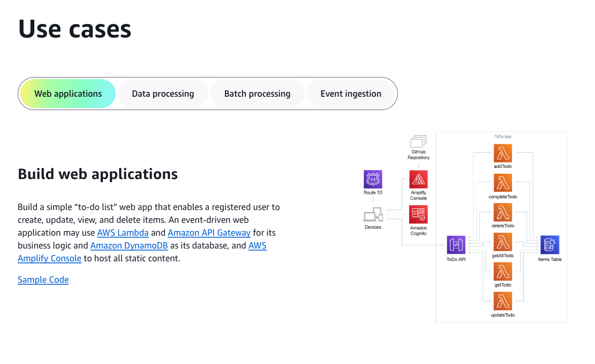
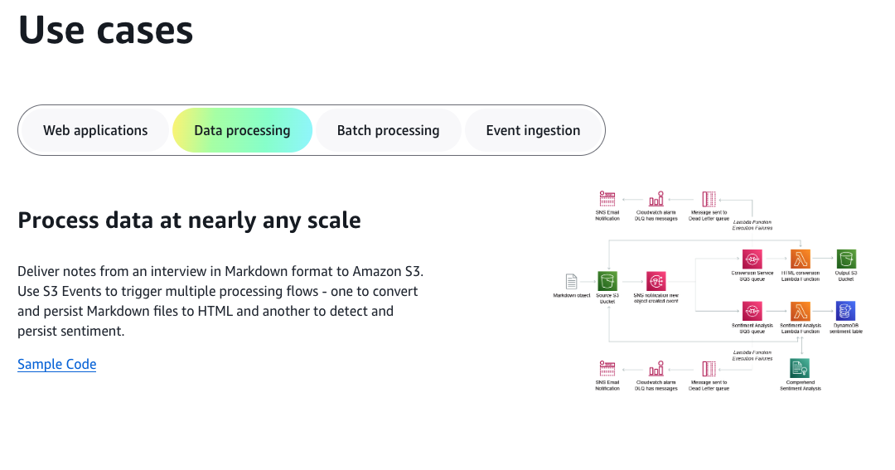
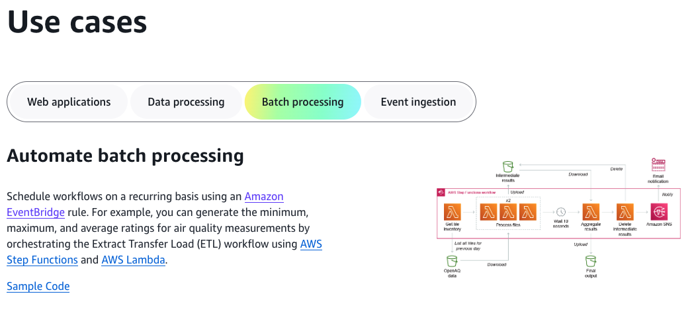
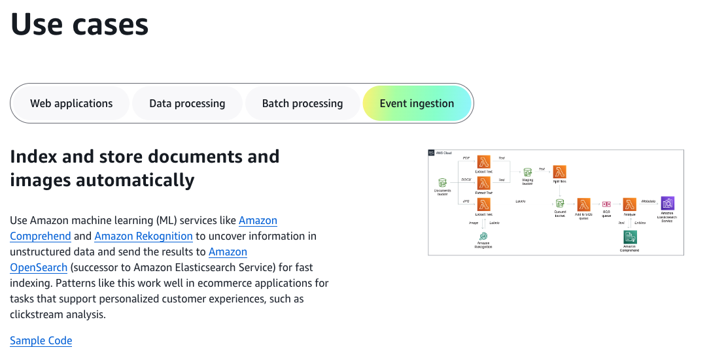

# **Introduction to Serverless Computing on AWS**

## **1. Overview of Serverless on AWS**
Amazon Web Services (AWS) provides a comprehensive ecosystem for serverless computing, enabling developers to build and deploy applications without managing infrastructure. AWS serverless services offer **automatic scaling, pay-as-you-go pricing, and event-driven execution**, making cloud development more efficient and cost-effective.

### **1.1 What is Serverless Computing on AWS?**
Serverless computing on AWS eliminates the need for provisioning and managing servers. Instead, developers focus on writing code, while AWS dynamically handles resource allocation, scaling, and maintenance.

### **1.2 Key Advantages of AWS Serverless**
- **No Server Management** – AWS handles infrastructure provisioning, scaling, and maintenance.
- **Cost Efficiency** – Pay only for execution time and resources consumed.
- **Event-Driven Execution** – Automatically respond to triggers from AWS services.
- **High Availability and Resilience** – Built-in fault tolerance and multi-region redundancy.
- **Security and Compliance** – Integrated with IAM, encryption, and AWS security best practices.

---

## **2. AWS Serverless Services**
AWS provides a suite of fully managed services that enable serverless application development across different domains:

### **2.1 Compute Services**
- **AWS Lambda** – Run event-driven, serverless functions without managing servers.
- **AWS Fargate** – Run containers without managing the underlying infrastructure.

### **2.2 API and Event Management**
- **Amazon API Gateway** – Expose, manage, and secure RESTful APIs.
- **AWS App Runner** – Automate deployment of web applications and APIs.
- **Amazon EventBridge** – Event bus for serverless event-driven applications.
- **Amazon Simple Notification Service (SNS)** – Publish/subscribe messaging service.
- **Amazon Simple Queue Service (SQS)** – Message queuing for decoupled applications.

### **2.3 Data and Storage Services**
- **Amazon S3** – Scalable object storage with event-driven triggers.
- **Amazon DynamoDB** – Serverless NoSQL database with high availability.
- **Amazon Aurora Serverless** – On-demand, auto-scaling relational database.

### **2.4 Workflow and Automation**
- **AWS Step Functions** – Orchestrate workflows using event-driven logic.
- **AWS Lambda@Edge** – Run serverless functions closer to users via CloudFront.

---

## **3. How AWS Serverless Works**
### **3.1 Event-Driven Execution**
AWS serverless services respond to different triggers:
- **HTTP Requests** – API Gateway invokes Lambda functions.
- **File Uploads** – S3 triggers Lambda upon file upload.
- **Database Changes** – DynamoDB Streams triggers event processing.
- **Scheduled Jobs** – AWS EventBridge schedules serverless workflows.
- **Messaging Services** – SNS and SQS enable event-driven communication.

### **3.2 Stateless Design & Scaling**
AWS serverless applications are stateless by default, relying on external services like:
- **Amazon S3** for file storage.
- **Amazon DynamoDB** for data persistence.
- **AWS Step Functions** for workflow orchestration.

### **3.3 Integration with Other AWS Services**
AWS serverless services seamlessly integrate with various AWS solutions, including:
- **IAM for Access Control** – Ensuring secure function execution.
- **CloudWatch for Monitoring** – Logging and performance tracking.
- **Secrets Manager for Secure Configurations** – Storing API keys, passwords, and other credentials securely.
- **X-Ray for Tracing** – Visualizing request flows across AWS services.

---

## **4. Serverless Development Workflow on AWS**
AWS provides multiple tools and frameworks to simplify the development, deployment, and management of serverless applications.

### **4.1 Infrastructure as Code (IaC) for Serverless**
- **AWS Serverless Application Model (AWS SAM)** – Framework to define serverless applications using YAML.
- **AWS CloudFormation** – Automates the provisioning of serverless architectures.
- **Serverless Framework** – Open-source framework for deploying serverless applications across multiple cloud providers.

### **4.2 CICD for Serverless Applications**
AWS enables automation of serverless deployments using:
- **AWS CodePipeline** – Automates serverless application deployment.
- **AWS CodeBuild** – Builds and tests serverless applications.
- **AWS CodeDeploy** – Manages updates to AWS Lambda functions with traffic shifting capabilities.

### **4.3 Local Development and Testing**
- **AWS SAM CLI** – Enables local testing of Lambda functions and API Gateway integrations.
- **LocalStack** – A third-party tool that emulates AWS services locally for testing.

---

## **5. Best Practices for Serverless on AWS**
### **5.1 Performance Optimization**
- Optimize AWS Lambda **memory allocation** to balance cost and speed.
- Use **provisioned concurrency** to mitigate cold starts for latency-sensitive applications.
- Implement **caching with Amazon ElastiCache** to reduce database query times.

### **5.2 Security Best Practices**
- Apply **least privilege IAM policies** to AWS Lambda functions.
- Store sensitive data in **AWS Secrets Manager** instead of hardcoding credentials.
- Use **VPC integration** for controlling network access to AWS services.

### **5.3 Cost Optimization**
- Use **on-demand pricing** for unpredictable workloads and **reserved capacity** for predictable usage.
- Implement **AWS Cost Explorer** to analyze serverless application expenses.
- Optimize AWS Lambda execution by reducing function size and dependencies.

---

## **Summary**
- AWS provides a robust **serverless ecosystem** with services like **Lambda, API Gateway, DynamoDB, EventBridge, and S3**.
- **Event-driven execution** allows applications to scale dynamically based on demand.
- **Security, performance, and cost optimization** should be considered when designing AWS serverless architectures.
- **AWS tools like AWS SAM, CodePipeline, and CloudFormation** streamline development and deployment.

