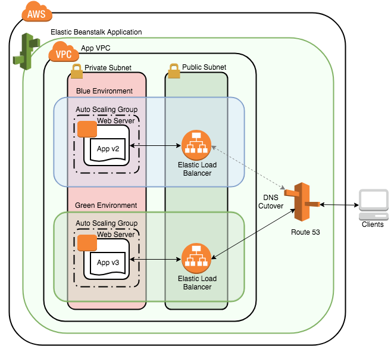

# **AWS Elastic Beanstalk**

## **1. Introduction to AWS Elastic Beanstalk**

**AWS Elastic Beanstalk** is a Platform-as-a-Service (PaaS) offering that allows developers to deploy and manage applications in the cloud without needing to manually handle the infrastructure that supports those applications.

Rather than provisioning compute, network, storage, load balancers, or monitoring individually, Elastic Beanstalk automates these tasks. This makes it suitable for developers who want to focus on application logic and deployment speed rather than infrastructure complexity.



Common use cases include:
- Hosting web applications and APIs.
- Running background worker processes.
- Deploying containerized apps using Docker.

---

## **2. Core Concepts**

Elastic Beanstalk revolves around the following components:

### **Application**
An Elastic Beanstalk application is a logical collection of components including environments, versions, and configurations. Think of it as the top-level folder for managing deployments.

### **Environment**
An environment represents a specific deployment of your application. For example, you might have separate environments for **development**, **testing**, and **production**. Each environment includes EC2 instances, load balancers, auto scaling groups, and other resources.

### **Application Version**
This is a specific bundle of deployable code (ZIP, WAR, etc.) uploaded to Elastic Beanstalk. It can be deployed to one or more environments.

### **Configuration Template**
Elastic Beanstalk uses templates to define environment parameters, such as instance types, platform versions, and scaling settings. These templates help standardize deployments.

---

## **3. Supported Platforms and Application Models**

Elastic Beanstalk supports a wide range of application platforms. These include:

- **Web Applications**: Using Node.js, Python, Java, PHP, Go, .NET, and Ruby.
- **Docker Containers**: For custom runtimes or multiple services, either single or multi-container setups.
- **Worker Applications**: Applications that run asynchronous jobs triggered by SQS messages.

Each supported platform comes with pre-configured environments. For example, a Node.js application on Elastic Beanstalk includes an EC2 instance running a pre-installed Node.js runtime.

---

## **4. Deployment and Management**

### **Application Deployment**
To deploy an application:
1. Package your code (e.g., as a ZIP file).
2. Upload it to Elastic Beanstalk via the web console, CLI, or SDKs.
3. Elastic Beanstalk provisions the required resources (e.g., EC2, ALB, ASG) and deploys your application.

Elastic Beanstalk also supports **rolling, immutable, and blue/green deployments**, allowing for minimal downtime and safer releases.

### **Environment Updates**
When updating your application version or configuration:
- Beanstalk replaces instances in a **rolling** fashion or spins up new environments depending on the deployment strategy selected.
- You can monitor updates via the **Elastic Beanstalk console**, **CloudWatch metrics**, and **event logs**.

---

## **5. Monitoring and Troubleshooting**

Elastic Beanstalk provides multiple tools to observe and manage the health of applications:

- **Health Dashboard**: Offers real-time status on your environment’s health (green, yellow, red).
- **Logs**: You can view logs from EC2 instances directly in the console or push them to Amazon CloudWatch for centralized monitoring.
- **CloudWatch Metrics**: Provides CPU usage, latency, request count, and more to monitor application performance.
- **Alarms**: You can set CloudWatch alarms to notify you when thresholds are breached.

---

## **6. Integration with AWS Services**

Elastic Beanstalk integrates smoothly with several AWS services, which include:

- **Amazon RDS**: Relational database instances can be launched alongside your application.
- **IAM Roles**: Securely grant applications access to other AWS services (e.g., access S3 or read from DynamoDB).
- **Amazon S3**: Used to store and manage application versions.
- **Amazon CloudWatch and X-Ray**: For monitoring and application tracing.

This tight integration helps ensure security, performance visibility, and operational efficiency without additional setup.

---

## **7. Pros and Limitations**

### **Advantages**
- **Simplicity**: Ideal for teams that want a quick and easy deployment solution.
- **Managed Infrastructure**: Developers can deploy without deep knowledge of AWS infrastructure.
- **Multiple Deployment Strategies**: Supports rolling, blue/green, and immutable deployments.
- **Scalability**: Automatically scales based on traffic and resource demand.

### **Limitations**
- **Limited Customization**: Less control compared to using EC2, ECS, or Kubernetes directly.
- **Platform Boundaries**: You must stick to the supported platforms or Docker.
- **Abstraction Overhead**: Debugging infrastructure issues can be more opaque.

---

## **8. When to Use Elastic Beanstalk**

Elastic Beanstalk is ideal for:
- Small to medium-sized applications.
- Rapid prototyping and deployment of web apps.
- Teams that prefer PaaS over managing IaaS.
- Developers wanting to maintain control over configuration while avoiding full DevOps responsibilities.