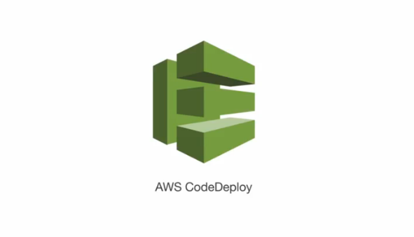

# AWS CodeDeploy






## 1. Introduction
AWS CodeDeploy is a fully managed deployment service that automates software deployments to various compute platforms, including Amazon EC2, on-premises servers, AWS Lambda functions, and Amazon ECS services. By abstracting the complexity of application deployments, CodeDeploy allows developers and DevOps teams to deploy rapidly, with minimal downtime and consistent control over application delivery. It supports a wide variety of application types and deployment strategies, making it suitable for modern, hybrid, and cloud-native applications alike.

## 2. Benefits
One of the primary advantages of AWS CodeDeploy is its ability to unify deployment mechanisms across diverse environments. It supports both server-based and serverless workloads, giving organizations the flexibility to choose the most appropriate infrastructure. CodeDeploy automates deployment processes across development, staging, and production environments, improving deployment velocity and consistency.

Other key benefits include:
- **Minimized Downtime**: In-place and blue/green deployment types allow for controlled rollouts, reducing service interruptions.
- **Automated Rollbacks**: If a deployment fails or predefined alarms are triggered, CodeDeploy can automatically roll back to the last known good state.
- **Monitoring & Auditing**: Integration with Amazon CloudWatch, SNS, and CloudTrail enables monitoring, alerting, and auditing of deployment activities.
- **Scalability**: Whether deploying to one instance or thousands, CodeDeploy scales seamlessly with the infrastructure.
- **Integration-Friendly**: It works well with CICD tools such as AWS CodePipeline, Jenkins, GitHub Actions, and Bitbucket.

## 3. Compute Platform Support
AWS CodeDeploy supports three compute platforms:

### 3.1 EC2/On-Premises
Deployments on this platform can be applied to Amazon EC2 instances, on-premises servers, or both. It supports two deployment types: in-place and blue/green. Applications deployed to EC2/On-Premises can consist of any combination of scripts, configuration files, web content, binaries, or multimedia.

### 3.2 AWS Lambda
This platform enables deployments of updated versions of Lambda functions. CodeDeploy manages traffic shifting between old and new function versions using canary, linear, or all-at-once strategies. This ensures minimal disruption and a safer rollout for serverless applications.

### 3.3 Amazon ECS
For containerized applications, CodeDeploy supports ECS blue/green deployments. It replaces the old task set with a new one, reroutes production traffic, and terminates the original tasks only after the new ones pass health checks. Canary and linear traffic shifting strategies are also supported here.

## 4. Deployment Types

### 4.1 In-Place Deployment
Used only for EC2/On-Premises compute platforms. The application is stopped, replaced, and restarted on each target instance. During the process, CodeDeploy deregisters the instance from any load balancer, installs the update, and re-registers the instance once the update is verified.

### 4.2 Blue/Green Deployment
Applicable to all supported compute platforms. CodeDeploy provisions a replacement environment with the new application version, validates the environment, reroutes traffic from the original version, and optionally terminates the old environment. For EC2, this may involve launching new instances using an Auto Scaling group; for ECS and Lambda, the replacement task sets or versions are handled via their respective APIs.

## 5. Core Components
To understand how AWS CodeDeploy functions, it is essential to examine the primary building blocks that enable its deployment automation. These components form the foundation of the deployment process and provide structure and control for both simple and complex use cases.

### 5.1 Application
An application in CodeDeploy is not the application code itself, but rather a logical container that serves to organize and manage your deployment lifecycle. It encompasses revisions (application versions), deployment groups (targets), and configurations (deployment strategies). Each application is associated with a compute platform—EC2/On-Premises, Lambda, or Amazon ECS—which determines how and where the deployment will be executed.

Applications provide isolation and clarity in managing deployments, especially in environments with multiple microservices or deployment targets. They also help segregate production and development environments under a unified name.

### 5.2 Deployment Group
A deployment group is a key component that defines the specific resources (such as EC2 instances, Lambda functions, or ECS services) that a revision will be deployed to. It acts as a bridge between the application and the infrastructure. For EC2/On-Premises, deployment groups can be formed using Amazon EC2 tags, Auto Scaling groups, or even on-premises instances registered with CodeDeploy. For Lambda, the deployment group maps to a specific Lambda function and version. For ECS, it maps to a service within a cluster along with associated listeners and target groups.

Each deployment group also includes settings for rollback behaviors, load balancer configuration, deployment alarms, and triggers, offering granular control over the deployment process.

### 5.3 Deployment Configuration
Deployment configurations define the strategy and pace at which the application is deployed to the target resources. This includes how many instances or what percentage of traffic should receive the update at a given time. Predefined configurations are available, such as `CodeDeployDefault.AllAtOnce`, `CodeDeployDefault.HalfAtATime`, and `CodeDeployDefault.OneAtATime`, each with specific thresholds for batch deployments. In addition, custom configurations can be created for highly tailored deployment needs.

For Lambda and ECS, deployment configurations also include traffic shifting strategies such as canary and linear deployments, which define the proportion of traffic and interval timings.

### 5.4 Revision
A revision refers to a version of your application that you want to deploy. For EC2 and on-premises deployments, a revision typically includes an archive (e.g., .zip or .tar) containing the application source code, binaries, configuration files, and an AppSpec file. These revisions are stored in Amazon S3 or GitHub. For Lambda, the revision is a reference to a Lambda function version along with its AppSpec configuration. For ECS, it includes the ECS task definition and container-specific settings.

Revisions are immutable once created and serve as snapshots of your application that can be redeployed or rolled back to as needed.

**Example**:
```json
{
  "version": 0.0,
  "os": "linux",
  "files": [
    {
      "source": "index.html",
      "destination": "/var/www/html"
    }
  ],
  "hooks": {
    "BeforeInstall": [
      {
        "location": "scripts/install_dependencies.sh",
        "timeout": 300,
        "runas": "root"
      }
    ]
  }
}
```

### 5.5 AppSpec File
The AppSpec file is the central configuration document that tells CodeDeploy exactly how to deploy your application. Written in YAML or JSON, it defines lifecycle event hooks, scripts to run before and after deployment stages, and additional resources like containers or Lambda functions.

For EC2, it controls file copying, service restarts, and script execution. For Lambda, it defines the function version and test hooks. For ECS, it includes task definitions, container names, port mappings, and network configurations. This file must be included with every application revision and must be syntactically correct to ensure a successful deployment.

**YAML Example for EC2**:
```yaml
version: 0.0
os: linux
files:
  - source: /
    destination: /home/ec2-user/my-app
hooks:
  AfterInstall:
    - location: scripts/restart_app.sh
      timeout: 180
      runas: ec2-user
```

### 5.6 Service Role
The service role is an AWS Identity and Access Management (IAM) role that grants CodeDeploy permissions to perform operations on your behalf. This includes reading deployment configurations, accessing source files in S3 or GitHub, updating load balancers, tagging resources, and sending metrics to CloudWatch.

It is a best practice to use the principle of least privilege when defining this role, ensuring that only the required actions are permitted. This helps to maintain a secure deployment pipeline and reduce potential attack surfaces.

Together, these components make AWS CodeDeploy a powerful and flexible tool for managing application delivery across a wide range of AWS services and hybrid environments. Each component plays a distinct and critical role in defining, controlling, executing, and monitoring deployments effectively.

## 6. Monitoring and Rollbacks
Monitoring your deployments is essential to ensuring application reliability and performance. AWS CodeDeploy integrates with CloudWatch to provide detailed metrics, logs, and alarms. You can monitor individual deployment status, failure reasons, and lifecycle event execution.

CodeDeploy supports both automatic and manual rollbacks. Automatic rollback can be configured to trigger based on failed deployments or breached CloudWatch alarms. Manual rollback is performed by redeploying a previous, successful revision. These mechanisms help minimize disruption and speed up recovery in the event of a faulty release.

## 7. Security and IAM
Security in CodeDeploy revolves around proper use of IAM roles and policies. The service role grants CodeDeploy permission to manage AWS resources during deployments. The instance profile enables EC2 instances to retrieve application revisions and report status.

Security best practices include:
- Using minimal privilege roles
- Encrypting artifacts in S3
- Monitoring role usage via CloudTrail
- Applying tagging policies for audit tracking

## 8. CICD Integration
CodeDeploy integrates tightly with AWS CodePipeline, enabling complete automation from source to deployment. It also works with third-party tools such as Jenkins, GitHub Actions, and Bitbucket Pipelines.

In a CICD workflow, CodeDeploy is typically used in the delivery stage to deploy built and tested artifacts to production or staging environments. Deployment success, failure, or rollback events can trigger additional actions in the pipeline.

## 9. Best Practices
- Use blue/green deployments for production to enable safe testing and instant rollback.
- Keep AppSpec files modular and under version control.
- Use pre-deployment and post-deployment hooks to run tests and validations.
- Monitor deployments with CloudWatch alarms for rapid response to issues.
- Validate AppSpec files locally before uploading to avoid syntax-related failures.
- Use code snippets to document and automate frequent deployment tasks.

## 10. Conclusion
AWS CodeDeploy provides a robust, flexible solution for automating deployments across AWS compute services. Its support for multiple deployment strategies, integrations with CICD pipelines, detailed monitoring, and rollback capabilities makes it a key tool for modern DevOps practices. With the right configurations and best practices, CodeDeploy can significantly enhance the speed, reliability, and safety of application releases.

