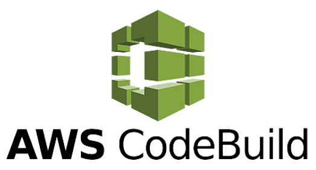

# AWS CodeBuild



## 1. Introduction
AWS CodeBuild is a fully managed continuous integration service that compiles source code, runs tests, and produces software packages ready for deployment. Unlike traditional build servers, CodeBuild eliminates the need to provision, scale, and manage your own infrastructure. It supports a variety of programming languages and build tools out of the box, and can be customized to suit specific build environments through Docker images.

CodeBuild is designed to integrate seamlessly with other AWS developer tools such as CodeCommit, CodePipeline, CodeDeploy, and third-party tools like GitHub and Bitbucket. As a serverless service, it scales automatically based on the number of concurrent builds, helping reduce build wait times.




## 2. Key Features and Benefits
- **Fully Managed**: No servers to manage. AWS handles provisioning, scaling, and patching.
- **Pay-As-You-Go**: Charges based on build minutes used.
- **Automatic Scaling**: Builds run concurrently without queueing.
- **Preconfigured Environments**: Supports major languages and tools including JavaScript, Python, Go, and more.
- **Custom Builds**: Use your own Docker images for more control.
- **Secure**: Integrates with IAM, VPC, KMS, and Secrets Manager.
- **Artifact Management**: Output artifacts are pushed to Amazon S3 or ECR.
- **Detailed Logging**: Integrated with CloudWatch Logs for real-time insights.

## 3. How CodeBuild Works
CodeBuild follows a straightforward execution model:

1. **Define a Build Project**: This includes source repository information, build environment details, and artifact locations.
2. **Prepare Environment**: CodeBuild provisions the build container with the selected runtime and dependencies.
3. **Download Source**: Source code is downloaded from the specified source (e.g., S3, CodeCommit, GitHub).
4. **Execute Build**: Based on instructions in `buildspec.yml` or defined overrides.
5. **Upload Artifacts**: Output files are stored in the target destination (e.g., S3 bucket).
6. **Log Output**: Logs are sent to Amazon CloudWatch.

### Example Diagram: CodeBuild Integration Flow
```
+-------------+     +---------------+     +------------------+     +---------------+
| Source Repo | --> | CodeBuild Job | --> | Build Artifacts   | --> | Artifact Store |
| (CodeCommit)|     |  (Docker Env) |     | (e.g., ZIP, EXE)  |     |   (S3/ECR)     |
+-------------+     +---------------+     +------------------+     +---------------+
```

## 4. Buildspec File
The `buildspec.yml` file defines how CodeBuild runs a build. It contains instructions for different build phases and how to manage input/output artifacts.

### Basic Example
```yaml
version: 0.2
phases:
  install:
    runtime-versions:
      nodejs: 16
  pre_build:
    commands:
      - npm ci
  build:
    commands:
      - npm run build
  post_build:
    commands:
      - echo Build completed on `date`
artifacts:
  files:
    - '**/*'
    - '!node_modules/**'
```

### Phases Explained
- **install**: Setup runtime versions and dependencies.
- **pre_build**: Commands run before the main build (e.g., dependency install, validation).
- **build**: Main compilation and packaging (e.g., transpilation, bundling).
- **post_build**: Notifications, uploads, or cleanup.

## 5. Source Repositories
CodeBuild supports the following source providers:
- Amazon S3 (ZIP file with buildspec)
- AWS CodeCommit
- GitHub (OAuth or Webhook-based)
- GitHub Enterprise Server
- Bitbucket

For S3-based builds, the source must include `buildspec.yml` in the root directory or override it in the project definition.

## 6. Build Environments
CodeBuild uses Docker containers to run builds. You can choose:
- **Managed Images**: Pre-built by AWS for common languages.
- **Custom Images**: Hosted in Amazon ECR or public Docker Hub.

### Example Configuration (CLI)
```json
"environment": {
  "type": "LINUX_CONTAINER",
  "image": "aws/codebuild/standard:7.0",
  "computeType": "BUILD_GENERAL1_SMALL"
}
```

## 7. Artifact Storage
CodeBuild supports storing build outputs in:
- **Amazon S3**: For files and binaries.
- **Amazon ECR**: For Docker images built during the process.

Artifacts are defined in `buildspec.yml` or directly in the project configuration.

### Example Output Definition
```yaml
artifacts:
  files:
    - "dist/**/*"
  discard-paths: yes
  base-directory: "dist"
```

## 8. Monitoring and Logging
- **CloudWatch Logs**: Real-time build logs and metrics.
- **Console View**: Summarized and detailed phase-wise build status.
- **CloudTrail**: Logs API calls for auditing.

## 9. Security and IAM
- Use IAM roles for CodeBuild to access source and destination services.
- Use KMS for encrypting artifacts and logs.
- Store environment secrets securely using AWS Secrets Manager or SSM Parameter Store.

## 10. CICD Integration
AWS CodeBuild integrates naturally with:
- **CodePipeline**: As a `Build` or `Test` action.
- **EventBridge**: For triggering builds on commit events.
- **GitHub Actions / GitLab CI**: Via webhook or runner.

### Example: CodeBuild in CodePipeline
```yaml
- Name: Build
  Actions:
    - Name: AppBuild
      ActionTypeId:
        Category: Build
        Owner: AWS
        Provider: CodeBuild
        Version: 1
      Configuration:
        ProjectName: MyCodeBuildProject
```

## 11. Sample Project: Node.js App with Webpack
To illustrate, here’s a simple Node.js application built with CodeBuild using npm and webpack.

**Source Structure:**
```
nodejs-app/
├── buildspec.yml
├── package.json
├── webpack.config.js
└── src
    └── index.js
```

**buildspec.yml**
```yaml
version: 0.2
phases:
  install:
    runtime-versions:
      nodejs: 16
  pre_build:
    commands:
      - npm ci
  build:
    commands:
      - npm run build
artifacts:
  files:
    - dist/**/*
```

**package.json** (partial)
```json
{
  "scripts": {
    "build": "webpack --mode production"
  },
  "devDependencies": {
    "webpack": "^5",
    "webpack-cli": "^4"
  }
}
```

## 12. Best Practices
- Use minimal permissions (IAM Least Privilege).
- Leverage build caching to speed up builds.
- Separate buildspec files per environment or stage.
- Use build badges for visibility into project status.
- Use batch builds for parallel testing or builds.

## 13. Summary
AWS CodeBuild offers a scalable, reliable, and integrated solution for building software in the cloud. With support for multiple languages, custom environments, and seamless CICD integration, it’s a critical tool for modern DevOps workflows. Whether used standalone or as part of CodePipeline, CodeBuild accelerates software delivery without infrastructure headaches.