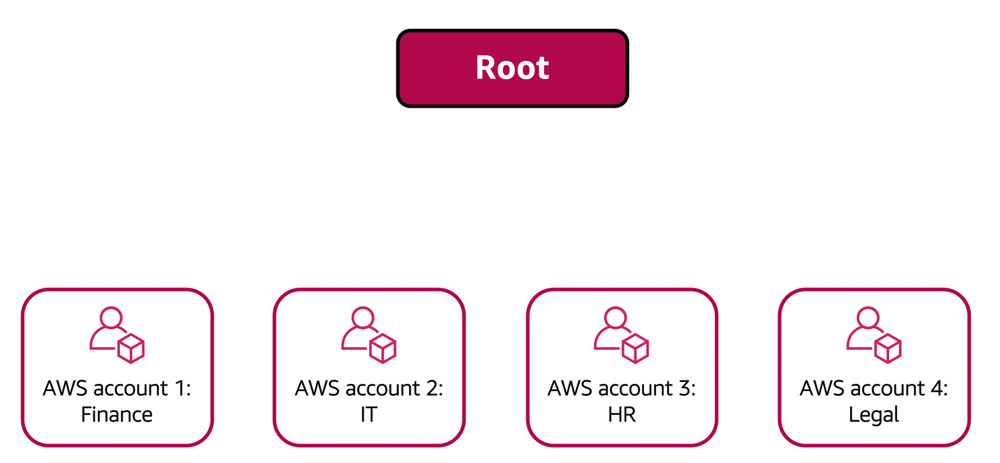
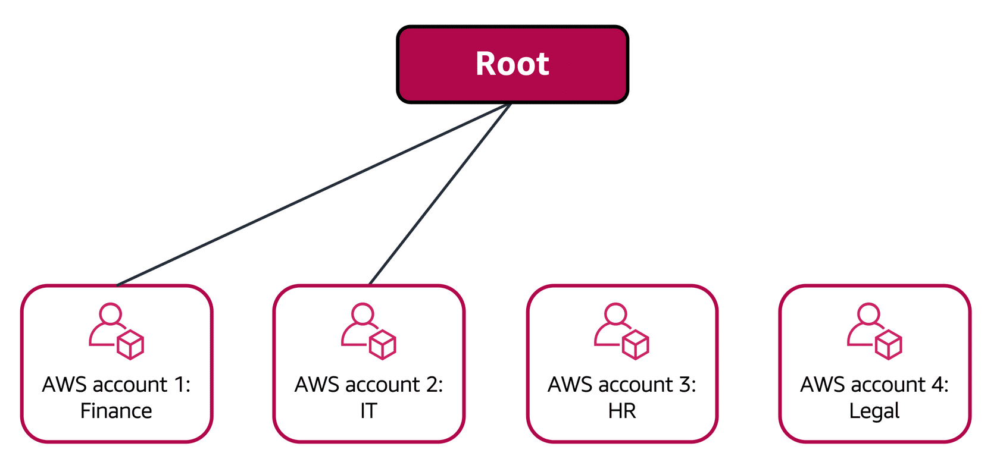

### **AWS Organizations**

AWS Organizations allows companies to consolidate and manage multiple AWS accounts from a central location. When an organization is created, AWS Organizations automatically establishes a root, which serves as the parent container for all accounts in the organization.

Through AWS Organizations, permissions for accounts can be centrally managed using **service control policies (SCPs)**. SCPs enable restrictions on AWS services, resources, and specific API actions that users and roles within each account can access.

Another feature of AWS Organizations is **consolidated billing**, which allows all accounts to be grouped under a single payment method, simplifying the billing process.

---

#### **Organizational Units (OUs)**

In AWS Organizations, accounts can be grouped into **organizational units (OUs)** to facilitate managing accounts with similar business or security needs. Applying a policy to an OU ensures that all accounts within the OU automatically inherit the specified permissions.

By grouping accounts into OUs, it becomes easier to isolate workloads or applications that have specific security requirements. For example, if certain accounts need to meet regulatory requirements, they can be placed into an OU, and a policy can be attached to block access to any services that do not meet those requirements.

---

#### **Example: AWS Organizations**

For example, a company may have separate AWS accounts for the finance, IT, HR, and legal departments. These accounts can be consolidated into a single organization for centralized management. When the organization is created, a root is established, and all accounts can be grouped accordingly.

The finance and IT departments might have requirements that differ from other departments, so these accounts can be brought into the organization to take advantage of benefits like consolidated billing without being placed into any OUs.

Meanwhile, the HR and legal departments may share access needs to certain AWS services and resources, so they can be grouped into an OU. By doing so, policies can be applied to manage access for both departments' accounts.

Grouping accounts into OUs allows for streamlined access management, enabling each department to access the resources they require while restricting access to unnecessary services.

For more information, visit the official [AWS Organizations](https://aws.amazon.com/organizations/) page and the [AWS Organizations User Guide](https://docs.aws.amazon.com/organizations/latest/userguide/orgs_manage_policies_scps.html).