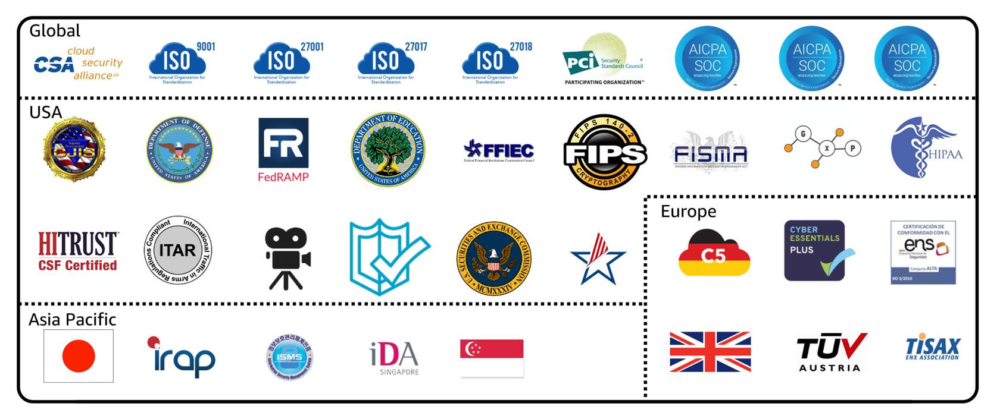

### **Compliance: AWS Artifact**

Depending on the industry in which a company operates, specific compliance standards may need to be met. Audits or inspections are typically conducted to ensure that these standards are adhered to.

**AWS Artifact** is a service that provides on-demand access to AWS security and compliance reports, as well as selected online agreements. AWS Artifact is divided into two main sections: **AWS Artifact Agreements** and **AWS Artifact Reports**.

---

#### **AWS Artifact Agreements**

If a company needs to sign an agreement with AWS regarding the use of specific types of information across AWS services, **AWS Artifact Agreements** enables this process. 

In this section, companies can review, accept, and manage agreements for both individual accounts and all accounts within **AWS Organizations**. AWS offers various types of agreements to meet the needs of customers subject to specific regulations, such as the **Health Insurance Portability and Accountability Act (HIPAA)**.

---

#### **AWS Artifact Reports**

If a member of the company's development team is working on an application and requires detailed information on compliance responsibilities for certain regulatory standards, they can access this information through **AWS Artifact Reports**.

AWS Artifact Reports provide compliance reports from third-party auditors who have tested and verified AWS’s compliance with numerous global, regional, and industry-specific security standards and regulations. AWS continuously updates the reports, ensuring that the latest versions are available. These reports can be shared with auditors or regulators as evidence of AWS’s security controls.

Some of the compliance reports and regulations available in AWS Artifact include descriptions of their contents and the reporting periods for which the documents are valid.

For more details, AWS Artifact helps ensure that companies can meet their compliance obligations by providing the necessary resources and documentation.

