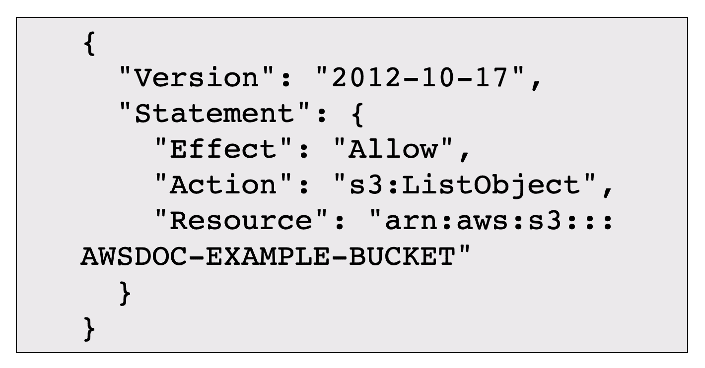
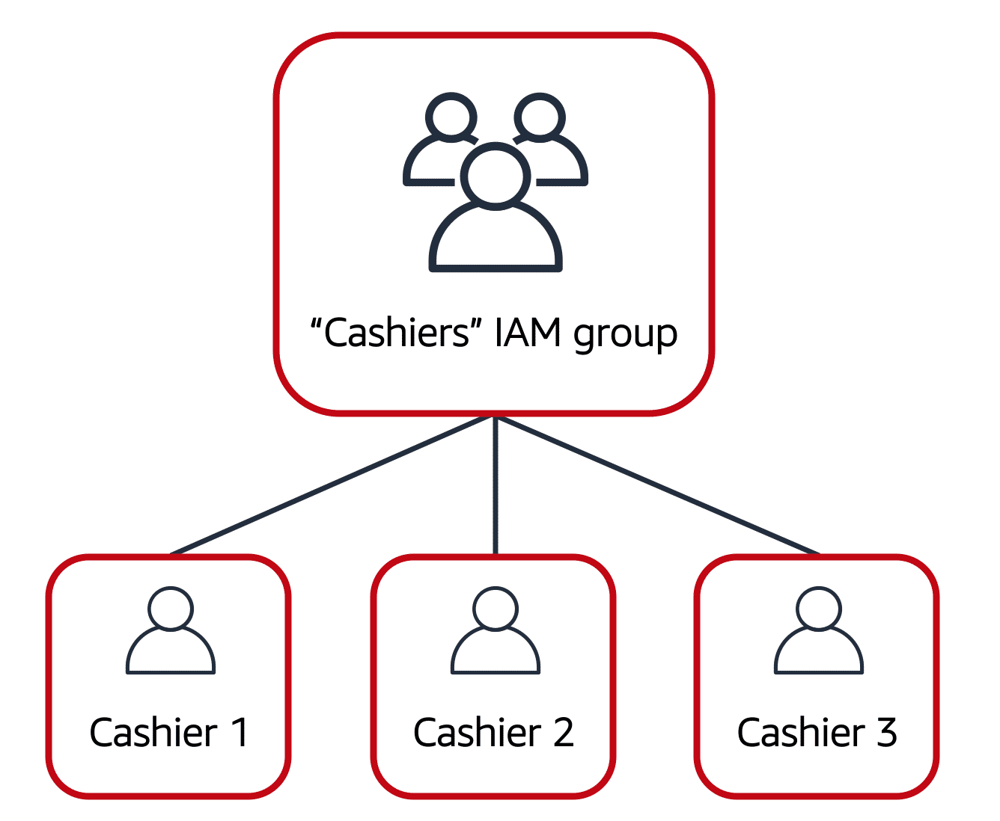
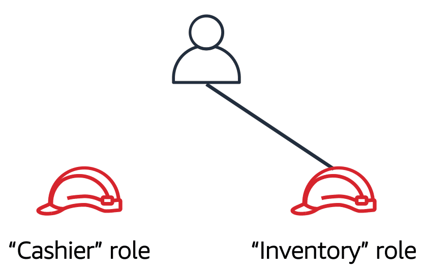

### **User Permissions and Access in AWS**

---

#### **AWS Identity and Access Management (IAM)**

AWS Identity and Access Management (IAM) allows secure management of access to AWS services and resources. With IAM, organizations can configure access based on specific security needs using the following key features:

- IAM users, groups, and roles
- IAM policies
- Multi-factor authentication (MFA)

Best practices for these features are highlighted in this module.

---

#### **AWS Account Root User**

When an AWS account is created, it starts with a root user that has complete access to all services and resources. However, AWS best practices recommend using the root user only for critical tasks (such as changing account details). The root user should be used to create IAM users with specific permissions for regular operations.

---

#### **IAM Users**

An IAM user represents an individual or application interacting with AWS resources. By default, IAM users have no permissions, so they need specific permissions assigned through IAM policies to perform tasks.

Best practice: Create individual IAM users for each person requiring access to AWS, even if they have the same permissions. This ensures security by maintaining unique credentials for each user.

---

#### **IAM Policies**

IAM policies are documents that define what actions are allowed or denied on AWS resources. Policies enable the customization of access for users, groups, or roles.

Best practice: Apply the **least privilege** principle, ensuring users only have the permissions necessary to complete their tasks.

---

#### **IAM Groups**

IAM groups allow the grouping of multiple IAM users, simplifying the management of permissions. Assigning policies to groups enables centralized control over users with similar roles.

Example: A coffee shop owner can create a "Cashiers" IAM group and add users to the group, making it easier to manage permissions as employees transition between roles.

---

#### **IAM Roles**

IAM roles provide temporary access to permissions, allowing users, applications, or services to assume different access rights as needed. This is ideal when short-term access to resources is required.

Best practice: Use IAM roles for granting temporary access to resources rather than providing long-term permissions.

---

#### **Multi-factor Authentication (MFA)**

MFA adds an extra layer of security by requiring multiple forms of verification before granting access. In AWS, MFA can be enabled for both the root user and IAM users to protect the account from unauthorized access.

Best practice: Enable MFA for the root user and all IAM users to enhance security.

---

This module covered key IAM concepts, such as users, groups, roles, and policies, along with best practices for securing access in AWS. Following these guidelines ensures resources are protected while enabling authorized access.