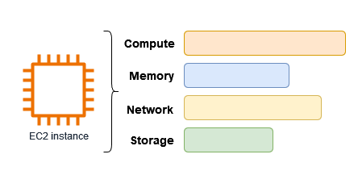
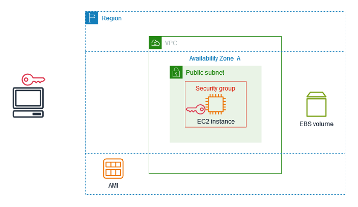

# Amazon EC2

Amazon Elastic Compute Cloud (Amazon EC2) offers on-demand, scalable computing capacity within the Amazon Web Services (AWS) Cloud. By utilizing Amazon EC2, organizations can reduce hardware costs, thereby enabling faster application development and deployment. Amazon EC2 provides the flexibility to launch as many or as few virtual servers as needed, with options to configure security, networking, and storage management. Capacity can be increased (scaled up) to handle compute-intensive tasks, such as periodic processes or traffic spikes on websites, and can be decreased (scaled down) when usage diminishes.

An EC2 instance is a virtual server hosted in the AWS Cloud. When launching an EC2 instance, the selected instance type determines the hardware resources available. Each instance type offers a distinct combination of compute, memory, network, and storage resources to meet varying application requirements.

## Accessing Amazon EC2

Amazon EC2 instances can be created and managed using several interfaces:

- **Amazon EC2 Console**

  The Amazon EC2 console is a web interface that allows users to create and manage EC2 instances and resources. Once an AWS account is registered, the Amazon EC2 console can be accessed by signing into the AWS Management Console and selecting EC2 from the console home page.

- **AWS Command Line Interface (CLI)**

  The AWS Command Line Interface (CLI) enables interaction with AWS services through commands in a command-line shell. It is available on Windows, Mac, and Linux. For detailed information, refer to the [AWS Command Line Interface User Guide](https://docs.aws.amazon.com/cli/latest/userguide/). The specific commands for Amazon EC2 can be found in the [AWS CLI Command Reference](https://docs.aws.amazon.com/cli/latest/reference/ec2/).

- **AWS CloudFormation**

  Amazon EC2 resources can be created using AWS CloudFormation. Users can create a template in JSON or YAML format that describes the AWS resources, and AWS CloudFormation will provision and configure those resources. These templates can be reused to provision the same resources multiple times across different Regions and accounts. For more information on supported resource types and properties for Amazon EC2, see the [EC2 resource type reference](https://docs.aws.amazon.com/AWSCloudFormation/latest/UserGuide/AWS_EC2.html) in the AWS CloudFormation User Guide.

- **AWS SDKs**

  AWS provides SDKs that allow developers to build applications using language-specific APIs instead of making requests over HTTP or HTTPS. These SDKs include libraries, sample code, tutorials, and other resources to help automate tasks like cryptographically signing requests, retrying requests, and handling error responses. For more information, visit [Tools to Build on AWS](https://aws.amazon.com/tools/).

- **AWS Tools for PowerShell**

  AWS Tools for PowerShell consist of PowerShell modules built on the functionality of the AWS SDK for .NET. These tools enable users to script operations on AWS resources from the PowerShell command line. For more information, refer to the [AWS Tools for Windows PowerShell User Guide](https://docs.aws.amazon.com/powershell/latest/userguide/). The cmdlets for Amazon EC2 can be found in the [AWS Tools for PowerShell Cmdlet Reference](https://docs.aws.amazon.com/powershell/latest/reference/index.html).

- **Query API**

  Amazon EC2 provides a Query API that allows users to make HTTP or HTTPS requests using the HTTP verbs GET or POST with a Query parameter named Action. For more information about API actions for Amazon EC2, see the [Amazon EC2 API Reference](https://docs.aws.amazon.com/AWSEC2/latest/APIReference/).

## Getting Started with Amazon EC2

This tutorial guides users through the process of launching and connecting to an Amazon Elastic Compute Cloud (Amazon EC2) instance. An EC2 instance is a virtual server in the AWS Cloud that enables the setup and configuration of the operating system and applications.

### Overview

The key components used in this tutorial are illustrated below:

- **Image:** A template containing the software to run on the instance, such as the operating system.

- **Key Pair:** A set of security credentials used to verify identity when connecting to the instance. The public key is stored on the instance, while the private key is retained on the local machine.

- **Network:** Amazon VPC (Virtual Private Cloud) is a virtual network dedicated to the AWS account. The account includes a default VPC in each AWS Region, with each VPC containing a default subnet in every Availability Zone, making it easy to get started.

- **Security Group:** A virtual firewall that controls inbound and outbound traffic to the instance.

- **EBS Volume:** The root volume required for the image, with the option to add additional data volumes.

The EC2 instance will include these components: a security group, key pair, and EBS root volume.

### Cost Considerations for this Tutorial

For AWS accounts that are less than 12 months old and have not exceeded the AWS Free Tier benefits for Amazon EC2, this tutorial will not incur any charges. The tutorial is designed to select options within the Free Tier benefits. However, for accounts that have exceeded Free Tier limits or are older, standard Amazon EC2 usage fees will apply from the time the instance is launched until it is terminated, even if the instance remains idle.