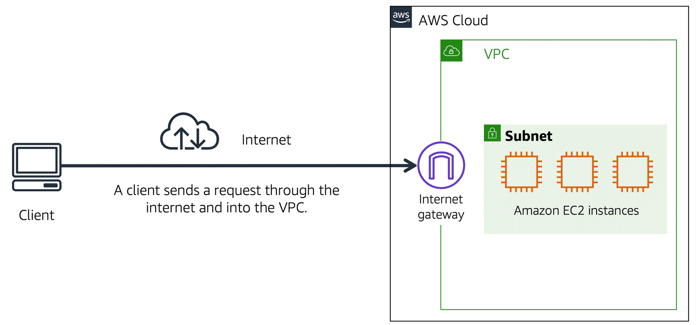
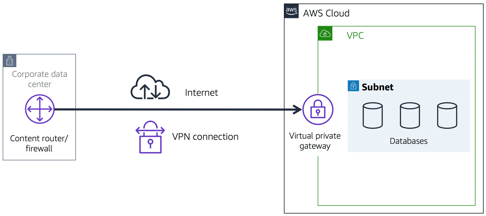
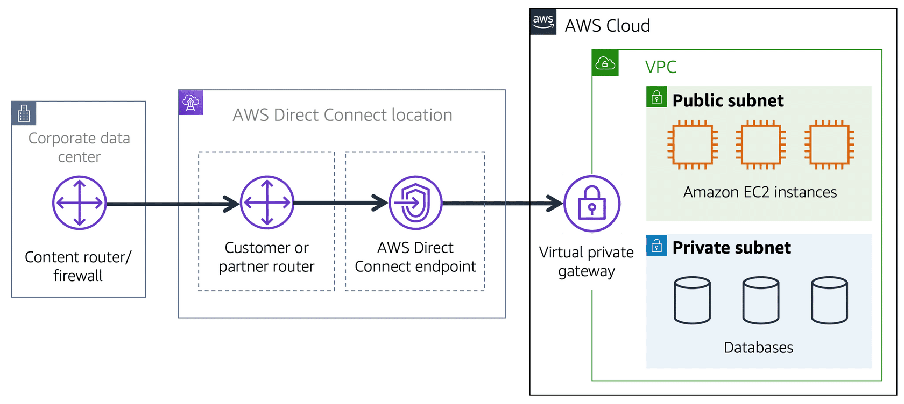

### **Connectivity to AWS**

#### **Amazon Virtual Private Cloud (Amazon VPC)**

Amazon Virtual Private Cloud (Amazon VPC) is a networking service that allows users to establish boundaries around their AWS resources. Without these boundaries, network traffic could flow between millions of resources—such as Amazon EC2 instances—without restriction.

Amazon VPC enables users to provision an isolated section of the AWS Cloud where they can launch resources within a **virtual network** they define. Within this isolated environment, users can organize resources into **subnets**. A subnet is a section of a VPC that can contain resources like EC2 instances.

---

#### **Internet Gateway**

To allow public traffic to access your VPC, you can attach an **internet gateway** to it. An internet gateway serves as a connection point between the VPC and the internet. It acts like a doorway that enables external traffic to reach resources within your VPC. Without an internet gateway, resources in the VPC are isolated from the internet.

---

#### **Virtual Private Gateway**

If your VPC consists of only private resources, you can use a **virtual private gateway** to enable encrypted connections to external networks. A virtual private gateway works by allowing **Virtual Private Network (VPN)** connections between your VPC and other private networks, such as an on-premises data center. It provides an extra layer of security, ensuring that only approved networks can send traffic into the VPC.

---

#### **AWS Direct Connect**

**AWS Direct Connect** provides a dedicated, private connection between your data center and a VPC, bypassing the need for the public internet. This private connection reduces network costs and increases available bandwidth. You can think of it as a private hallway linking your data center directly to your VPC, avoiding the shared public network, much like residents of an apartment building using a private hallway to access a coffee shop.