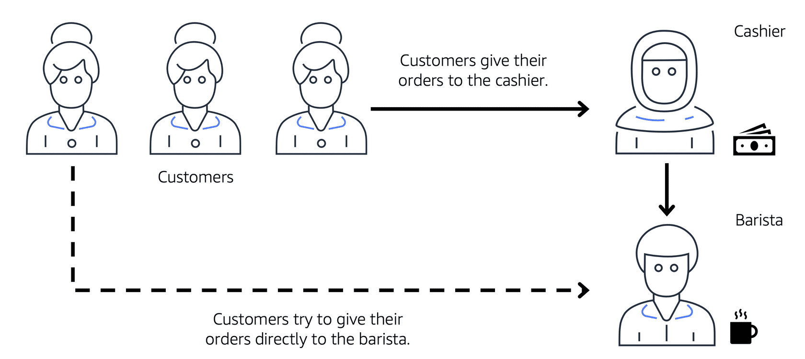
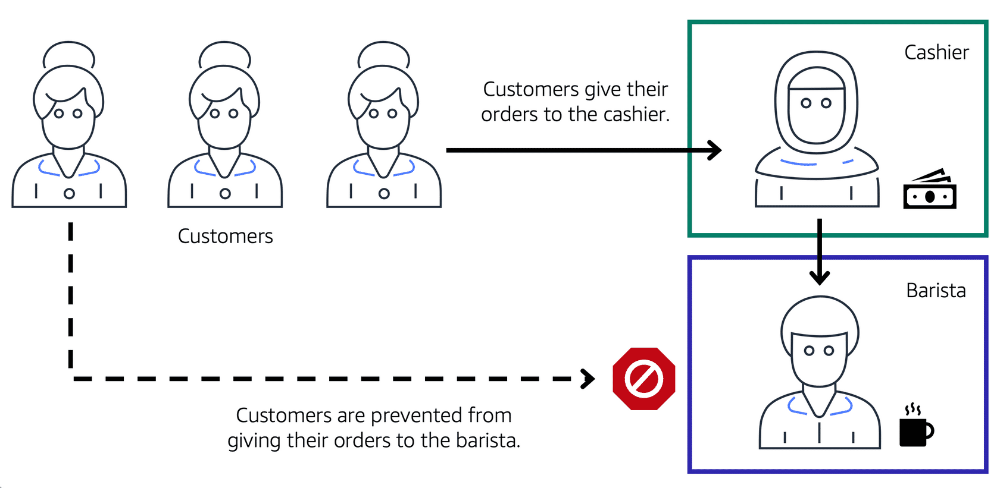
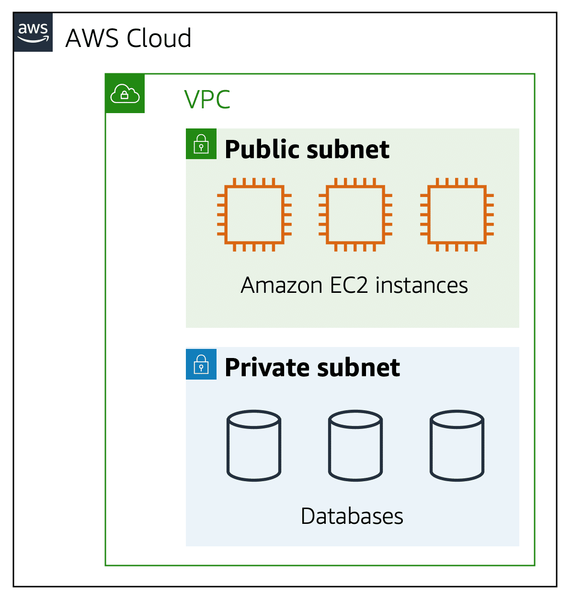
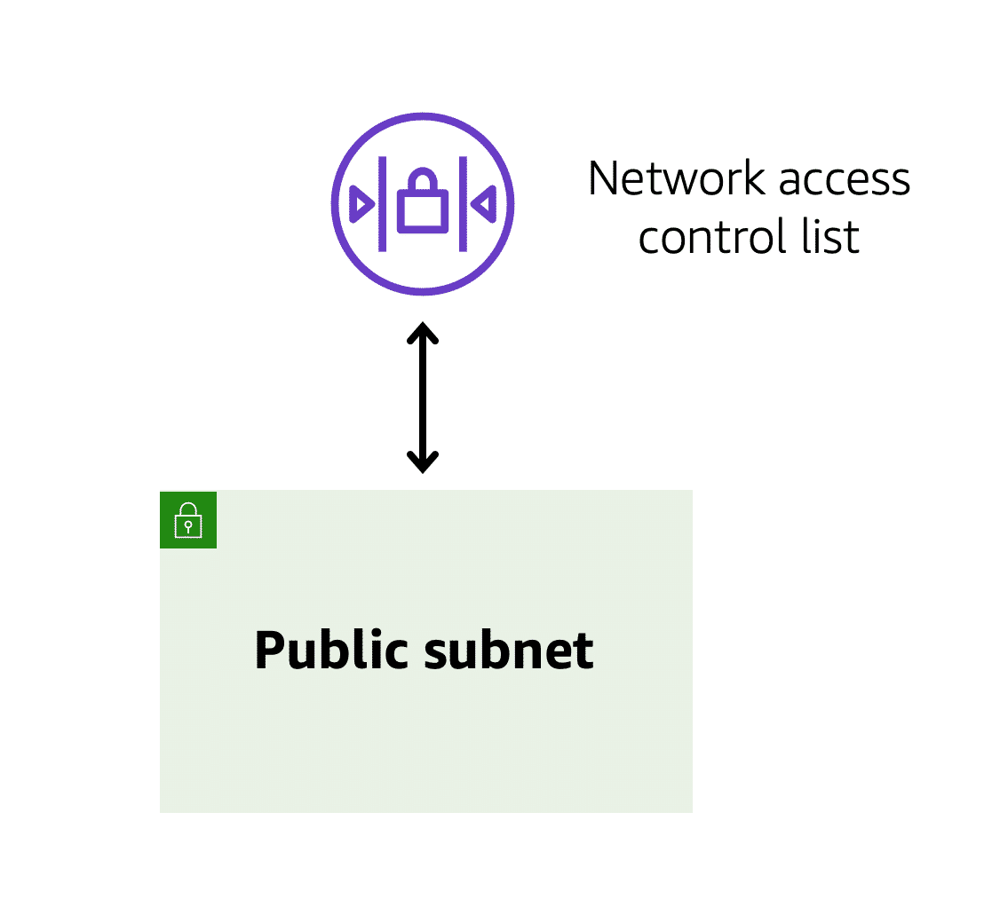
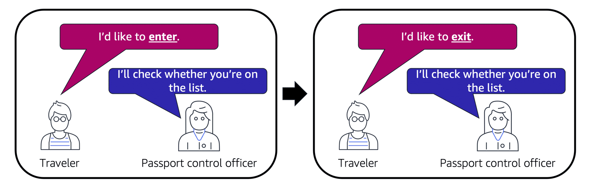
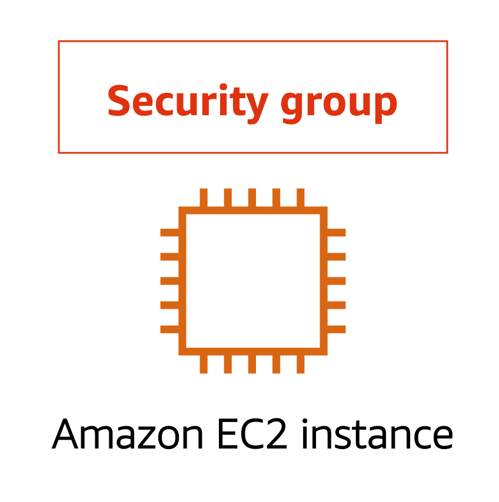
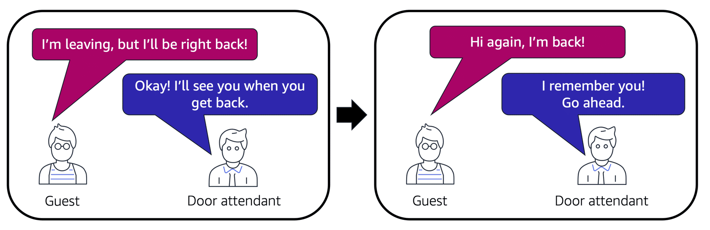
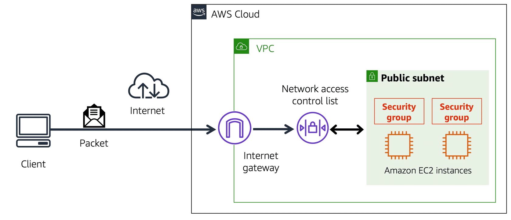

### Subnets and Network Access Control Lists

To understand the role of subnets within a VPC, consider this analogy from a coffee shop.

Customers give their orders to the cashier, who then passes the orders to the barista. This process ensures that the line moves smoothly as more customers arrive.

However, if some customers try to bypass the cashier and give their orders directly to the barista, it disrupts the flow of traffic and allows customers to access restricted parts of the coffee shop.

To prevent this, the coffee shop owners divide the counter area, creating separate workstations for the cashier and the barista. The cashier’s workstation is public-facing, designed to handle customers, while the barista’s area is private, only receiving orders from the cashier, not from customers.

This setup is similar to how AWS networking services isolate resources and control how network traffic flows.

In this analogy, the counter area represents the VPC. The separate workstations for the cashier and barista are like subnets within the VPC, which are used to group resources based on security or operational needs.

### Subnets

A **subnet** is a section of a VPC used to group resources. Subnets can be **public** or **private**:

- **Public subnets** contain resources that need to be accessible by the public, such as a website.
- **Private subnets** contain resources that should only be accessible within a private network, like a database storing customer information.

In a VPC, subnets can communicate with each other. For example, EC2 instances in a public subnet might interact with databases in a private subnet.

### Network Traffic in a VPC

When a customer requests data from an AWS-hosted application, the request is sent as a **packet**, a unit of data that travels over the internet or a network.

The packet enters the VPC through an internet gateway. Before it can enter or leave a subnet, it checks for permissions, which verify the source and how the packet is communicating with resources in the subnet.

The VPC component that checks these packet permissions is called a **network access control list (ACL).**

### Network Access Control Lists (ACLs)

A **network ACL** is a virtual firewall that controls inbound and outbound traffic at the subnet level.

For example, imagine an airport where travelers (packets) need to pass through passport control (the network ACL) when entering or leaving a country. The passport control officer checks if the traveler is approved to pass. If they are not on the approved list or are explicitly banned, they are denied entry.

Every AWS account includes a **default network ACL**. You can use this default ACL or create custom ones when configuring a VPC.

- By default, the network ACL allows all inbound and outbound traffic, but this can be customized with rules.
- Custom ACLs deny all traffic by default until rules are created to allow specific traffic. All network ACLs also have an explicit deny rule for unmatched packets.

### Stateless Packet Filtering

Network ACLs use **stateless packet filtering**, meaning they do not remember previous interactions. Each time a packet crosses a subnet boundary (inbound or outbound), it is checked against the ACL rules.

For instance, if an EC2 instance sends a request to the internet, the return packet is checked by the ACL again, even though it is a response to a previous request.

### Security Groups

Once a packet enters a subnet, its permissions are checked for specific resources within that subnet, such as Amazon EC2 instances. The VPC component that handles these checks is a **security group**.

A **security group** is a virtual firewall that controls inbound and outbound traffic for EC2 instances.

- By default, security groups deny all inbound traffic but allow all outbound traffic. Custom rules can be added to allow specific traffic.

In this analogy, consider a door attendant in an apartment building who greets guests (packets). The attendant checks a list to ensure the guests can enter the building, but does not check the list again when they leave.

If there are multiple EC2 instances within a subnet, they can share the same security group or have separate ones.

### Stateful Packet Filtering

Security groups use **stateful packet filtering**, meaning they remember previous decisions for incoming packets. For example, if an EC2 instance sends a request to the internet, the security group will remember this and automatically allow the response packet, even if inbound rules would otherwise deny it.

---

Both **network ACLs** and **security groups** allow the configuration of custom rules to manage traffic in a VPC. As you explore AWS security and networking, it's crucial to understand the differences between network ACLs and security groups to ensure effective traffic control and resource protection within a VPC.

