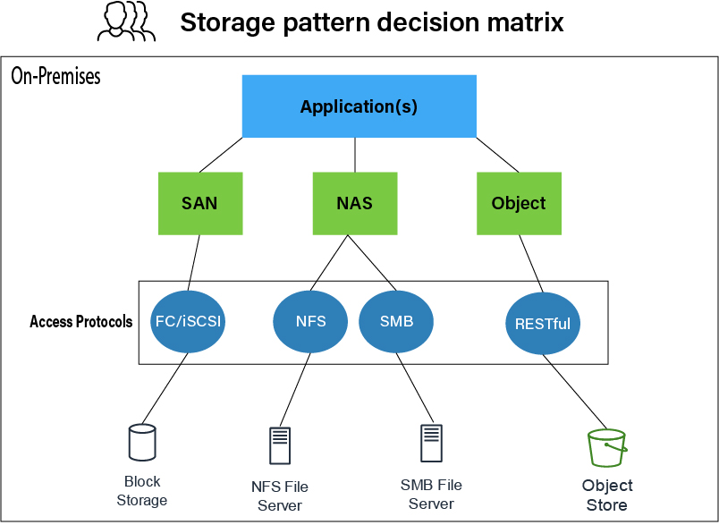

# Block, Object, and File Storage

## Difference between Block, Object, and File Storage

Block, object, and cloud file storage are three ways of storing data in the cloud so that users and applications can access it remotely over a network connection. Object storage stores and manages all data in an unstructured format and in units called objects. Block storage takes any data, like a file or database entry, and divides it into blocks of equal sizes. It then stores the data block on underlying physical storage in a way that’s optimized for fast access and retrieval. Cloud file storage is another data storage method that provides servers and applications access to data through shared file systems. Each type offers its own unique advantages for various use cases.

## Similarities between Object Storage, Block Storage, and File Storage

Object, block, and file storage are cloud storage services that users and applications can use to store and share data. They have many similarities, which are discussed below.

### Availability

Data persistence is the ability of data to remain within a storage system for an extended period. Block, object, and file storage systems provide data availability and reliability through various data persistence mechanisms. For instance, all three use data replication. By storing data in multiple locations, it can be accessed even if one location fails. All three systems also use checksums and error detection codes to verify data and detect corruption during storage.

### Accessibility

All three of these storage systems can be accessed over a network using APIs. Remote access ensures that stored data can be shared across multiple users and applications.

### Scalability

All three storage types offer scalability, which allows for the storage of large volumes of data. They can accommodate expanding storage needs by adding additional resources or nodes to the storage infrastructure.

### Data Security

Security features like encryption of data at rest and in transit are supported in all three storage types. They offer measures to protect data confidentiality and integrity, which helps ensure that stored data remains secure.

### Metadata Management

Cloud file storage, object storage, and block storage systems typically provide ways to manage metadata associated with stored data. Metadata can include attributes like file or object names, sizes, timestamps, and permissions. Metadata facilitates the organization, search, and retrieval of stored data.

## How Object Storage, Block Storage, and File Storage Work

Object, block, and cloud file storage work differently. They each use distinct structures, systems, and storage solutions.

### Object Storage

Object storage stores and manages data as discrete units called objects. An object typically consists of the actual data—such as documents, images, or data values—and its associated metadata. Metadata is additional information about the object that can be used to retrieve it. The metadata can include attributes like the unique identifier, object’s name, size, creation date, and custom-defined tags.

Object storage systems use a flat namespace, so objects are stored without the need for a hierarchical structure. Instead, the object’s unique identifier provides the address for the object within the storage system. A hashing algorithm generates the ID from the object’s content, which ensures that objects with the same content have the same identifier.

### Block Storage

Block storage works by dividing data into fixed-sized blocks and storing them as individual units. Blocks range from a few kilobytes to several megabytes in size. They can be predetermined during the configuration process.

The operating system gives each block a unique address or block number, logged inside a data lookup table. The addressing uses a logical block addressing (LBA) scheme that assigns a sequential number to each block.

Block storage allows direct access to individual data blocks. Data can be read or written to specific blocks without having to retrieve or modify the entire dataset to which the block belongs.

### Cloud File Storage

Cloud file storage is a hierarchical storage system that provides shared access to file data. It uses a remote infrastructure of servers to store data. The cloud provider maintains the servers and manages data on them. Files contain metadata like the file name, size, timestamps, and permissions.

Files can be created, modified, deleted, and read. They can also be organized logically in directory trees for intuitive access. Multiple users can simultaneously access the same files. Security for online file storage is managed with user and group permissions, allowing administrators to control access to the shared file data.

## Key Differences between Object Storage, Block Storage, and File Storage

Object storage, block storage, and cloud file storage have some key differences.

### File Management

Object storage solutions support the storage of files as objects. Accessing them with existing applications requires new code, the use of APIs, and direct knowledge of naming semantics.

Similarly, block storage can be used as the underlying storage component of a self-managed file storage solution. However, the one-to-one relationship required between the host and volume makes it difficult to achieve the scalability, availability, and affordability of a fully managed file storage solution. Additional budget and management resources are required to support files on block storage.

Only file-based storage supports common file-level protocols and permissions models. No new code is required to integrate with applications configured to work with shared file storage.

### Metadata Management

Object storage metadata can hold any amount of information about an object. This includes its name, content type, creation date, size, or other custom-defined inputs. By using a flexible metadata schema, additional fields can be created to help locate data.

Block storage stores as little metadata as possible to maintain high efficiency. A very basic metadata structure ensures minimal overhead during data transfer. Block storage mainly uses unique identifiers for each block when searching, finding, and retrieving data.

Cloud file storage uses metadata to describe the data that a file holds. Metadata can be accessed and changed depending on access permissions. Cloud storage systems using access control lists (ACLs) manage permission control for who can access and change metadata.

### Performance

Object storage systems prioritize storage quantity over availability. As highly scalable systems, large volumes of unstructured data can be stored in an object storage system. However, there is more latency when accessing these files. Object storage also has a lower throughput compared to block storage and cloud storage.

Block storage offers high performance, low latency, and quick data transfer rates. Operating on a block level, direct access to data allows for high I/O performance. Block storage is used for applications that need fast access to stored data, such as virtual machines or databases.

Cloud file storage can offer high performance, but performance is not the main reason for using it. Cloud file storage is more about storing data in a manner intuitive for human access. File sharing, collaboration, and shared repositories are more common with cloud file storage than high performance.

### Physical Storage Systems

Object storage normally uses a distributed storage environment across multiple different storage nodes or servers.

Block storage, on the other hand, uses RAID, SSDs, and hard disk drives (HDDs) for storage.

Cloud file storage uses network-attached storage (NAS) in an on-premises setup. In the cloud, file storage services may be set up over underlying physical block storage.

[Read a comparison of SDDs and HDDs »](https://aws.amazon.com/compare/the-difference-between-ssd-hard-drive/)

[Read about NAS »](https://aws.amazon.com/what-is/nas/)

### Scalability

Object storage offers near-infinite scaling, to petabytes and billions of objects.

Block storage offers scalability by adding more storage volumes or expanding existing volumes. Scalability depends on the block storage system’s ability to handle increased I/O demands and capacity requirements.

Due to its inherent hierarchy and pathing, file storage hits scaling constraints and is the least scalable of the three.

## When to Use Object Storage, Block Storage, and File Storage

- **Object storage** is best used for large amounts of unstructured data. This is especially true when durability, unlimited storage, scalability, and complex metadata management are relevant factors for overall performance.
  
- **Block storage** offers high-speed data processing, low latency, and high-performance storage. Any service that requires fast access to data works well with block storage. For example, real-time analytics, high-performance computing, and systems with many rapid transactions all benefit from block storage.

- **Cloud file storage** is best when users need concurrent access to a shared system of files. Additionally, file-level access control allows for setting up permissions and access control lists (ACLs) to increase security. Collaborative work environments that require sharing files between remote teams use file storage.

## Summary of Differences: Object vs. Block vs. File Storage

| **Feature**          | **Object Storage**                                           | **Block Storage**                                              | **Cloud File Storage**                                        |
|----------------------|--------------------------------------------------------------|----------------------------------------------------------------|----------------------------------------------------------------|
| **File Management**  | Stores files as objects. Accessing files in object storage with existing applications requires new code and the use of APIs. | Can store files but requires additional budget and management resources to support files on block storage. | Supports common file-level protocols and permissions models. Usable by applications configured to work with shared file storage. |
| **Metadata Management** | Can store unlimited metadata for any object. Define custom metadata fields. | Uses very little associated metadata. | Stores limited metadata relevant to files only. |
| **Performance**      | Stores unlimited data with minimal latency.                  | High-performance, low latency, and rapid data transfer.         | Offers high performance for shared file access.               |
| **Physical Storage** | Distributed across multiple storage nodes.                  | Distributed across SSDs and HDDs.                               | On-premises NAS servers or over underlying physical block storage. |
| **Scalability**      | Unlimited scale.                                             | Somewhat limited.                                               | Somewhat limited.                                               |

## How AWS Supports Object, Block, and File Storage Requirements

- **Amazon Simple Storage Service (Amazon S3)** provides unlimited object storage in the cloud. With cost-effective storage classes and easy-to-use management features, users can optimize costs, organize data, and configure fine-tuned access controls to meet specific business, organizational, and compliance requirements.

- **Amazon Elastic Block Store (Amazon EBS)** is an easy-to

-use, scalable, high-performance block storage service designed for Amazon Elastic Compute Cloud (Amazon EC2) workloads. It provides a highly scalable storage solution for mission-critical and I/O-intensive applications.

- **Amazon Elastic File System (Amazon EFS)** is a serverless, fully elastic file storage that automatically grows and shrinks as files are added and removed, with no need for management or provisioning.

- **Amazon FSx** makes it easy to launch, run, and scale high-performance, feature-rich file systems in the cloud. It supports workloads with scalability, broad capabilities, security, and reliability.