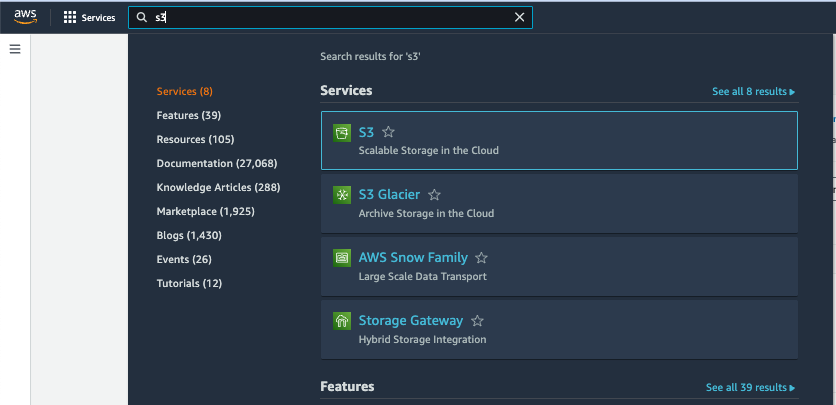
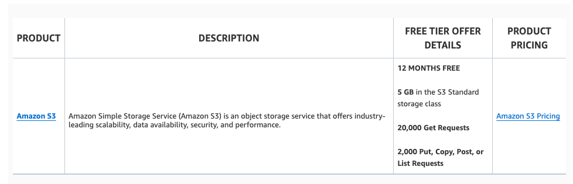

# Amazon S3

Amazon Simple Storage Service (Amazon S3) is an object storage service that provides industry-leading scalability, data availability, security, and performance. Amazon S3 is used by customers of all sizes and industries to store and protect any amount of data for a wide range of use cases, such as data lakes, websites, mobile applications, backups, archives, enterprise applications, IoT devices, and big data analytics. With Amazon S3, it can be optimized, organized, and configured access to the data to meet business, organizational, and compliance requirements.

## Features of Amazon S3

### Storage Classes

Amazon S3 offers a variety of storage classes designed for different use cases:

- **S3 Standard:** For frequently accessed mission-critical data.
- **S3 Standard-IA and S3 One Zone-IA:** For infrequently accessed data with lower storage costs.
- **S3 Glacier Instant Retrieval, S3 Glacier Flexible Retrieval, and S3 Glacier Deep Archive:** For archival storage with low costs.
- **S3 Express One Zone:** A high-performance, single-zone storage class offering low latency for latency-sensitive applications.

### Storage Management

Amazon S3 provides features for managing storage, reducing costs, meeting regulatory requirements, and ensuring compliance:

- **S3 Lifecycle:** Automates object transitions between storage classes or object expiration.
- **S3 Object Lock:** Prevents objects from being deleted or overwritten, ideal for regulatory compliance.
- **S3 Replication:** Replicates objects and metadata to other buckets across Regions for reduced latency and enhanced security.
- **S3 Batch Operations:** Enables bulk operations, such as copying, invoking Lambda functions, and restoring objects.

### Access Management and Security

Amazon S3 ensures secure access management and offers various tools for auditing and controlling access:

- **S3 Block Public Access:** Prevents public access to buckets and objects by default.
- **AWS Identity and Access Management (IAM):** Centrally manages permissions for accessing S3 resources.
- **Bucket Policies and Access Control Lists (ACLs):** Manage granular access control to S3 resources.
- **S3 Access Points:** Manage data access for shared datasets at scale.

### Data Processing

Amazon S3 provides features for transforming data and automating workflows:

- **S3 Object Lambda:** Allows custom processing on S3 objects during retrieval, such as filtering rows or resizing images.
- **Event Notifications:** Triggers workflows when changes occur in S3 resources using services like Amazon SNS, SQS, and Lambda.

### Logging and Monitoring

Amazon S3 offers tools for monitoring storage and usage:

- **CloudWatch Metrics for S3:** Tracks the operational health of S3 resources and provides billing alerts.
- **AWS CloudTrail:** Logs API activities and operations at both the bucket and object level.
- **Server Access Logging:** Provides detailed records of bucket requests for auditing and security purposes.

### Analytics and Insights

Amazon S3 offers features to help understand and optimize storage usage:

- **S3 Storage Lens:** Provides metrics and dashboards for analyzing storage across accounts and Regions.
- **Storage Class Analysis:** Identifies access patterns for optimizing storage class usage.
- **S3 Inventory:** Generates reports on objects and metadata for auditing and compliance.

### Strong Consistency

Amazon S3 offers strong read-after-write consistency for PUT and DELETE operations, ensuring immediate consistency across all Regions.

## How Amazon S3 Works

Amazon S3 is an object storage service that stores data as objects within buckets. An object consists of a file and any metadata that describes the file. A bucket is a container for objects.

To store data in Amazon S3, a bucket must be created, specifying a unique bucket name and AWS Region. Data is then uploaded to the bucket as objects, each identified by a key (or key name), which serves as a unique identifier within the bucket.

Amazon S3 provides various features to support specific use cases. For example, S3 Versioning allows multiple versions of an object in the same bucket, enabling recovery from accidental deletions or overwrites.

Buckets and objects are private by default and can be accessed only through explicitly granted permissions. Access management is done using bucket policies, AWS Identity and Access Management (IAM) policies, access control lists (ACLs), and S3 Access Points.

### Buckets

A bucket is a container for storing objects in Amazon S3. Each bucket can store an unlimited number of objects, and up to 100 buckets can be created per account (increases can be requested through the Service Quotas console).

Each object is stored within a bucket and is accessible through a unique URL. For instance, an object named `photos/puppy.jpg` in the `amzn-s3-demo-bucket` in the US West (Oregon) Region is accessible via `https://amzn-s3-demo-bucket.s3.us-west-2.amazonaws.com/photos/puppy.jpg`.

When creating a bucket, a name and AWS Region must be specified, and once created, these cannot be changed. Buckets also:

- Organize the Amazon S3 namespace at the highest level.
- Identify the account responsible for storage and data transfer charges.
- Provide access control options, including bucket policies, ACLs, and S3 Access Points.
- Serve as the unit of aggregation for usage reporting.

### Objects

Objects are the core entities stored in Amazon S3, consisting of data and metadata. Metadata includes name-value pairs describing the object, such as the last modified date and content type. Custom metadata can also be added when storing the object.

An object is uniquely identified within a bucket by a key (name) and a version ID (if S3 Versioning is enabled). For more information, refer to the [Amazon S3 objects overview](#).

### Keys

An object key (or key name) is a unique identifier for an object within a bucket. Each bucket-object combination has a single key. Together with the bucket name and optional version ID, the key forms a unique identifier for the object.

For example, the URL `https://amzn-s3-demo-bucket.s3.us-west-2.amazonaws.com/photos/puppy.jpg` identifies the object stored in the `amzn-s3-demo-bucket` bucket with the key `photos/puppy.jpg`.

### S3 Versioning

S3 Versioning allows to maintain multiple variants of an object within the same bucket. With versioning enabled, it can be preserved, retrieved, and restored every version of each object, making it easier to recover from unintended deletions or application failures.

When S3 Versioning is enabled, each new version of an object is assigned a unique version ID. Objects created before enabling versioning have a null version ID.

### Bucket Policy

A bucket policy is a resource-based IAM policy that grants access permissions to a bucket and the objects it contains. Only the bucket owner can assign policies, which apply to all objects owned by the bucket owner. Bucket policies are JSON-based and can control access based on request elements like requester, S3 actions, resources, and conditions.

Bucket policies support wildcard characters and can be used to control access to specific subsets of objects. For example, access can be granted to all objects with a common prefix or a specific extension.

### S3 Access Points

Amazon S3 Access Points are named network endpoints with specific access policies that define how data is accessed through that endpoint. Each access point is associated with a bucket and simplifies managing access for large datasets.

Access points allow configuring Block Public Access settings and restricting data access to private networks via Virtual Private Cloud (VPC) settings.

### Access Control Lists (ACLs)

ACLs can be used to grant read and write permissions to authorized users for individual buckets and objects. ACLs are an older access control mechanism, and modern use cases typically recommend using bucket policies or IAM policies instead.

S3 Object Ownership allows to disable or enable ACLs and manage ownership of uploaded objects. By default, Object Ownership is set to "Bucket owner enforced," disabling ACLs and granting the bucket owner full control over all objects.

### Regions

Amazon S3 allows to choose the AWS Region where the buckets are stored. The selected Region can help optimize latency, reduce costs, or meet regulatory requirements. Data remains within the selected Region unless explicitly transferred or replicated.

Amazon S3 and its features are accessible only in the Regions enabled for the account. For a list of Amazon S3 Regions and endpoints, refer to the [AWS General Reference](#).

## Accessing Amazon S3

Amazon S3 can be accessed using any of the following methods:

### AWS Management Console

The AWS Management Console is a web-based user interface for managing Amazon S3 and other AWS resources. By signing into the AWS Management Console, users can access the S3 console by selecting "S3" from the home page.

### AWS Command Line Interface (CLI)

The AWS CLI provides command-line tools to issue commands or create scripts for various AWS tasks, including S3 operations. It is supported on Windows, macOS, and Linux. To get started, users can refer to the [AWS Command Line Interface User Guide](#). Specific commands for Amazon S3 can be found in the `s3api` and `s3control` sections of the AWS CLI Command Reference.

### AWS SDKs

AWS offers SDKs (software development kits) that include libraries and sample code for various programming languages and platforms like Java, Python, Ruby, .NET, iOS, and Android. The SDKs simplify programmatic access to Amazon S3 by wrapping the REST API, handling tasks such as signature calculation, cryptographic signing, error management, and automatic retries. For more details on downloading and installing SDKs, refer to [Tools for AWS](#).

Interactions with Amazon S3 are either authenticated or anonymous. When using the SDKs, the libraries compute the authentication signature based on the provided keys. For more information about making requests, see [Making requests](#).

### Amazon S3 REST API

Amazon S3’s architecture is designed to be programming language-neutral, allowing programmatic access through the REST API. The REST API is an HTTP interface used to create, fetch, and delete buckets and objects in Amazon S3.

The REST API can be accessed using any HTTP-supporting toolkit, including browsers for fetching objects when they are publicly accessible. The API uses standard HTTP headers and status codes for compatibility with standard browsers and toolkits. In cases where additional functionality is needed (e.g., access control), Amazon S3 extends HTTP in a manner consistent with standard usage.

When making direct REST API calls, developers need to manually compute and include the signature in their requests.

## Paying for Amazon S3

Amazon S3 follows a pay-as-you-go pricing model, charging only for the resources used. New customers can start with free-tier access to S3. For detailed pricing information, visit [Amazon S3 Pricing](https://aws.amazon.com/s3/pricing/?p=pm&c=s3&z=4).

