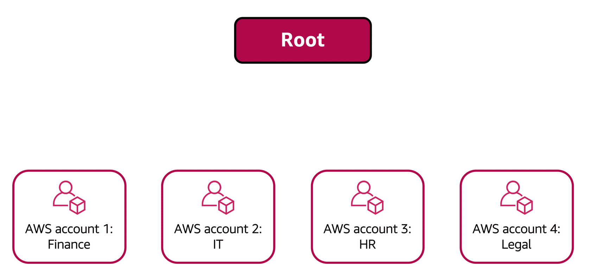

### **AWS Organizations**

AWS Organizations allows companies to consolidate and manage multiple AWS accounts within a central location. When an organization is created, AWS Organizations automatically establishes a root, which acts as the parent container for all accounts in the organization.

Through AWS Organizations, permissions can be centrally controlled for accounts by using **service control policies (SCPs)**. SCPs enable the restriction of AWS services, resources, and specific API actions that users and roles within each account can access.

Consolidated billing is another feature available in AWS Organizations. This allows all accounts to be grouped under a single payment method, simplifying billing processes.

---

#### **Organizational Units**

In AWS Organizations, accounts can be grouped into **organizational units (OUs)** to facilitate the management of accounts with similar business or security requirements. Applying a policy to an OU ensures that all accounts within the OU automatically inherit the permissions specified in the policy.

By organizing accounts into OUs, workloads or applications with specific security requirements can be isolated more easily. For instance, if certain accounts must adhere to regulatory requirements, those accounts can be placed into an OU, and a policy can be attached that blocks access to any services that do not meet those requirements.

---

#### **Example: AWS Organizations**

For example, a company may have separate AWS accounts for finance, IT, HR, and legal departments. These accounts can be consolidated into a single organization for centralized administration. When the organization is created, a root is established, and all accounts can be grouped accordingly.

The finance and IT departments may have requirements that differ from other departments, so these accounts can be brought into the organization for benefits such as consolidated billing but not placed into any OUs.

On the other hand, the HR and legal departments might share access needs to certain AWS services and resources, so they can be grouped into an OU. By doing this, policies can be applied to control access for both departments' accounts.

Grouping accounts into OUs enables streamlined access management, allowing each department to access the resources they need while restricting access to services they do not require.

For more information, visit the official [AWS Organizations](https://aws.amazon.com/organizations/) page and the [AWS Organizations User Guide](https://docs.aws.amazon.com/organizations/latest/userguide/orgs_manage_policies_scps.html).