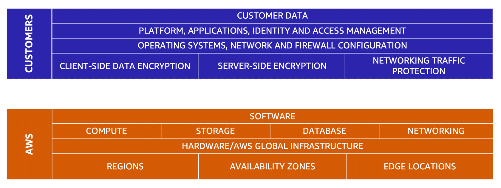

# **The AWS Shared Responsibility Model**

The AWS Shared Responsibility Model defines the division of security responsibilities between AWS and its customers. Both AWS and customers play key roles in maintaining the security of resources within the AWS environment. The model is categorized into two sections: **security in the cloud** (customer responsibilities) and **security of the cloud** (AWS responsibilities).

---

#### **Customer Responsibilities: Security in the Cloud**

Customers are responsible for securing the resources they create and manage within the AWS Cloud. This includes the following:

- **Data and Content Control**: Customers maintain full control over the content they store in AWS, including decisions on what to store and who can access it.
- **Managing Access**: Customers are responsible for defining who can access their resources and managing access rights, including granting, managing, and revoking permissions.
- **Operating System and Security Configuration**: Customers must configure and patch operating systems running on services such as Amazon EC2 instances.
- **Security Group and Network Management**: It is the customer’s responsibility to configure security groups and network-related security settings to control access to resources.
- **Account Management**: Customers must manage and secure user accounts and permissions in AWS.

In essence, the security of what is built, stored, and managed in the cloud is the customer’s responsibility.

---

#### **AWS Responsibilities: Security of the Cloud**

AWS is responsible for securing the infrastructure that supports the services in the AWS Cloud. These responsibilities include the following:

- **Physical Security**: AWS secures its physical data centers, implementing access controls, monitoring, and other physical safeguards.
- **Network and Virtualization Infrastructure**: AWS manages and protects the network infrastructure, including the hardware and software that deliver AWS services.
- **Global Infrastructure**: AWS secures its global infrastructure, including Regions, Availability Zones, and edge locations that comprise the AWS Cloud.

AWS ensures the security of the foundational infrastructure that supports customer resources, providing a secure base for services.

---

#### **Analogy: Homeowner and Homebuilder**

The shared responsibility model can be compared to the relationship between a homeowner and a homebuilder. AWS (the builder) constructs and secures the infrastructure (the house), while the customer (the homeowner) is responsible for securing the content inside (e.g., locking doors and protecting belongings). Together, both parties ensure overall security.

By following the shared responsibility model, AWS provides a secure infrastructure, while customers maintain control over the security of their data and applications within that environment.