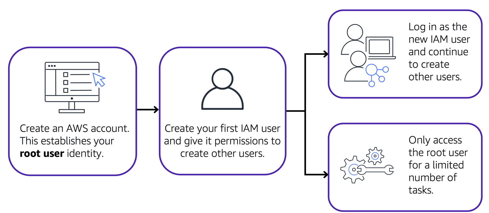
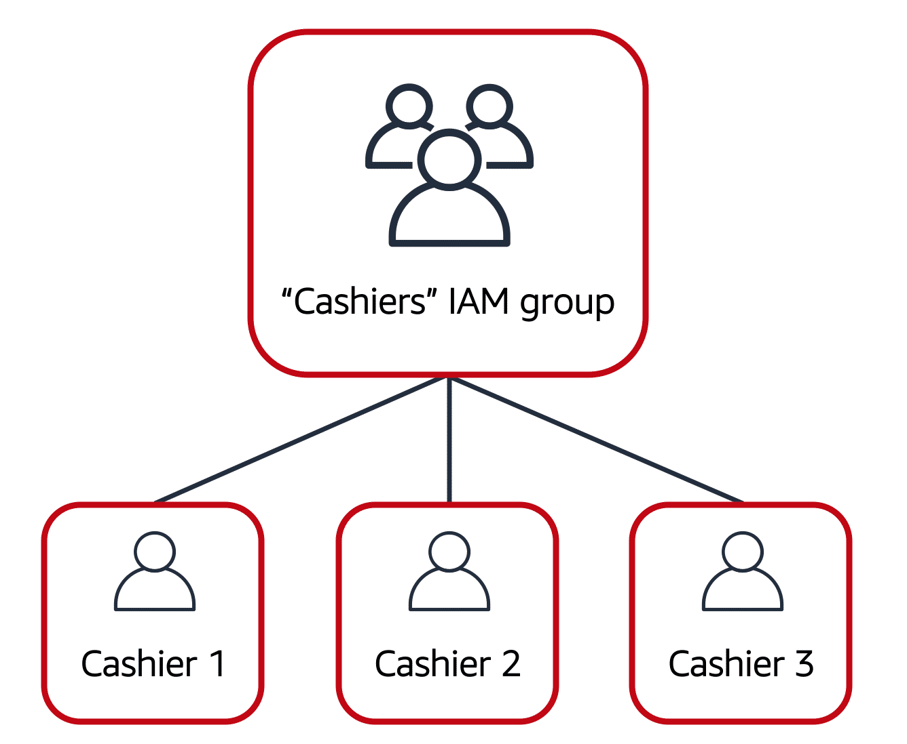
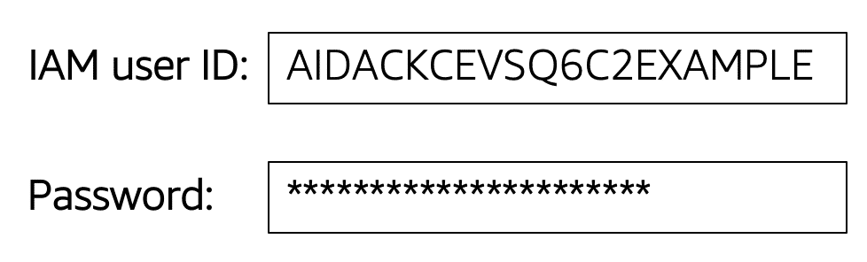

# **User Permissions and Access in AWS**

---

#### **AWS Identity and Access Management (IAM)**

AWS Identity and Access Management (IAM) allows you to manage access to AWS services and resources securely. With IAM, you can configure access based on your organization’s security needs using several key features:

- IAM users, groups, and roles
- IAM policies
- Multi-factor authentication (MFA)

Best practices for each of these features are also covered in this module.

---

#### **AWS Account Root User**

When creating an AWS account, you start with a root user, which has full access to all services and resources. However, AWS best practices recommend limiting the use of the root user to critical tasks (e.g., changing account details). Instead, the root user should be used to create IAM users with specific permissions for everyday tasks.

---

#### **IAM Users**

An IAM user represents an individual or application that interacts with AWS resources. Each IAM user is unique, with no permissions granted by default. To perform tasks, permissions must be explicitly assigned to users through IAM policies.

Best practice: Create individual IAM users for each person requiring access to AWS, even if they need the same permissions. This ensures security by maintaining unique credentials for each user.

---

#### **IAM Policies**

IAM policies are documents that define what actions are allowed or denied on AWS resources. Policies enable you to grant specific permissions to users, groups, or roles.

Best practice: Follow the principle of **least privilege**, granting only the necessary permissions for users to complete their tasks.

---

#### **IAM Groups**

IAM groups are collections of IAM users. By assigning policies to groups, you can easily manage permissions for multiple users at once.

Example: The coffee shop owner creates a “Cashiers” IAM group and adds users to the group, simplifying the process of managing permissions as employees transition between roles.

---

#### **IAM Roles**

IAM roles allow users, services, or applications to temporarily assume different sets of permissions. This is useful when specific access is needed for a short time.

Best practice: Use IAM roles when temporary access to resources is required, instead of long-term access.

---

#### **Multi-factor Authentication (MFA)**

MFA adds an extra layer of security by requiring users to provide multiple pieces of information to verify their identity. In AWS, you can enable MFA for both the root user and IAM users to protect your account from unauthorized access.

Best practice: Enable MFA for the root user and all IAM users to ensure an extra layer of protection for your AWS account.

--- 

This module provided an overview of IAM concepts, including users, groups, roles, policies, and best practices for securing access in AWS. By following these principles, organizations can ensure their resources are protected while allowing controlled access to authorized users.